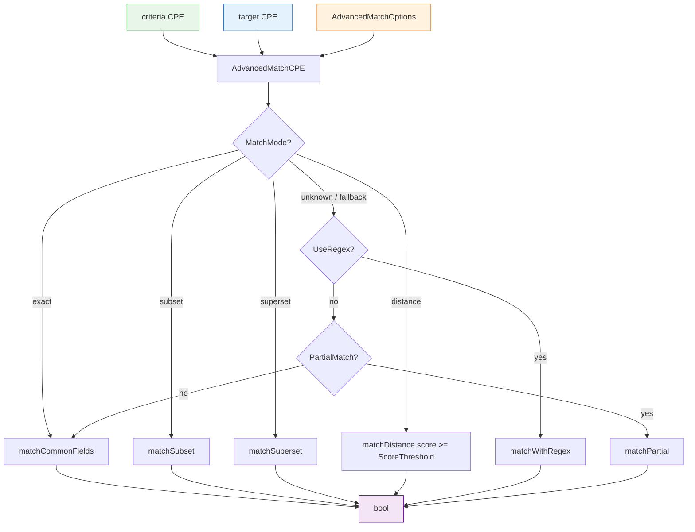

# 🎛️ Advanced Matching

The `advanced_matching` module provides fine-grained, option-driven CPE matching that goes beyond the strict NISTIR 7696 rules. It supports exact, subset, superset and distance (weighted similarity) match modes, regex and fuzzy field matching, configurable case sensitivity, and version comparisons (greater/less/range) via the `versions` package.

## Type: AdvancedMatchOptions

```go
type AdvancedMatchOptions struct {
    UseRegex           bool                       // match string fields as regular expressions
    IgnoreCase         bool                       // case-insensitive matching
    UseFuzzyMatch      bool                       // substring-based fuzzy matching
    MatchCommonOnly    bool                       // only match part, vendor, product, version
    PartialMatch       bool                       // only match non-empty criteria fields
    MatchMode          string                     // "exact", "subset", "superset", "distance"
    VersionCompareMode string                     // "exact", "greater", "greaterOrEqual", "less", "lessOrEqual", "range"
    VersionLower       string                     // range lower bound (inclusive), used when VersionCompareMode == "range"
    VersionUpper       string                     // range upper bound (inclusive), used when VersionCompareMode == "range"
    FieldOptions       map[string]FieldMatchOption // per-field weights, required flags, match methods
    ScoreThreshold     float64                    // similarity threshold (0.0-1.0) for distance mode
}
```

`NewAdvancedMatchOptions` returns an instance with sensible defaults: `MatchMode = "exact"`, `VersionCompareMode = "exact"`, and `ScoreThreshold = 0.7`.

## Type: FieldMatchOption

```go
type FieldMatchOption struct {
    Weight      float64 // field weight, 0.0-1.0
    Required    bool    // whether this field must match
    MatchMethod string  // match method name
}
```

`FieldMatchOption` configures how a single field participates in `distance`-mode matching. Entries are stored in `AdvancedMatchOptions.FieldOptions` keyed by field name (`part`, `vendor`, `product`, `version`, `update`, `edition`, `language`, `softwareEdition`, `targetSoftware`, `targetHardware`, `other`).

## 🆕 NewAdvancedMatchOptions

```go
func NewAdvancedMatchOptions() *AdvancedMatchOptions
```

Returns a pointer to a new `AdvancedMatchOptions` populated with default values.

| Return | Type | Description |
| --- | --- | --- |
| #1 | `*AdvancedMatchOptions` | Default options instance |

```go
opts := cpeskills.NewAdvancedMatchOptions()
opts.MatchMode = "distance"
opts.ScoreThreshold = 0.8
```

## 🎯 AdvancedMatchCPE

```go
func AdvancedMatchCPE(criteria *CPE, target *CPE, options *AdvancedMatchOptions) bool
```

Performs advanced matching of `criteria` against `target` according to `options`. Returns `false` if either CPE is `nil`. If `options` is `nil`, default options are used.

The dispatch follows `options.MatchMode`:

- `"exact"` — match the common fields (part, vendor, product, version) with the configured field-matching rules; version uses `VersionCompareMode` when it is not `"exact"`.
- `"subset"` — check whether `target` is a subset of `criteria` (criteria fields constrain; `*`/empty criteria fields are skipped).
- `"superset"` — check whether `target` is a superset of `criteria`.
- `"distance"` — compute a weighted similarity score across all (or common-only) fields; match succeeds when `score >= options.ScoreThreshold`. Fields marked `Required` in `FieldOptions` short-circuit to failure when unmatched.

For unknown `MatchMode` values the function falls back to `UseRegex`, then `PartialMatch`, and finally a common-field exact match.

| Parameter | Type | Description |
| --- | --- | --- |
| `criteria` | `*CPE` | The matching pattern |
| `target` | `*CPE` | The CPE being matched |
| `options` | `*AdvancedMatchOptions` | Match options, `nil` for defaults |

| Return | Type | Description |
| --- | --- | --- |
| #1 | `bool` | `true` if `target` matches `criteria` under the options, `false` otherwise |

```go
criteria := cpeskills.MustParse("cpe:2.3:a:microsoft:windows:10:*:*:*:*:*:*:*")
target := cpeskills.MustParse("cpe:2.3:a:microsoft:windows:10:*:*:*:*:*:*:*")

// Exact match with case-insensitive vendor/product
opts := cpeskills.NewAdvancedMatchOptions()
opts.IgnoreCase = true
fmt.Println(cpeskills.AdvancedMatchCPE(criteria, target, opts)) // true

// Version-range match
rangeOpts := cpeskills.NewAdvancedMatchOptions()
rangeOpts.VersionCompareMode = "range"
rangeOpts.VersionLower = "9.0"
rangeOpts.VersionUpper = "11.0"
fmt.Println(cpeskills.AdvancedMatchCPE(criteria, target, rangeOpts)) // true

// Distance match with a custom required field
distOpts := cpeskills.NewAdvancedMatchOptions()
distOpts.MatchMode = "distance"
distOpts.ScoreThreshold = 0.6
distOpts.FieldOptions = map[string]cpeskills.FieldMatchOption{
    "vendor": {Weight: 1.0, Required: true},
}
fmt.Println(cpeskills.AdvancedMatchCPE(criteria, target, distOpts)) // true
```

## 📐 Advanced Matching Flow Diagram


