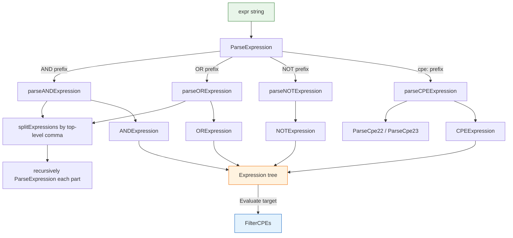

# 🧩 Applicability Expressions

The `applicability` module implements the CPE Applicability Language: a small expression language that combines CPE match checks with logical AND, OR, and NOT operators. An `Expression` can be parsed from a string and evaluated against a target CPE, or used to filter a list of CPEs.

## Type: ExpressionType

```go
type ExpressionType int
```

Enumerates the supported expression kinds.

```go
const (
    ExpressionTypeCPE ExpressionType = iota // 0, a single CPE match
    ExpressionTypeAND                       // 1, logical AND of sub-expressions
    ExpressionTypeOR                        // 2, logical OR of sub-expressions
    ExpressionTypeNOT                       // 3, logical NOT of a sub-expression
)
```

## Type: Expression

```go
type Expression interface {
    Type() ExpressionType
    Evaluate(target *CPE) bool
    String() string
}
```

`Expression` is the common interface implemented by all expression types. `Type` reports the expression kind, `Evaluate` tests whether the expression matches `target`, and `String` returns a debug-friendly textual form.

## Type: CPEExpression

```go
type CPEExpression struct {
    CPE *CPE
}
```

```go
func (e *CPEExpression) Type() ExpressionType
func (e *CPEExpression) Evaluate(target *CPE) bool
func (e *CPEExpression) String() string
```

A leaf expression that matches a target when the embedded CPE matches it (delegating to `CPE.Match`). `Type()` returns `ExpressionTypeCPE`; `String()` returns the 2.3 URI of the embedded CPE.

| Parameter | Type | Description |
| --- | --- | --- |
| `target` | `*CPE` | The CPE to test against (`Evaluate`) |

| Return (Type) | Type | Description |
| --- | --- | --- |
| #1 | `ExpressionType` | Always `ExpressionTypeCPE` |

| Return (Evaluate) | Type | Description |
| --- | --- | --- |
| #1 | `bool` | `true` if the embedded CPE matches `target` |

| Return (String) | Type | Description |
| --- | --- | --- |
| #1 | `string` | The 2.3 URI of the embedded CPE |

## Type: ANDExpression

```go
type ANDExpression struct {
    Expressions []Expression
}
```

```go
func (e *ANDExpression) Type() ExpressionType
func (e *ANDExpression) Evaluate(target *CPE) bool
func (e *ANDExpression) String() string
```

A logical AND over its sub-expressions. `Type()` returns `ExpressionTypeAND`. `Evaluate` returns `true` only when every sub-expression evaluates to `true`. `String()` returns `AND(e1, e2, ...)`.

| Parameter | Type | Description |
| --- | --- | --- |
| `target` | `*CPE` | The CPE to test against (`Evaluate`) |

| Return (Type) | Type | Description |
| --- | --- | --- |
| #1 | `ExpressionType` | Always `ExpressionTypeAND` |

| Return (Evaluate) | Type | Description |
| --- | --- | --- |
| #1 | `bool` | `true` only when all sub-expressions match |

| Return (String) | Type | Description |
| --- | --- | --- |
| #1 | `string` | `AND(e1, e2, ...)` |

## Type: ORExpression

```go
type ORExpression struct {
    Expressions []Expression
}
```

```go
func (e *ORExpression) Type() ExpressionType
func (e *ORExpression) Evaluate(target *CPE) bool
func (e *ORExpression) String() string
```

A logical OR over its sub-expressions. `Type()` returns `ExpressionTypeOR`. `Evaluate` returns `true` when at least one sub-expression evaluates to `true`. `String()` returns `OR(e1, e2, ...)`.

| Parameter | Type | Description |
| --- | --- | --- |
| `target` | `*CPE` | The CPE to test against (`Evaluate`) |

| Return (Type) | Type | Description |
| --- | --- | --- |
| #1 | `ExpressionType` | Always `ExpressionTypeOR` |

| Return (Evaluate) | Type | Description |
| --- | --- | --- |
| #1 | `bool` | `true` when any sub-expression matches |

| Return (String) | Type | Description |
| --- | --- | --- |
| #1 | `string` | `OR(e1, e2, ...)` |

## Type: NOTExpression

```go
type NOTExpression struct {
    Expression Expression
}
```

```go
func (e *NOTExpression) Type() ExpressionType
func (e *NOTExpression) Evaluate(target *CPE) bool
func (e *NOTExpression) String() string
```

A logical NOT over a single sub-expression. `Type()` returns `ExpressionTypeNOT`. `Evaluate` returns the negation of the wrapped expression's result. `String()` returns `NOT(e)`.

| Parameter | Type | Description |
| --- | --- | --- |
| `target` | `*CPE` | The CPE to test against (`Evaluate`) |

| Return (Type) | Type | Description |
| --- | --- | --- |
| #1 | `ExpressionType` | Always `ExpressionTypeNOT` |

| Return (Evaluate) | Type | Description |
| --- | --- | --- |
| #1 | `bool` | `true` when the wrapped expression does not match |

| Return (String) | Type | Description |
| --- | --- | --- |
| #1 | `string` | `NOT(e)` |

## 🔤 ParseExpression

```go
func ParseExpression(expr string) (Expression, error)
```

Parses a CPE applicability-language expression string into an `Expression` tree. Supported forms:

- A single CPE: `"cpe:2.3:a:microsoft:windows:10:*:*:*:*:*:*:*"` (2.3 form) or `"cpe:/a:microsoft:windows:10"` (2.2 form).
- `AND(e1, e2, ...)` — all sub-expressions must match.
- `OR(e1, e2, ...)` — at least one sub-expression must match.
- `NOT(e)` — negates the wrapped expression.

Sub-expressions may be nested arbitrarily. Top-level commas inside `AND`/`OR` separate sub-expressions; commas inside nested parentheses are preserved. Parentheses must be balanced.

| Parameter | Type | Description |
| --- | --- | --- |
| `expr` | `string` | The expression string to parse |

| Return | Type | Description |
| --- | --- | --- |
| #1 | `Expression` | The parsed expression tree, `nil` on error |
| #2 | `error` | Non-`nil` when the format is invalid or a sub-expression fails to parse |

```go
// Single CPE
cpeExpr, err := cpeskills.ParseExpression("cpe:2.3:a:microsoft:windows:10:*:*:*:*:*:*:*")
if err != nil {
    log.Fatal(err)
}

// OR of two CPEs
orExpr, err := cpeskills.ParseExpression("OR(cpe:2.3:a:microsoft:windows:10:*:*:*:*:*:*:*, cpe:2.3:a:microsoft:windows:11:*:*:*:*:*:*:*)")
if err != nil {
    log.Fatal(err)
}

// AND of two wildcarded CPEs
andExpr, err := cpeskills.ParseExpression("AND(cpe:2.3:a:microsoft:*:*:*:*:*:*:*:*:*, cpe:2.3:a:*:windows:*:*:*:*:*:*:*:*)")
if err != nil {
    log.Fatal(err)
}

// NOT of a single CPE
notExpr, err := cpeskills.ParseExpression("NOT(cpe:2.3:a:microsoft:windows:10:*:*:*:*:*:*:*)")
if err != nil {
    log.Fatal(err)
}

target, _ := cpeskills.ParseCpe23("cpe:2.3:a:microsoft:windows:11:*:*:*:*:*:*:*")
fmt.Println("OR matches Windows 11:", orExpr.Evaluate(target)) // true
fmt.Println("NOT rejects Windows 11:", notExpr.Evaluate(target)) // true
```

## 🧹 FilterCPEs

```go
func FilterCPEs(cpes []*CPE, expr Expression) []*CPE
```

Returns the subset of `cpes` for which `expr.Evaluate` returns `true`, preserving the original order. Returns an empty (non-nil) slice when nothing matches.

| Parameter | Type | Description |
| --- | --- | --- |
| `cpes` | `[]*CPE` | The CPE list to filter |
| `expr` | `Expression` | The applicability expression to evaluate |

| Return | Type | Description |
| --- | --- | --- |
| #1 | `[]*CPE` | CPEs matching the expression |

```go
cpes := []*CPE{
    cpeskills.MustParse("cpe:2.3:a:microsoft:windows:10:*:*:*:*:*:*:*"),
    cpeskills.MustParse("cpe:2.3:a:microsoft:windows:11:*:*:*:*:*:*:*"),
    cpeskills.MustParse("cpe:2.3:a:adobe:reader:*:*:*:*:*:*:*:*"),
}
expr, _ := cpeskills.ParseExpression("OR(cpe:2.3:a:microsoft:windows:10:*:*:*:*:*:*:*, cpe:2.3:a:microsoft:windows:11:*:*:*:*:*:*:*)")
matched := cpeskills.FilterCPEs(cpes, expr)
for _, c := range matched {
    fmt.Println(c.GetURI())
}
```

## 📐 Expression Parse & Evaluate Diagram


