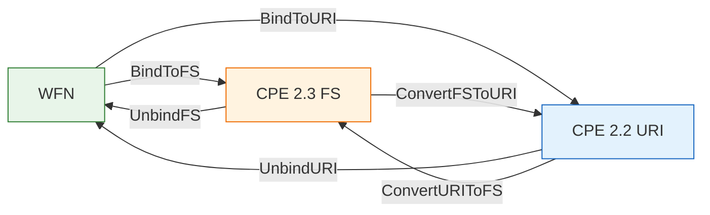

# 🔗 Binding (WFN ↔ FS / URI)

This module binds a `WFN` to and from the two CPE serialized forms defined by NISTIR 7695: the 2.3 **Formatted String (FS)** and the 2.2 **URI**. Binding converts the logical values `*` (ANY) and `-` (NA) plus escaped component values into their wire representation; unbinding reverses it. Conversion helpers between the two forms are also provided.

## 🔗 BindToFS

```go
func BindToFS(w *WFN) string
```

Binds a `WFN` to a CPE 2.3 FS formatted string, per NISTIR 7695. Each attribute is read via `Get` (so an unset attribute becomes ANY) and escaped with the FS rules. The result has 13 colon-separated parts beginning with `cpe:2.3:`. A `nil` WFN returns an empty string.

| Parameter | Type | Description |
| --- | --- | --- |
| `w` | `*WFN` | The WFN to bind |

| Return | Type | Description |
| --- | --- | --- |
| #1 | `string` | The CPE 2.3 FS string, or `""` if `w` is nil |

```go
wfn := &cpeskills.WFN{Part: "a", Vendor: "microsoft", Product: "windows", Version: "10"}
fmt.Println(cpeskills.BindToFS(wfn)) // cpe:2.3:a:microsoft:windows:10:*:*:*:*:*:*:*
```

## ✂️ UnbindFS

```go
func UnbindFS(fs string) (*WFN, error)
```

Unbinds a CPE 2.3 FS string back into a `WFN`. The input must start with `cpe:2.3:` and contain exactly 13 colon-separated components; each component is unescaped per the FS rules.

| Parameter | Type | Description |
| --- | --- | --- |
| `fs` | `string` | CPE 2.3 FS formatted string |

| Return | Type | Description |
| --- | --- | --- |
| #1 | `*WFN` | The unbound WFN, `nil` on error |
| #2 | `error` | `nil` on success, otherwise a format error |

```go
wfn, err := cpeskills.UnbindFS("cpe:2.3:a:microsoft:windows:10:*:*:*:*:*:*:*")
if err != nil {
    panic(err)
}
fmt.Println(wfn.Vendor, wfn.Product) // microsoft windows
```

## 🔗 BindToURI

```go
func BindToURI(w *WFN) string
```

Binds a `WFN` to a CPE 2.2 URI formatted string, per NISTIR 7695. The five main fields (part, vendor, product, version, update) are colon-separated after the `cpe:/` prefix; extended attributes are packed with `~` and appended. A `nil` WFN returns an empty string.

| Parameter | Type | Description |
| --- | --- | --- |
| `w` | `*WFN` | The WFN to bind |

| Return | Type | Description |
| --- | --- | --- |
| #1 | `string` | The CPE 2.2 URI string, or `""` if `w` is nil |

```go
wfn := &cpeskills.WFN{Part: "a", Vendor: "microsoft", Product: "windows", Version: "10"}
fmt.Println(cpeskills.BindToURI(wfn)) // cpe:/a:microsoft:windows:10
```

## ✂️ UnbindURI

```go
func UnbindURI(uri string) (*WFN, error)
```

Unbinds a CPE 2.2 URI string back into a `WFN`. The input must start with `cpe:/`. The main fields are read positionally; an extended-attributes segment (containing `~`) is unpacked into edition, language, sw_edition, target_sw, target_hw, and other.

| Parameter | Type | Description |
| --- | --- | --- |
| `uri` | `string` | CPE 2.2 URI formatted string |

| Return | Type | Description |
| --- | --- | --- |
| #1 | `*WFN` | The unbound WFN, `nil` on error |
| #2 | `error` | `nil` on success, otherwise a format error |

```go
wfn, err := cpeskills.UnbindURI("cpe:/a:microsoft:windows:10")
if err != nil {
    panic(err)
}
fmt.Println(wfn.Part, wfn.Vendor, wfn.Product, wfn.Version) // a microsoft windows 10
```

## 🔁 ConvertURIToFS

```go
func ConvertURIToFS(uri string) (string, error)
```

Converts a CPE 2.2 URI string into a CPE 2.3 FS string by unbinding to a `WFN` and then re-binding to FS.

| Parameter | Type | Description |
| --- | --- | --- |
| `uri` | `string` | CPE 2.2 URI formatted string |

| Return | Type | Description |
| --- | --- | --- |
| #1 | `string` | The converted CPE 2.3 FS string |
| #2 | `error` | `nil` on success, otherwise the unbind error |

```go
fs, err := cpeskills.ConvertURIToFS("cpe:/a:microsoft:windows:10")
if err != nil {
    panic(err)
}
fmt.Println(fs) // cpe:2.3:a:microsoft:windows:10:*:*:*:*:*:*:*
```

## 🔁 ConvertFSToURI

```go
func ConvertFSToURI(fs string) (string, error)
```

Converts a CPE 2.3 FS string into a CPE 2.2 URI string by unbinding to a `WFN` and then re-binding to URI.

| Parameter | Type | Description |
| --- | --- | --- |
| `fs` | `string` | CPE 2.3 FS formatted string |

| Return | Type | Description |
| --- | --- | --- |
| #1 | `string` | The converted CPE 2.2 URI string |
| #2 | `error` | `nil` on success, otherwise the unbind error |

```go
uri, err := cpeskills.ConvertFSToURI("cpe:2.3:a:microsoft:windows:10:*:*:*:*:*:*:*")
if err != nil {
    panic(err)
}
fmt.Println(uri) // cpe:/a:microsoft:windows:10
```

## 📐 Binding Flow Diagram


