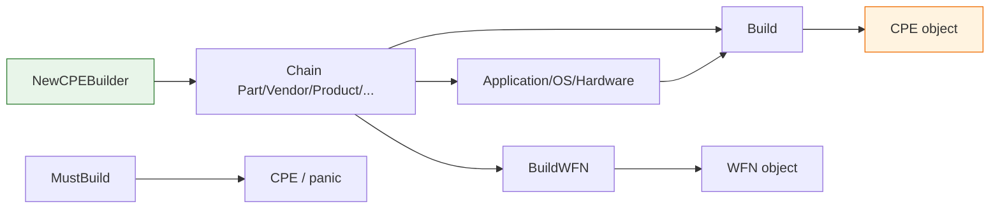

# 🏗️ CPE Builder

`CPEBuilder` provides a chainable fluent API for constructing CPE objects, internally backed by a WFN (Well-Formed Name) representation.

## Type: CPEBuilder

```go
type CPEBuilder struct {
    // contains unexported fields
}
```

`CPEBuilder` is an opaque struct: create it with `NewCPEBuilder()` and configure attributes via its chainable methods.

## 🆕 NewCPEBuilder

```go
func NewCPEBuilder() *CPEBuilder
```

Returns a new `CPEBuilder` instance.

| Return | Type | Description |
| --- | --- | --- |
| #1 | `*CPEBuilder` | A fresh builder instance |

```go
b := cpeskills.NewCPEBuilder()
```

## ⚙️ Chainable attribute methods

Each of the following returns `*CPEBuilder` to support chaining:

```go
func (b *CPEBuilder) Part(part string) *CPEBuilder
func (b *CPEBuilder) Vendor(vendor string) *CPEBuilder
func (b *CPEBuilder) Product(product string) *CPEBuilder
func (b *CPEBuilder) Version(version string) *CPEBuilder
func (b *CPEBuilder) Update(update string) *CPEBuilder
func (b *CPEBuilder) Edition(edition string) *CPEBuilder
func (b *CPEBuilder) Language(language string) *CPEBuilder
func (b *CPEBuilder) SoftwareEdition(swEdition string) *CPEBuilder
func (b *CPEBuilder) TargetSoftware(targetSw string) *CPEBuilder
func (b *CPEBuilder) TargetHardware(targetHw string) *CPEBuilder
func (b *CPEBuilder) Other(other string) *CPEBuilder
```

| Parameter | Type | Description |
| --- | --- | --- |
| first arg | `string` | The corresponding attribute value |

| Return | Type | Description |
| --- | --- | --- |
| #1 | `*CPEBuilder` | The builder itself, for chaining |

```go
b := cpeskills.NewCPEBuilder().
    Part("a").
    Vendor("microsoft").
    Product("windows").
    Version("10")
```

## 🏷️ Application / OS / Hardware

```go
func (b *CPEBuilder) Application() *CPEBuilder
func (b *CPEBuilder) OS() *CPEBuilder
func (b *CPEBuilder) Hardware() *CPEBuilder
```

Convenience setters that mark the part as application (`a`), operating system (`o`) or hardware (`h`) respectively.

| Return | Type | Description |
| --- | --- | --- |
| #1 | `*CPEBuilder` | The builder itself |

```go
b := cpeskills.NewCPEBuilder().Application().Vendor("adobe").Product("acrobat_reader")
```

## 🏁 Build

```go
func (b *CPEBuilder) Build() (*CPE, error)
```

Builds and returns the `CPE` object. Returns an error if any attribute is invalid.

| Return | Type | Description |
| --- | --- | --- |
| #1 | `*CPE` | The built CPE object |
| #2 | `error` | An error if building fails |

```go
cpe, err := cpeskills.NewCPEBuilder().
    Application().Vendor("microsoft").Product("windows").Version("10").
    Build()
```

## 🚀 MustBuild

```go
func (b *CPEBuilder) MustBuild() *CPE
```

Builds and returns the `CPE` object, panicking on failure.

| Return | Type | Description |
| --- | --- | --- |
| #1 | `*CPE` | The built CPE object |

```go
cpe := cpeskills.NewCPEBuilder().Application().Vendor("microsoft").Product("windows").MustBuild()
```

## 🔧 BuildWFN

```go
func (b *CPEBuilder) BuildWFN() (*WFN, error)
```

Builds and returns the underlying WFN (Well-Formed Name) object.

| Return | Type | Description |
| --- | --- | --- |
| #1 | `*WFN` | The built WFN object |
| #2 | `error` | An error if building fails |

```go
wfn, err := cpeskills.NewCPEBuilder().Application().Vendor("microsoft").BuildWFN()
```

## 🧭 Builder Flow


