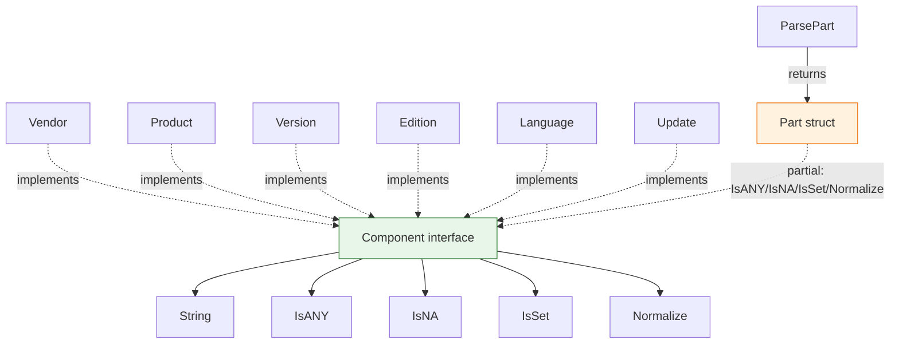

# 🧩 Component Types

This module defines the `Component` interface and the shared method set implemented by every CPE attribute type: `Vendor`, `Product`, `Version`, `Edition`, `Language`, and `Update`. Each of these types is a named `string` type (declared in its own file) and provides the same five methods so it can be treated uniformly as a `Component`. The `Part` type implements a subset of these methods (it has no `String` method).

## Type: Component

```go
type Component interface {
    String() string
    IsANY() bool
    IsNA() bool
    IsSet() bool
    Normalize() string
}
```

The `Component` interface describes the common behavior of every CPE attribute type:

- `String` returns the raw string value.
- `IsANY` reports whether the value is the logical ANY (`*`).
- `IsNA` reports whether the value is the logical NA (`-`).
- `IsSet` reports whether the value is a real, non-empty, non-ANY, non-NA value.
- `Normalize` returns the normalized form of the value (lowercased, spaces→underscores, collapsed repeated underscores).

The named string types `Vendor`, `Product`, `Version`, `Edition`, `Language`, and `Update` all implement this interface.

## 🏷️ String

```go
func (v Vendor) String() string
func (p Product) String() string
func (v Version) String() string
func (e Edition) String() string
func (l Language) String() string
func (u Update) String() string
```

Returns the raw string value of the component.

| Return | Type | Description |
| --- | --- | --- |
| #1 | `string` | The raw value |

```go
v := cpeskills.Vendor("microsoft")
fmt.Println(v.String()) // microsoft
```

## ❓ IsANY

```go
func (v Vendor) IsANY() bool
func (p Product) IsANY() bool
func (v Version) IsANY() bool
func (e Edition) IsANY() bool
func (l Language) IsANY() bool
func (u Update) IsANY() bool
```

Reports whether the value equals the logical ANY (`*`).

| Return | Type | Description |
| --- | --- | --- |
| #1 | `bool` | `true` if the value is `*` |

```go
v := cpeskills.Vendor("*")
fmt.Println(v.IsANY()) // true
```

## ❓ IsNA

```go
func (v Vendor) IsNA() bool
func (p Product) IsNA() bool
func (v Version) IsNA() bool
func (e Edition) IsNA() bool
func (l Language) IsNA() bool
func (u Update) IsNA() bool
```

Reports whether the value equals the logical NA (`-`).

| Return | Type | Description |
| --- | --- | --- |
| #1 | `bool` | `true` if the value is `-` |

```go
v := cpeskills.Version("-")
fmt.Println(v.IsNA()) // true
```

## ✔️ IsSet

```go
func (v Vendor) IsSet() bool
func (p Product) IsSet() bool
func (v Version) IsSet() bool
func (e Edition) IsSet() bool
func (l Language) IsSet() bool
func (u Update) IsSet() bool
```

Reports whether the value is a real value: non-empty, non-ANY, and non-NA.

| Return | Type | Description |
| --- | --- | --- |
| #1 | `bool` | `true` if the value is a concrete value |

```go
v := cpeskills.Vendor("microsoft")
fmt.Println(v.IsSet()) // true

a := cpeskills.Vendor("*")
fmt.Println(a.IsSet()) // false
```

## 🧹 Normalize

```go
func (v Vendor) Normalize() string
func (p Product) Normalize() string
func (v Version) Normalize() string
func (e Edition) Normalize() string
func (l Language) Normalize() string
func (u Update) Normalize() string
```

Returns the normalized form of the value by delegating to `NormalizeComponent`: the value is lowercased, spaces are replaced with underscores, and repeated underscores are collapsed into one. Logical values (`*`, `-`, `""`) are returned unchanged.

| Return | Type | Description |
| --- | --- | --- |
| #1 | `string` | The normalized value |

```go
p := cpeskills.Product("Windows 10")
fmt.Println(p.Normalize()) // windows_10
```

## 📥 ParsePart

```go
func ParsePart(s string) (Part, error)
```

Parses a part short-name string into a `Part` value. Recognized inputs (case-insensitive) are `a` (Application), `h` (Hardware), and `o` (Operation System), returning the corresponding predefined `Part`; `*` returns a `Part` whose `ShortName` is `*` and `LongName` is `ANY`. Any other input returns an error.

| Parameter | Type | Description |
| --- | --- | --- |
| `s` | `string` | The part short name to parse |

| Return | Type | Description |
| --- | --- | --- |
| #1 | `Part` | The parsed Part (zero value on error) |
| #2 | `error` | `nil` on success, otherwise an "invalid part value" error |

```go
p, err := cpeskills.ParsePart("a")
if err != nil {
    panic(err)
}
fmt.Println(p.LongName) // Application
```

## Part methods

The `Part` struct type implements the inspection subset of the `Component` method set (it does not implement `String`, so it does not satisfy the full `Component` interface).

```go
func (p Part) IsANY() bool
func (p Part) IsNA() bool
func (p Part) IsSet() bool
func (p Part) Normalize() string
```

`IsANY` / `IsNA` test the `ShortName` against `*` / `-`. `IsSet` reports whether `ShortName` is non-empty, non-ANY, and non-NA. `Normalize` returns the lowercased `ShortName`.

| Return | Type | Description |
| --- | --- | --- |
| #1 | `bool` / `string` | `IsANY`/`IsNA`/`IsSet` return a `bool`; `Normalize` returns a `string` |

```go
p := *cpeskills.PartApplication
fmt.Println(p.IsSet())     // true
fmt.Println(p.IsANY())     // false
fmt.Println(p.Normalize()) // a
```

## 📐 Component Method Set Diagram


