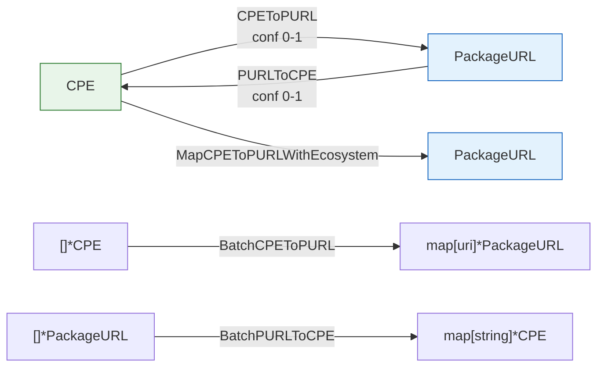

# 🔁 CPE-PURL Mapping

This module converts between CPE (`*CPE`) and Package URL (`*PackageURL`) identifiers. Because the two schemes describe packages differently — CPE by vendor/product/version, PURL by ecosystem/namespace/name — every conversion carries a confidence score in the range `0.0`–`1.0`. Higher values mean a more certain mapping.

## 🔄 CPEToPURL

```go
func CPEToPURL(cpe *CPE) (*PackageURL, float64, error)
```

Converts a CPE into a PackageURL, inferring the ecosystem from the CPE vendor and product names. Returns the mapped PURL and a confidence score (`0.0`–`1.0`); the score is reduced when the version is missing or `*`.

| Parameter | Type | Description |
| --- | --- | --- |
| `cpe` | `*CPE` | The CPE to convert |

| Return | Type | Description |
| --- | --- | --- |
| #1 | `*PackageURL` | The mapped PURL, or `nil` on error |
| #2 | `float64` | Mapping confidence, `0.0`–`1.0` |
| #3 | `error` | Non-nil if `cpe` is nil |

```go
cpe := &cpeskills.CPE{
    Part:        *cpeskills.PartApplication,
    Vendor:      "apache",
    ProductName: "log4j-core",
    Version:     "2.14.1",
}
purl, conf, err := cpeskills.CPEToPURL(cpe)
if err != nil {
    log.Fatal(err)
}
fmt.Println(purl.String(), conf)
// pkg:maven/apache/log4j-core@2.14.1 0.9
```

## 🔄 PURLToCPE

```go
func PURLToCPE(purl *PackageURL) (*CPE, float64, error)
```

Converts a PackageURL into a CPE, inferring the vendor and product from the PURL's ecosystem, namespace, and name. Returns the CPE and a confidence score (`0.0`–`1.0`); the score is reduced when the version is empty or the ecosystem is `EcosystemGeneric`.

| Parameter | Type | Description |
| --- | --- | --- |
| `purl` | `*PackageURL` | The PURL to convert |

| Return | Type | Description |
| --- | --- | --- |
| #1 | `*CPE` | The mapped CPE, or `nil` on error |
| #2 | `float64` | Mapping confidence, `0.0`–`1.0` |
| #3 | `error` | Non-nil if `purl` is nil |

```go
p, _ := cpeskills.ParsePURL("pkg:maven/org.apache.logging.log4j/log4j-core@2.14.1")
cpe, conf, err := cpeskills.PURLToCPE(p)
if err != nil {
    log.Fatal(err)
}
fmt.Println(cpe.Cpe23, conf)
```

## 🎯 MapCPEToPURLWithEcosystem

```go
func MapCPEToPURLWithEcosystem(cpe *CPE, ecosystem Ecosystem) (*PackageURL, error)
```

Converts a CPE into a PURL using a caller-specified ecosystem. Compared to the auto-inferring `CPEToPURL`, this avoids ecosystem ambiguity and is preferable when the target ecosystem is known. The namespace/name layout is ecosystem-specific (e.g. Maven uses the vendor as groupId, npm as `@scope`, Go as a module-path prefix).

| Parameter | Type | Description |
| --- | --- | --- |
| `cpe` | `*CPE` | The CPE to convert |
| `ecosystem` | `Ecosystem` | The target ecosystem |

| Return | Type | Description |
| --- | --- | --- |
| #1 | `*PackageURL` | The mapped PURL, or `nil` on error |
| #2 | `error` | Non-nil if `cpe` is nil or the ecosystem is unknown |

```go
purl, err := cpeskills.MapCPEToPURLWithEcosystem(cpe, cpeskills.EcosystemMaven)
if err != nil {
    log.Fatal(err)
}
fmt.Println(purl.String())
```

## 📦 BatchCPEToPURL

```go
func BatchCPEToPURL(cpes []*CPE) map[string]*PackageURL
```

Converts a batch of CPEs to PURLs. The result map is keyed by each CPE's URI (from `cpe.GetURI()`); CPEs that fail to convert are silently skipped.

| Parameter | Type | Description |
| --- | --- | --- |
| `cpes` | `[]*CPE` | The CPEs to convert |

| Return | Type | Description |
| --- | --- | --- |
| #1 | `map[string]*PackageURL` | Map of CPE URI to mapped PURL |

```go
m := cpeskills.BatchCPEToPURL([]*cpeskills.CPE{cpe1, cpe2})
for uri, purl := range m {
    fmt.Println(uri, "->", purl.String())
}
```

## 📋 BatchPURLToCPE

```go
func BatchPURLToCPE(purls []*PackageURL) map[string]*CPE
```

Converts a batch of PURLs to CPEs. The result map is keyed by each PURL's canonical string (from `purl.String()`); PURLs that fail to convert are silently skipped.

| Parameter | Type | Description |
| --- | --- | --- |
| `purls` | `[]*PackageURL` | The PURLs to convert |

| Return | Type | Description |
| --- | --- | --- |
| #1 | `map[string]*CPE` | Map of PURL string to mapped CPE |

```go
m := cpeskills.BatchPURLToCPE([]*cpeskills.PackageURL{p1, p2})
for s, cpe := range m {
    fmt.Println(s, "->", cpe.Cpe23)
}
```

## 📐 CPE ↔ PURL Mapping Diagram


