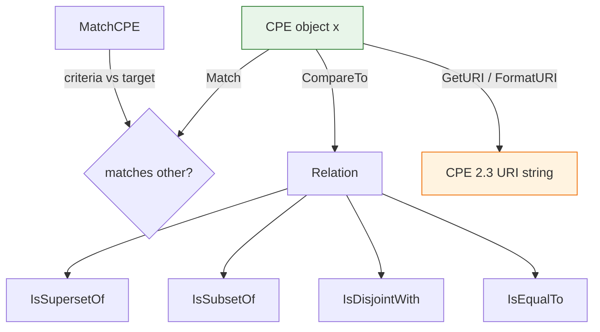

# 📦 CPE Core Type and Methods

`CPE` is the core type of this library, representing a Common Platform Enumeration object. It implements the CPE Name Matching specification, supports parsing and formatting of the 2.3 URI form, and provides set-relation comparisons (superset, subset, disjoint, equal).

## Type: CPE

```go
type CPE struct {
    Cpe23          string   `json:"cpe_23" bson:"cpe_23"`
    Part           Part     `json:"part" bson:"part"`
    Vendor         Vendor   `json:"vendor" bson:"vendor"`
    ProductName    Product  `json:"product_name" bson:"product_name"`
    Version        Version  `json:"version" bson:"version"`
    Update         Update   `json:"update" bson:"update"`
    Edition        Edition  `json:"edition" bson:"edition"`
    Language       Language `json:"language" bson:"language"`
    SoftwareEdition string  `json:"software_edition" bson:"software_edition"`
    TargetSoftware string   `json:"target_software" bson:"target_software"`
    TargetHardware string   `json:"target_hardware" bson:"target_hardware"`
    Other          string   `json:"other" bson:"other"`
    Cve            string   `json:"cve" bson:"cve"`
    Url            string   `json:"url" bson:"url"`
}
```

The fields of the CPE struct correspond to the attributes defined by the CPE 2.3 specification, plus two extension fields: `Cve` (associated vulnerability identifier) and `Url` (information source).

## 🔍 Match

```go
func (x *CPE) Match(other *CPE) bool
```

Reports whether the current CPE matches another CPE, following the CPE Name Matching specification. The matching rules account for the special semantics of the wildcard `*` and the not-applicable marker `-`: identical URIs match directly; `Part` must match exactly; for the remaining attributes, either side being `*` matches, both being `-` matches, and otherwise exact equality is required.

| Parameter | Type | Description |
| --- | --- | --- |
| `other` | `*CPE` | The target CPE to compare against |

| Return | Type | Description |
| --- | --- | --- |
| #1 | `bool` | `true` if they match, `false` otherwise |

```go
package main

import (
    "fmt"
    "github.com/scagogogo/cpe-skills"
)

func main() {
    windowsCPE, _ := cpeskills.ParseCpe23("cpe:2.3:a:microsoft:windows:10:*:*:*:*:*:*:*")
    pattern, _ := cpeskills.ParseCpe23("cpe:2.3:a:microsoft:windows:*:*:*:*:*:*:*:*")

    if pattern.Match(windowsCPE) {
        fmt.Println("matched")
    }
}
```

## ⚙️ GetURI

```go
func (c *CPE) GetURI() string
```

Returns the 2.3-formatted URI string of this CPE object.

| Return | Type | Description |
| --- | --- | --- |
| #1 | `string` | The CPE 2.3 URI string |

```go
cpe, _ := cpeskills.ParseCpe23("cpe:2.3:a:microsoft:windows:10:*:*:*:*:*:*:*")
fmt.Println(cpe.GetURI())
```

## 🧩 FormatURI

```go
func FormatURI(cpe *CPE) string
```

Formats a CPE object into a 2.3 URI string; the package-level counterpart of `GetURI`.

| Parameter | Type | Description |
| --- | --- | --- |
| `cpe` | `*CPE` | The CPE object to format |

| Return | Type | Description |
| --- | --- | --- |
| #1 | `string` | The CPE 2.3 URI string |

```go
cpe := cpeskills.MustParse("cpe:2.3:a:microsoft:windows:10:*:*:*:*:*:*:*")
fmt.Println(cpeskills.FormatURI(cpe))
```

## 🎯 MatchCPE

```go
func MatchCPE(criteria *CPE, target *CPE, options *MatchOptions) bool
```

Reports whether `criteria` matches `target` according to the optional matching options. Passing `nil` for `options` uses the default rules.

| Parameter | Type | Description |
| --- | --- | --- |
| `criteria` | `*CPE` | The matching pattern |
| `target` | `*CPE` | The target CPE being matched |
| `options` | `*MatchOptions` | Matching options, `nil` for defaults |

| Return | Type | Description |
| --- | --- | --- |
| #1 | `bool` | `true` if matched, `false` otherwise |

```go
criteria := cpeskills.MustParse("cpe:2.3:a:microsoft:windows:*:*:*:*:*:*:*:*")
target := cpeskills.MustParse("cpe:2.3:a:microsoft:windows:10:*:*:*:*:*:*:*")
if cpeskills.MatchCPE(criteria, target, nil) {
    fmt.Println("target matches criteria")
}
```

## 📊 CompareTo

```go
func (x *CPE) CompareTo(other *CPE) Relation
```

Compares the current CPE with another and returns the set relation between them.

| Parameter | Type | Description |
| --- | --- | --- |
| `other` | `*CPE` | The other CPE to compare with |

| Return | Type | Description |
| --- | --- | --- |
| #1 | `Relation` | The relation (equal, superset, subset, disjoint, etc.) |

```go
a := cpeskills.MustParse("cpe:2.3:a:microsoft:windows:*:*:*:*:*:*:*:*")
b := cpeskills.MustParse("cpe:2.3:a:microsoft:windows:10:*:*:*:*:*:*:*")
fmt.Println(a.CompareTo(b))
```

## ⬆️ IsSupersetOf

```go
func (x *CPE) IsSupersetOf(other *CPE) bool
```

Reports whether the current CPE is a superset of another.

| Parameter | Type | Description |
| --- | --- | --- |
| `other` | `*CPE` | The other CPE to compare with |

| Return | Type | Description |
| --- | --- | --- |
| #1 | `bool` | `true` if it is a superset, `false` otherwise |

```go
a := cpeskills.MustParse("cpe:2.3:a:microsoft:windows:*:*:*:*:*:*:*:*")
b := cpeskills.MustParse("cpe:2.3:a:microsoft:windows:10:*:*:*:*:*:*:*")
fmt.Println(a.IsSupersetOf(b))
```

## ⬇️ IsSubsetOf

```go
func (x *CPE) IsSubsetOf(other *CPE) bool
```

Reports whether the current CPE is a subset of another.

| Parameter | Type | Description |
| --- | --- | --- |
| `other` | `*CPE` | The other CPE to compare with |

| Return | Type | Description |
| --- | --- | --- |
| #1 | `bool` | `true` if it is a subset, `false` otherwise |

```go
a := cpeskills.MustParse("cpe:2.3:a:microsoft:windows:10:*:*:*:*:*:*:*")
b := cpeskills.MustParse("cpe:2.3:a:microsoft:windows:*:*:*:*:*:*:*:*")
fmt.Println(a.IsSubsetOf(b))
```

## 🚫 IsDisjointWith

```go
func (x *CPE) IsDisjointWith(other *CPE) bool
```

Reports whether the current CPE is disjoint with another (no overlap at all).

| Parameter | Type | Description |
| --- | --- | --- |
| `other` | `*CPE` | The other CPE to compare with |

| Return | Type | Description |
| --- | --- | --- |
| #1 | `bool` | `true` if disjoint, `false` otherwise |

```go
a := cpeskills.MustParse("cpe:2.3:a:microsoft:windows:*:*:*:*:*:*:*:*")
b := cpeskills.MustParse("cpe:2.3:a:adobe:reader:*:*:*:*:*:*:*:*")
fmt.Println(a.IsDisjointWith(b))
```

## 🟰 IsEqualTo

```go
func (x *CPE) IsEqualTo(other *CPE) bool
```

Reports whether the current CPE is equal to another.

| Parameter | Type | Description |
| --- | --- | --- |
| `other` | `*CPE` | The other CPE to compare with |

| Return | Type | Description |
| --- | --- | --- |
| #1 | `bool` | `true` if equal, `false` otherwise |

```go
a := cpeskills.MustParse("cpe:2.3:a:microsoft:windows:10:*:*:*:*:*:*:*")
b := cpeskills.MustParse("cpe:2.3:a:microsoft:windows:10:*:*:*:*:*:*:*")
fmt.Println(a.IsEqualTo(b))
```

## 📐 Type Relation Diagram


