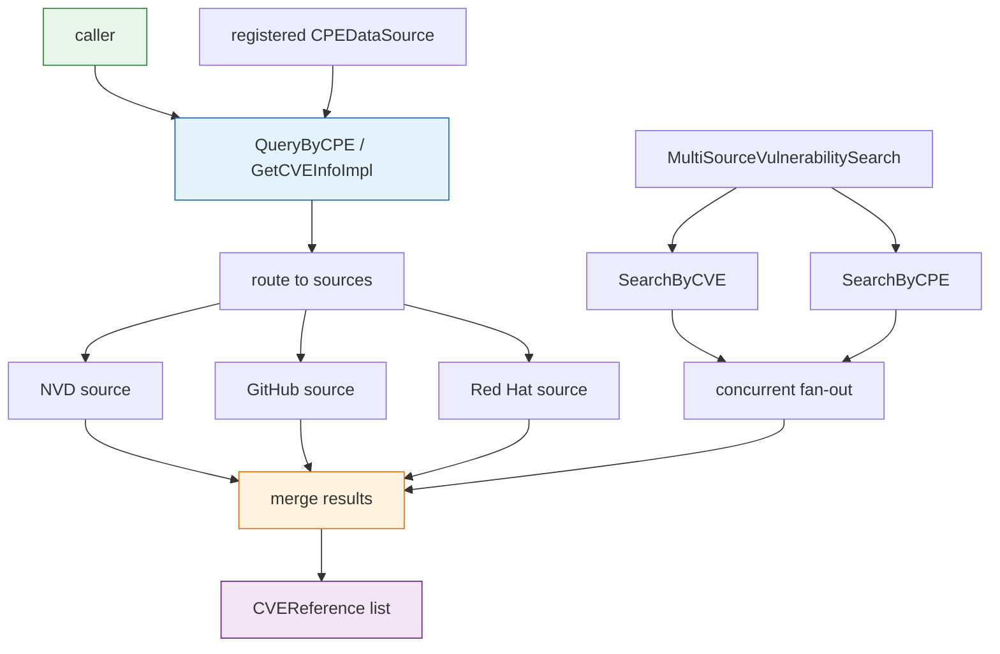

# 🗄️ Datasource

The `datasource` module provides a unified abstraction over vulnerability data sources (NVD, GitHub Security Advisories, Red Hat CVE). It defines a `VulnDataSource` HTTP client with optional authentication and caching, a `MultiSourceVulnerabilitySearch` that fans a query out across several sources concurrently, and a `CPEDataSource` interface plus registry functions for plugging custom providers into the global query path.

## Type: DataSourceType

```go
type DataSourceType string
```

String-typed enum identifying a vulnerability data source. Defined constants:

| Constant | Value | Description |
| --- | --- | --- |
| `DataSourceNVD` | `"NVD"` | NVD (National Vulnerability Database) |
| `DataSourceMITRE` | `"MITRE"` | MITRE CVE database |
| `DataSourceGitHub` | `"GitHub"` | GitHub Security Advisories |
| `DataSourceRedHatCVE` | `"RedHat"` | Red Hat CVE database |
| `DataSourceOWASP` | `"OWASP"` | OWASP data source |
| `DataSourceCustom` | `"Custom"` | Custom data source |

## Type: VulnDataSource

```go
type VulnDataSource struct {
    Type            DataSourceType
    Name            string
    Description     string
    URL             string
    Authentication  *DataSourceAuth
    Client          *http.Client
    LastUpdated     time.Time
    CacheSettings   *CacheSettings
    Options         map[string]interface{}
}
```

Represents a single vulnerability data source. `Client` defaults to an HTTP client with a 60-second timeout. `CacheSettings` is initialized enabled with a 24-hour expiry. `Options` is an arbitrary key/value bag for source-specific configuration.

## Type: DataSourceAuth

```go
type DataSourceAuth struct {
    APIKey   string
    Username string
    Password string
    Token    string
    Headers  map[string]string
}
```

Holds credentials sent with requests to a data source. `Headers` carries arbitrary extra HTTP headers (e.g. `Authorization`).

## Type: CacheSettings

```go
type CacheSettings struct {
    Enabled          bool
    Directory        string
    ExpiryHours      int
    FileNameTemplate string
}
```

Controls on-disk caching of fetched responses. `Enabled` toggles caching; `Directory` is the cache root; `ExpiryHours` is the TTL in hours; `FileNameTemplate` is an optional filename template.

## Type: MultiSourceVulnerabilitySearch

```go
type MultiSourceVulnerabilitySearch struct {
    Sources          []*VulnDataSource
    ConcurrencyLevel int
    TimeoutSeconds   int
    MergeResults     bool
}
```

Queries multiple `VulnDataSource` instances in parallel and optionally merges their results. `NewMultiSourceSearch` defaults `ConcurrencyLevel` to 3, `TimeoutSeconds` to 30, and `MergeResults` to `true`.

## Type: CPEDataSource

```go
type CPEDataSource interface {
    QueryByCPE(cpe string) ([]string, error)
    GetCVEInfo(cveID string) (*CVEReference, error)
}
```

Interface that any CPE data provider implements to participate in the global query path. Implementations are registered via `RegisterDataSource` and queried by the package-level `QueryByCPE` / `GetCVEInfoImpl` functions.

## 🆕 NewVulnDataSource

```go
func NewVulnDataSource(sourceType DataSourceType, name, description, url string) *VulnDataSource
```

Creates a `VulnDataSource` with a default 60-second HTTP client and an enabled cache (24-hour expiry, `./cache` directory). `Options` is initialized to an empty map.

| Parameter | Type | Description |
| --- | --- | --- |
| `sourceType` | `DataSourceType` | One of the `DataSource*` constants |
| `name` | `string` | Human-readable source name |
| `description` | `string` | Short description |
| `url` | `string` | Base URL of the source |

| Return | Type | Description |
| --- | --- | --- |
| #1 | `*VulnDataSource` | The new data source |

```go
ds := cpeskills.NewVulnDataSource(
    cpeskills.DataSourceNVD,
    "NVD",
    "National Vulnerability Database",
    "https://services.nvd.nist.gov/rest/json/cves/2.0",
)
```

## 🔐 SetAuthentication

```go
func (ds *VulnDataSource) SetAuthentication(auth *DataSourceAuth)
```

Attaches authentication credentials to the data source. Subsequent `FetchData` calls carry these credentials.

| Parameter | Type | Description |
| --- | --- | --- |
| `auth` | `*DataSourceAuth` | Credentials to attach |

```go
ds.SetAuthentication(&cpeskills.DataSourceAuth{APIKey: "nvd-api-key"})
```

## 💾 SetCacheSettings

```go
func (ds *VulnDataSource) SetCacheSettings(cache *CacheSettings)
```

Replaces the data source's cache settings.

| Parameter | Type | Description |
| --- | --- | --- |
| `cache` | `*CacheSettings` | New cache settings |

```go
ds.SetCacheSettings(&cpeskills.CacheSettings{
    Enabled:     true,
    Directory:   "/var/cache/cpe",
    ExpiryHours: 12,
})
```

## 🌐 FetchData

```go
func (ds *VulnDataSource) FetchData(endpoint string) ([]byte, error)
```

Performs an HTTP GET against `URL + endpoint`, applying authentication headers and cache settings, and returns the raw response body.

| Parameter | Type | Description |
| --- | --- | --- |
| `endpoint` | `string` | Path appended to the source `URL` |

| Return | Type | Description |
| --- | --- | --- |
| #1 | `[]byte` | Raw response body |
| #2 | `error` | Network or HTTP error |

```go
body, err := ds.FetchData("/cves?cveId=CVE-2021-44228")
```

## 📋 GetVulnerabilities

```go
func (ds *VulnDataSource) GetVulnerabilities(params map[string]string) ([]*CVEReference, error)
```

Queries the source with the given query parameters and returns parsed `CVEReference` records. Response parsing is dispatched by source type (NVD, GitHub, Red Hat).

| Parameter | Type | Description |
| --- | --- | --- |
| `params` | `map[string]string` | Source-specific query parameters |

| Return | Type | Description |
| --- | --- | --- |
| #1 | `[]*CVEReference` | Parsed vulnerability records |
| #2 | `error` | Fetch or parse error |

```go
cves, err := ds.GetVulnerabilities(map[string]string{"keyword": "log4j"})
```

## 🔎 GetVulnerabilityById

```go
func (ds *VulnDataSource) GetVulnerabilityById(cveID string) (*CVEReference, error)
```

Fetches a single vulnerability by CVE ID from the source. The ID is normalized via `cve.Format` before querying.

| Parameter | Type | Description |
| --- | --- | --- |
| `cveID` | `string` | CVE identifier, e.g. `"CVE-2021-44228"` |

| Return | Type | Description |
| --- | --- | --- |
| #1 | `*CVEReference` | The matching vulnerability, `nil` if not found |
| #2 | `error` | Fetch or parse error |

```go
cve, err := ds.GetVulnerabilityById("CVE-2021-44228")
```

## 🧩 SearchVulnerabilitiesByCPE

```go
func (ds *VulnDataSource) SearchVulnerabilitiesByCPE(cpe *CPE) ([]*CVEReference, error)
```

Searches the source for vulnerabilities affecting the given CPE.

| Parameter | Type | Description |
| --- | --- | --- |
| `cpe` | `*CPE` | The CPE to search vulnerabilities for |

| Return | Type | Description |
| --- | --- | --- |
| #1 | `[]*CVEReference` | Vulnerabilities affecting the CPE |
| #2 | `error` | Search error |

```go
cpe, _ := cpeskills.ParseCpe23("cpe:2.3:a:apache:log4j:2.0:*:*:*:*:*:*:*")
cves, err := ds.SearchVulnerabilitiesByCPE(cpe)
```

## 🔀 NewMultiSourceSearch

```go
func NewMultiSourceSearch(sources []*VulnDataSource) *MultiSourceVulnerabilitySearch
```

Builds a multi-source searcher over the given sources with default concurrency 3, 30-second timeout, and result merging enabled.

| Parameter | Type | Description |
| --- | --- | --- |
| `sources` | `[]*VulnDataSource` | Sources to query in parallel |

| Return | Type | Description |
| --- | --- | --- |
| #1 | `*MultiSourceVulnerabilitySearch` | The new searcher |

```go
ms := cpeskills.NewMultiSourceSearch([]*cpeskills.VulnDataSource{nvd, redhat})
```

## 🔍 SearchByCVE

```go
func (ms *MultiSourceVulnerabilitySearch) SearchByCVE(cveID string) ([]*CVEReference, error)
```

Queries every source for the given CVE ID concurrently, merges the results (deduplicating by CVE ID) when `MergeResults` is `true`, and respects `TimeoutSeconds` and `ConcurrencyLevel`.

| Parameter | Type | Description |
| --- | --- | --- |
| `cveID` | `string` | CVE identifier |

| Return | Type | Description |
| --- | --- | --- |
| #1 | `[]*CVEReference` | Merged vulnerability records |
| #2 | `error` | Aggregate search error |

```go
cves, err := ms.SearchByCVE("CVE-2021-44228")
```

## 🔍 SearchByCPE

```go
func (ms *MultiSourceVulnerabilitySearch) SearchByCPE(cpe *CPE) ([]*CVEReference, error)
```

Queries every source for vulnerabilities affecting the given CPE concurrently and merges the results.

| Parameter | Type | Description |
| --- | --- | --- |
| `cpe` | `*CPE` | The CPE to search for |

| Return | Type | Description |
| --- | --- | --- |
| #1 | `[]*CVEReference` | Merged vulnerability records |
| #2 | `error` | Search error |

```go
cves, err := ms.SearchByCPE(cpe)
```

## 🏗️ CreateNVDDataSource

```go
func CreateNVDDataSource(apiKey string) *VulnDataSource
```

Returns a preconfigured NVD `VulnDataSource` (API 2.0 base URL). When `apiKey` is non-empty it is attached as authentication to benefit from higher rate limits.

| Parameter | Type | Description |
| --- | --- | --- |
| `apiKey` | `string` | Optional NVD API key; empty string for anonymous access |

| Return | Type | Description |
| --- | --- | --- |
| #1 | `*VulnDataSource` | Configured NVD data source |

```go
nvd := cpeskills.CreateNVDDataSource("my-nvd-api-key")
```

## 🐙 CreateGitHubDataSource

```go
func CreateGitHubDataSource(token string) *VulnDataSource
```

Returns a preconfigured GitHub Security Advisories `VulnDataSource`. The `token` is attached as authentication for GraphQL API access.

| Parameter | Type | Description |
| --- | --- | --- |
| `token` | `string` | GitHub personal access token |

| Return | Type | Description |
| --- | --- | --- |
| #1 | `*VulnDataSource` | Configured GitHub data source |

```go
gh := cpeskills.CreateGitHubDataSource("ghp_xxx")
```

## 🎩 CreateRedHatDataSource

```go
func CreateRedHatDataSource() *VulnDataSource
```

Returns a preconfigured Red Hat CVE `VulnDataSource`. Red Hat's public CVE API requires no authentication.

| Return | Type | Description |
| --- | --- | --- |
| #1 | `*VulnDataSource` | Configured Red Hat data source |

```go
rh := cpeskills.CreateRedHatDataSource()
```

## ⚡ CreateDefaultMultiSourceSearch

```go
func CreateDefaultMultiSourceSearch() *MultiSourceVulnerabilitySearch
```

Returns a `MultiSourceVulnerabilitySearch` preconfigured with the default NVD and Red Hat sources.

| Return | Type | Description |
| --- | --- | --- |
| #1 | `*MultiSourceVulnerabilitySearch` | Default multi-source searcher |

```go
ms := cpeskills.CreateDefaultMultiSourceSearch()
cves, _ := ms.SearchByCVE("CVE-2021-44228")
```

## 🌐 QueryByCPE

```go
func QueryByCPE(cpe string) ([]string, error)
```

Package-level helper that queries all registered data sources for CVE IDs related to the given CPE string. Sources must be initialized beforehand (e.g. via `DownloadAllNVDData`).

| Parameter | Type | Description |
| --- | --- | --- |
| `cpe` | `string` | CPE identifier, 2.2 or 2.3 format |

| Return | Type | Description |
| --- | --- | --- |
| #1 | `[]string` | Related CVE IDs |
| #2 | `error` | Query error |

```go
cveIDs, err := cpeskills.QueryByCPE("cpe:2.3:a:apache:log4j:2.0:*:*:*:*:*:*:*")
```

## ℹ️ GetCVEInfoImpl

```go
func GetCVEInfoImpl(cveID string) (*CVEReference, error)
```

Package-level helper that fetches detailed information for a CVE ID from the registered data sources. The ID is normalized to standard form before querying.

| Parameter | Type | Description |
| --- | --- | --- |
| `cveID` | `string` | CVE identifier, e.g. `"CVE-2021-44228"` |

| Return | Type | Description |
| --- | --- | --- |
| #1 | `*CVEReference` | Vulnerability details, `nil` if not found |
| #2 | `error` | Query error |

```go
info, err := cpeskills.GetCVEInfoImpl("CVE-2021-44228")
```

## 📥 RegisterDataSource

```go
func RegisterDataSource(dataSource CPEDataSource)
```

Registers a custom `CPEDataSource` so the package-level query functions can use it.

| Parameter | Type | Description |
| --- | --- | --- |
| `dataSource` | `CPEDataSource` | Custom data source implementing the interface |

```go
cpeskills.RegisterDataSource(myDataSource)
```

## 🧹 ClearDataSources

```go
func ClearDataSources()
```

Removes all registered data sources, resetting the global query state.

```go
cpeskills.ClearDataSources()
```

## 🧭 Datasource Query Flow


