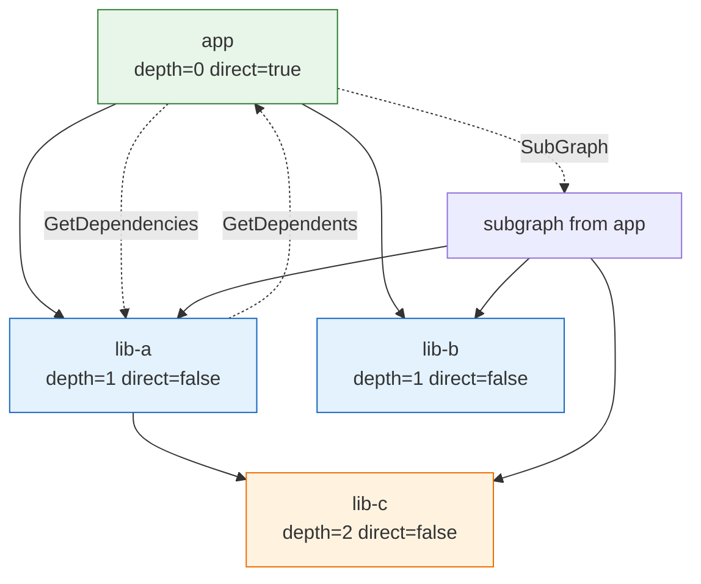

# 🕸️ Dependency Graph

`DependencyGraph` models the dependency relationships between SBOM components, enabling transitive vulnerability analysis and reachability checks. It is an adjacency-list graph keyed by node ID. This module declares the graph and node types and the operations for building, traversing, and querying the graph.

## Type: DependencyGraph

```go
type DependencyGraph struct {
    Nodes map[string]*DependencyNode `json:"nodes"`
    Edges map[string][]string        `json:"edges"`
}
```

| Field | Type | Description |
| --- | --- | --- |
| `Nodes` | `map[string]*DependencyNode` | All nodes in the graph (nodeID → node) |
| `Edges` | `map[string][]string` | Edges: nodeID → list of depended-upon nodeIDs |

## Type: DependencyNode

```go
type DependencyNode struct {
    ID        string          `json:"id"`
    Component *SBOMComponent  `json:"component"`
    Depth     int             `json:"depth"`
    Direct    bool            `json:"direct"`
}
```

| Field | Type | Description |
| --- | --- | --- |
| `ID` | `string` | Unique node identifier |
| `Component` | `*SBOMComponent` | Associated SBOM component |
| `Depth` | `int` | Depth in the dependency tree (0 = direct dependency) |
| `Direct` | `bool` | Whether it is a direct dependency |

## 🆕 NewDependencyGraph

```go
func NewDependencyGraph() *DependencyGraph
```

Creates a new empty dependency graph with initialized `Nodes` and `Edges` maps.

| Return | Type | Description |
| --- | --- | --- |
| #1 | `*DependencyGraph` | A new empty graph |

```go
g := cpeskills.NewDependencyGraph()
```

## ➕ AddComponent

```go
func (g *DependencyGraph) AddComponent(component *SBOMComponent, dependencies []*SBOMComponent)
```

Adds a component and its dependencies to the graph. The component is registered as a direct node (depth 0); each dependency is registered as a transitive node (depth 1) and an edge is recorded from the component to each dependency. Node IDs come from `component.BomRef`, generated when empty.

| Parameter | Type | Description |
| --- | --- | --- |
| `component` | `*SBOMComponent` | The component to add |
| `dependencies` | `[]*SBOMComponent` | The component's direct dependencies |

```go
g.AddComponent(app, []*cpeskills.SBOMComponent{dep1, dep2})
```

## ➕ AddNode

```go
func (g *DependencyGraph) AddNode(component *SBOMComponent)
```

Adds a standalone component as a direct node, with no edges. The node ID comes from `component.BomRef`, generated when empty.

| Parameter | Type | Description |
| --- | --- | --- |
| `component` | `*SBOMComponent` | The component to add |

```go
g.AddNode(root)
```

## 🔗 AddEdge

```go
func (g *DependencyGraph) AddEdge(from, to string)
```

Adds a dependency edge from `from` to `to`. If either node does not yet exist, an empty node is created for it (`from` marked direct, `to` marked transitive).

| Parameter | Type | Description |
| --- | --- | --- |
| `from` | `string` | The depending node ID |
| `to` | `string` | The depended-upon node ID |

```go
g.AddEdge("app", "lib-a")
```

## 👇 GetDependencies

```go
func (g *DependencyGraph) GetDependencies(nodeID string) []*DependencyNode
```

Returns the direct dependency nodes of `nodeID`, or `nil` if the node has no outgoing edges.

| Parameter | Type | Description |
| --- | --- | --- |
| `nodeID` | `string` | The node to inspect |

| Return | Type | Description |
| --- | --- | --- |
| #1 | `[]*DependencyNode` | Direct dependency nodes, or `nil` |

```go
deps := g.GetDependencies("app")
for _, d := range deps {
    fmt.Println(d.ID)
}
```

## 👆 GetDependents

```go
func (g *DependencyGraph) GetDependents(nodeID string) []*DependencyNode
```

Returns the nodes that depend on `nodeID` (reverse dependencies).

| Parameter | Type | Description |
| --- | --- | --- |
| `nodeID` | `string` | The node to inspect |

| Return | Type | Description |
| --- | --- | --- |
| #1 | `[]*DependencyNode` | Nodes that depend on `nodeID` |

```go
revDeps := g.GetDependents("lib-a")
```

## 🛣️ GetDependencyPath

```go
func (g *DependencyGraph) GetDependencyPath(from, to string) ([]string, error)
```

Finds a dependency path from `from` to `to` using BFS. Returns the path as an ordered list of node IDs.

| Parameter | Type | Description |
| --- | --- | --- |
| `from` | `string` | The start node ID |
| `to` | `string` | The target node ID |

| Return | Type | Description |
| --- | --- | --- |
| #1 | `[]string` | The path of node IDs from `from` to `to` |
| #2 | `error` | Non-nil if a node is missing or no path exists |

```go
path, err := g.GetDependencyPath("app", "lib-c")
if err != nil {
    log.Fatal(err)
}
fmt.Println(strings.Join(path, " -> "))
```

## 🔢 TopologicalSort

```go
func (g *DependencyGraph) TopologicalSort() ([]*DependencyNode, error)
```

Returns the graph's nodes in topological order. Returns an error if the graph contains a cycle.

| Return | Type | Description |
| --- | --- | --- |
| #1 | `[]*DependencyNode` | Nodes in topological order |
| #2 | `error` | Non-nil if the graph contains a cycle |

```go
sorted, err := g.TopologicalSort()
if err != nil {
    log.Fatal(err) // graph contains a cycle
}
```

## 🌲 SubGraph

```go
func (g *DependencyGraph) SubGraph(rootID string) *DependencyGraph
```

Extracts the subgraph reachable from `rootID` via DFS.

| Parameter | Type | Description |
| --- | --- | --- |
| `rootID` | `string` | The subgraph root node ID |

| Return | Type | Description |
| --- | --- | --- |
| #1 | `*DependencyGraph` | A new graph containing only the reachable nodes and edges |

```go
sub := g.SubGraph("app")
```

## 🐛 FindTransitiveVulnerabilities

```go
func (g *DependencyGraph) FindTransitiveVulnerabilities(cveData *NVDCPEData) []*VulnerabilityFinding
```

Walks the graph and returns vulnerability findings for every component (direct and transitive) whose CPE matches a CVE in `cveData`. Each finding's `Reachability` is set to `"direct"` or `"transitive"` based on the node's `Direct` flag.

| Parameter | Type | Description |
| --- | --- | --- |
| `cveData` | `*NVDCPEData` | The NVD CPE dataset to query |

| Return | Type | Description |
| --- | --- | --- |
| #1 | `[]*VulnerabilityFinding` | Findings for affected components |

```go
findings := g.FindTransitiveVulnerabilities(nvdData)
```

## 🔢 NodeCount

```go
func (g *DependencyGraph) NodeCount() int
```

Returns the number of nodes in the graph.

| Return | Type | Description |
| --- | --- | --- |
| #1 | `int` | Node count |

```go
fmt.Println(g.NodeCount())
```

## 🔢 EdgeCount

```go
func (g *DependencyGraph) EdgeCount() int
```

Returns the total number of edges in the graph.

| Return | Type | Description |
| --- | --- | --- |
| #1 | `int` | Edge count |

```go
fmt.Println(g.EdgeCount())
```

## 👇 GetDirectDependencies

```go
func (g *DependencyGraph) GetDirectDependencies() []*DependencyNode
```

Returns all direct-dependency nodes, sorted by `Depth` ascending.

| Return | Type | Description |
| --- | --- | --- |
| #1 | `[]*DependencyNode` | Direct-dependency nodes sorted by depth |

```go
direct := g.GetDirectDependencies()
```

## 👇 GetTransitiveDependencies

```go
func (g *DependencyGraph) GetTransitiveDependencies() []*DependencyNode
```

Returns all transitive-dependency nodes (those with `Direct == false`).

| Return | Type | Description |
| --- | --- | --- |
| #1 | `[]*DependencyNode` | Transitive-dependency nodes |

```go
trans := g.GetTransitiveDependencies()
```

## 📊 ComputeDepths

```go
func (g *DependencyGraph) ComputeDepths()
```

Computes the `Depth` of every node via BFS from each root node (nodes with no incoming edges). Root nodes get depth 0, their direct dependencies depth 1, and so on.

```go
g.ComputeDepths()
for _, n := range g.Nodes {
    fmt.Println(n.ID, n.Depth)
}
```

## 📐 Dependency Graph Diagram


