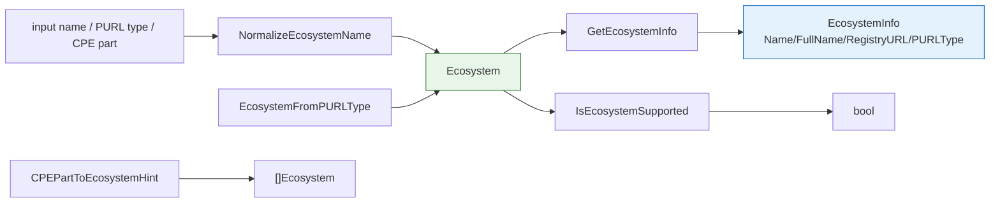

# 🌐 Ecosystem

`Ecosystem` identifies the package manager / registry a software package belongs to — a core concept for PURL and SBOM handling. This module declares the `Ecosystem` type, all exported ecosystem constants, the `EcosystemInfo` metadata struct, and helpers for lookup, normalization, and CPE-based hinting.

## Type: Ecosystem

```go
type Ecosystem string
```

A string-typed identifier for a package ecosystem.

## Constants

```go
const (
    EcosystemNPM      Ecosystem = "npm"
    EcosystemMaven    Ecosystem = "maven"
    EcosystemPyPI     Ecosystem = "pypi"
    EcosystemGo       Ecosystem = "golang"
    EcosystemNuGet    Ecosystem = "nuget"
    EcosystemDocker   Ecosystem = "docker"
    EcosystemRubyGems Ecosystem = "gem"
    EcosystemCargo    Ecosystem = "cargo"
    EcosystemComposer Ecosystem = "composer"
    EcosystemConan    Ecosystem = "conan"
    EcosystemConda    Ecosystem = "conda"
    EcosystemHex      Ecosystem = "hex"
    EcosystemPub      Ecosystem = "pub"
    EcosystemSwift    Ecosystem = "swift"
    EcosystemAlpine   Ecosystem = "alpine"
    EcosystemDebian   Ecosystem = "deb"
    EcosystemRPM      Ecosystem = "rpm"
    EcosystemGeneric  Ecosystem = "generic"
)
```

| Constant | Value | Description |
| --- | --- | --- |
| `EcosystemNPM` | `npm` | Node.js package manager (npm) |
| `EcosystemMaven` | `maven` | Java/Kotlin projects (Maven Central, Google Android) |
| `EcosystemPyPI` | `pypi` | Python Package Index |
| `EcosystemGo` | `golang` | Go modules |
| `EcosystemNuGet` | `nuget` | .NET package manager |
| `EcosystemDocker` | `docker` | Docker container images |
| `EcosystemRubyGems` | `gem` | Ruby package manager |
| `EcosystemCargo` | `cargo` | Rust package manager |
| `EcosystemComposer` | `composer` | PHP package manager |
| `EcosystemConan` | `conan` | C/C++ package manager |
| `EcosystemConda` | `conda` | Cross-language package manager |
| `EcosystemHex` | `hex` | Elixir/Erlang ecosystem |
| `EcosystemPub` | `pub` | Dart/Flutter package manager |
| `EcosystemSwift` | `swift` | Swift package manager |
| `EcosystemAlpine` | `alpine` | Alpine Linux (apk) packages |
| `EcosystemDebian` | `deb` | Debian/Ubuntu (deb) packages |
| `EcosystemRPM` | `rpm` | Red Hat/Fedora (rpm) packages |
| `EcosystemGeneric` | `generic` | Generic / unknown ecosystem |

## Type: EcosystemInfo

```go
type EcosystemInfo struct {
    Name        string
    FullName    string
    RegistryURL string
    PURLType    string
}
```

| Field | Type | Description |
| --- | --- | --- |
| `Name` | `string` | Ecosystem name |
| `FullName` | `string` | Ecosystem full name |
| `RegistryURL` | `string` | Default registry URL |
| `PURLType` | `string` | PURL `type` field value |

## ℹ️ GetEcosystemInfo

```go
func GetEcosystemInfo(ecosystem Ecosystem) (EcosystemInfo, error)
```

Returns the metadata for the given ecosystem.

| Parameter | Type | Description |
| --- | --- | --- |
| `ecosystem` | `Ecosystem` | The ecosystem to look up |

| Return | Type | Description |
| --- | --- | --- |
| #1 | `EcosystemInfo` | The ecosystem metadata, zero-value on error |
| #2 | `error` | Non-nil if the ecosystem is unknown |

```go
info, err := cpeskills.GetEcosystemInfo(cpeskills.EcosystemMaven)
if err != nil {
    log.Fatal(err)
}
fmt.Println(info.FullName, info.RegistryURL)
// Maven Central https://repo.maven.apache.org/maven2
```

## 📜 ListEcosystems

```go
func ListEcosystems() []Ecosystem
```

Returns all registered ecosystems. The order is not specified (map iteration order).

| Return | Type | Description |
| --- | --- | --- |
| #1 | `[]Ecosystem` | All registered ecosystems |

```go
for _, eco := range cpeskills.ListEcosystems() {
    fmt.Println(eco)
}
```

## 🔁 EcosystemFromPURLType

```go
func EcosystemFromPURLType(purlType string) Ecosystem
```

Maps a PURL `type` field to an `Ecosystem`, returning `EcosystemGeneric` when no ecosystem matches.

| Parameter | Type | Description |
| --- | --- | --- |
| `purlType` | `string` | The PURL type string |

| Return | Type | Description |
| --- | --- | --- |
| #1 | `Ecosystem` | The matching ecosystem, or `EcosystemGeneric` |

```go
fmt.Println(cpeskills.EcosystemFromPURLType("cargo")) // cargo
fmt.Println(cpeskills.EcosystemFromPURLType("unknown")) // generic
```

## ✅ IsEcosystemSupported

```go
func IsEcosystemSupported(ecosystem Ecosystem) bool
```

Reports whether the ecosystem is registered.

| Parameter | Type | Description |
| --- | --- | --- |
| `ecosystem` | `Ecosystem` | The ecosystem to check |

| Return | Type | Description |
| --- | --- | --- |
| #1 | `bool` | `true` if the ecosystem is registered |

```go
fmt.Println(cpeskills.IsEcosystemSupported(cpeskills.EcosystemNPM)) // true
```

## 💡 CPEPartToEcosystemHint

```go
func CPEPartToEcosystemHint(part *Part) []Ecosystem
```

Returns a heuristic list of ecosystems that a CPE `Part` might belong to, used to assist CPE→PURL mapping. Applications (`a`) map to most package ecosystems; operating systems (`o`) map to Linux-distribution ecosystems; hardware (`h`) maps to `EcosystemGeneric`. Returns `nil` when `part` is nil.

| Parameter | Type | Description |
| --- | --- | --- |
| `part` | `*Part` | The CPE part |

| Return | Type | Description |
| --- | --- | --- |
| #1 | `[]Ecosystem` | Candidate ecosystems, or `nil` if `part` is nil |

```go
hints := cpeskills.CPEPartToEcosystemHint(cpeskills.PartApplication)
fmt.Println(hints) // [npm maven pypi golang ...]
```

## 🧹 NormalizeEcosystemName

```go
func NormalizeEcosystemName(name string) (Ecosystem, error)
```

Normalizes an ecosystem name, accepting common aliases such as `node.js` → `EcosystemNPM`, `java` → `EcosystemMaven`, `python` → `EcosystemPyPI`. Falls back to a direct `Ecosystem(name)` match when no alias applies.

| Parameter | Type | Description |
| --- | --- | --- |
| `name` | `string` | The name or alias to normalize |

| Return | Type | Description |
| --- | --- | --- |
| #1 | `Ecosystem` | The normalized ecosystem, empty on error |
| #2 | `error` | Non-nil if the name is unknown |

```go
eco, err := cpeskills.NormalizeEcosystemName("node.js")
if err != nil {
    log.Fatal(err)
}
fmt.Println(eco) // npm
```

## 📐 Ecosystem Registry Diagram


