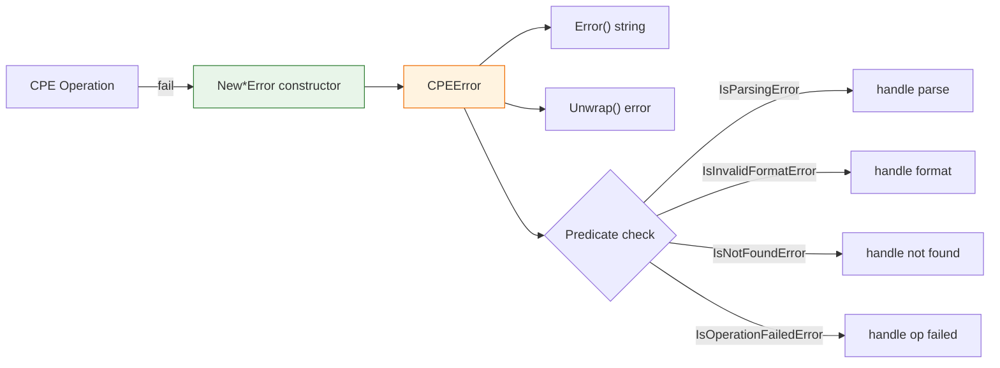

# ⚠️ Error Types

The `cpeskills` package exposes a unified error type `CPEError` plus a set of typed constructors and predicate helpers so callers can branch on the specific failure category.

## Type: ErrorType

```go
type ErrorType int
```

Enumerates the categories of errors that can occur during CPE operations.

### Constants

| Constant | Type | Value | Description |
| --- | --- | --- | --- |
| `ErrorTypeParsingFailed` | `ErrorType` | `0` (iota) | CPE string parsing failed |
| `ErrorTypeInvalidFormat` | `ErrorType` | `1` | CPE format is invalid |
| `ErrorTypeInvalidPart` | `ErrorType` | `2` | CPE part value is invalid |
| `ErrorTypeInvalidAttribute` | `ErrorType` | `3` | CPE attribute value is invalid |
| `ErrorTypeNotFound` | `ErrorType` | `4` | Requested resource or object not found |
| `ErrorTypeOperationFailed` | `ErrorType` | `5` | A CPE-related operation failed |

```go
_ = cpeskills.ErrorTypeParsingFailed
_ = cpeskills.ErrorTypeInvalidFormat
_ = cpeskills.ErrorTypeInvalidPart
_ = cpeskills.ErrorTypeInvalidAttribute
_ = cpeskills.ErrorTypeNotFound
_ = cpeskills.ErrorTypeOperationFailed
```

## Type: CPEError

```go
type CPEError struct {
    Type      ErrorType
    Message   string
    CPEString string
    Err       error
}
```

The unified error struct for all CPE operations.

| Field | Type | Description |
| --- | --- | --- |
| `Type` | `ErrorType` | The error category |
| `Message` | `string` | Human-readable error description |
| `CPEString` | `string` | The CPE string related to the error |
| `Err` | `error` | The underlying original error, if any |

## 📝 Error

```go
func (e *CPEError) Error() string
```

Implements the standard `error` interface. If `CPEString` is set, the message includes it as `Message: CPEString`.

| Return | Type | Description |
| --- | --- | --- |
| #1 | `string` | The formatted error message |

```go
err := cpeskills.NewInvalidFormatError("cpe:2.3:INVALID FORMAT")
fmt.Println(err.Error()) // invalid CPE format: cpe:2.3:INVALID FORMAT
```

## 🔗 Unwrap

```go
func (e *CPEError) Unwrap() error
```

Returns the wrapped underlying error, enabling `errors.Is` and `errors.As` (Go 1.13+ error chains).

| Return | Type | Description |
| --- | --- | --- |
| #1 | `error` | The original error, or `nil` if none |

```go
if cpeErr, ok := err.(*cpeskills.CPEError); ok {
    if inner := cpeErr.Unwrap(); inner != nil {
        log.Println("caused by:", inner)
    }
}
```

## 🆕 NewParsingError

```go
func NewParsingError(cpeString string, err error) *CPEError
```

Creates an error representing a CPE string parsing failure.

| Parameter | Type | Description |
| --- | --- | --- |
| `cpeString` | `string` | The CPE string that could not be parsed |
| `err` | `error` | The underlying error that caused parsing to fail |

| Return | Type | Description |
| --- | --- | --- |
| #1 | `*CPEError` | A `CPEError` with `Type == ErrorTypeParsingFailed` |

```go
return cpeskills.NewParsingError(cpeStr, err)
```

## 🚫 NewInvalidFormatError

```go
func NewInvalidFormatError(cpeString string) *CPEError
```

Creates an error indicating the CPE format is invalid.

| Parameter | Type | Description |
| --- | --- | --- |
| `cpeString` | `string` | The CPE string with invalid format |

| Return | Type | Description |
| --- | --- | --- |
| #1 | `*CPEError` | A `CPEError` with `Type == ErrorTypeInvalidFormat` |

```go
return cpeskills.NewInvalidFormatError(cpeStr)
```

## 🧩 NewInvalidPartError

```go
func NewInvalidPartError(part string) *CPEError
```

Creates an error indicating an invalid CPE part value.

| Parameter | Type | Description |
| --- | --- | --- |
| `part` | `string` | The invalid part value |

| Return | Type | Description |
| --- | --- | --- |
| #1 | `*CPEError` | A `CPEError` with `Type == ErrorTypeInvalidPart` |

```go
return cpeskills.NewInvalidPartError(part)
```

## 🏷️ NewInvalidAttributeError

```go
func NewInvalidAttributeError(attribute, value string) *CPEError
```

Creates an error indicating an invalid CPE attribute value.

| Parameter | Type | Description |
| --- | --- | --- |
| `attribute` | `string` | The attribute name |
| `value` | `string` | The invalid attribute value |

| Return | Type | Description |
| --- | --- | --- |
| #1 | `*CPEError` | A `CPEError` with `Type == ErrorTypeInvalidAttribute` |

```go
return cpeskills.NewInvalidAttributeError("product", product)
```

## 🔍 NewNotFoundError

```go
func NewNotFoundError(what string) *CPEError
```

Creates an error indicating a resource was not found.

| Parameter | Type | Description |
| --- | --- | --- |
| `what` | `string` | Description of the resource that was not found |

| Return | Type | Description |
| --- | --- | --- |
| #1 | `*CPEError` | A `CPEError` with `Type == ErrorTypeNotFound` |

```go
return cpeskills.NewNotFoundError(fmt.Sprintf("CPE with ID %s", cpeID))
```

## ⚙️ NewOperationFailedError

```go
func NewOperationFailedError(operation string, err error) *CPEError
```

Creates an error indicating an operation failed.

| Parameter | Type | Description |
| --- | --- | --- |
| `operation` | `string` | Description of the failed operation |
| `err` | `error` | The underlying error that caused the failure |

| Return | Type | Description |
| --- | --- | --- |
| #1 | `*CPEError` | A `CPEError` with `Type == ErrorTypeOperationFailed` |

```go
return cpeskills.NewOperationFailedError("save CPE to storage", err)
```

## ❓ IsParsingError

```go
func IsParsingError(err error) bool
```

Returns `true` if `err` is a `*CPEError` with `Type == ErrorTypeParsingFailed`.

| Parameter | Type | Description |
| --- | --- | --- |
| `err` | `error` | The error to check |

| Return | Type | Description |
| --- | --- | --- |
| #1 | `bool` | `true` if it is a parsing error |

```go
if cpeskills.IsParsingError(err) {
    log.Printf("parsing error: %v", err)
}
```

## ❓ IsInvalidFormatError

```go
func IsInvalidFormatError(err error) bool
```

Returns `true` if `err` is a `*CPEError` with `Type == ErrorTypeInvalidFormat`.

| Parameter | Type | Description |
| --- | --- | --- |
| `err` | `error` | The error to check |

| Return | Type | Description |
| --- | --- | --- |
| #1 | `bool` | `true` if it is an invalid-format error |

```go
if cpeskills.IsInvalidFormatError(err) { /* ... */ }
```

## ❓ IsInvalidPartError

```go
func IsInvalidPartError(err error) bool
```

Returns `true` if `err` is a `*CPEError` with `Type == ErrorTypeInvalidPart`.

| Parameter | Type | Description |
| --- | --- | --- |
| `err` | `error` | The error to check |

| Return | Type | Description |
| --- | --- | --- |
| #1 | `bool` | `true` if it is an invalid-part error |

```go
if cpeskills.IsInvalidPartError(err) { /* ... */ }
```

## ❓ IsInvalidAttributeError

```go
func IsInvalidAttributeError(err error) bool
```

Returns `true` if `err` is a `*CPEError` with `Type == ErrorTypeInvalidAttribute`.

| Parameter | Type | Description |
| --- | --- | --- |
| `err` | `error` | The error to check |

| Return | Type | Description |
| --- | --- | --- |
| #1 | `bool` | `true` if it is an invalid-attribute error |

```go
if cpeskills.IsInvalidAttributeError(err) { /* ... */ }
```

## ❓ IsNotFoundError

```go
func IsNotFoundError(err error) bool
```

Returns `true` if `err` is a `*CPEError` with `Type == ErrorTypeNotFound`.

| Parameter | Type | Description |
| --- | --- | --- |
| `err` | `error` | The error to check |

| Return | Type | Description |
| --- | --- | --- |
| #1 | `bool` | `true` if it is a not-found error |

```go
if cpeskills.IsNotFoundError(err) { /* ... */ }
```

## ❓ IsOperationFailedError

```go
func IsOperationFailedError(err error) bool
```

Returns `true` if `err` is a `*CPEError` with `Type == ErrorTypeOperationFailed`.

| Parameter | Type | Description |
| --- | --- | --- |
| `err` | `error` | The error to check |

| Return | Type | Description |
| --- | --- | --- |
| #1 | `bool` | `true` if it is an operation-failed error |

```go
if cpeskills.IsOperationFailedError(err) { /* ... */ }
```

## 🧭 Error Handling Flow


