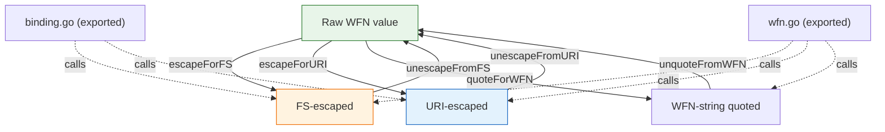

# 🔣 Escaping (Internal)

The `escaping` module implements the character-escaping rules defined by NISTIR 7695 for binding a `WFN` to the FS (formatted string) and URI forms, plus the quoting rules used by the WFN string representation.

> **This module is entirely internal.** Every identifier declared in `escaping.go` — including all functions and the percent-encoding maps — starts with a lowercase letter and is therefore **unexported**. There are no exported functions, types, variables, or constants in this module. The escaping behavior is exposed to callers only indirectly, through the `binding` module (`BindToFS`, `UnbindFS`, `BindToURI`, `UnbindURI`) and the `wfn` module (`FromCPE23String`, `ToCPE23String`, `FromCPE22String`, `ToCPE22String`, `WFNString`).

The following unexported helpers are documented here for reference and to clarify the escaping rules they implement. They cannot be called from outside the `cpeskills` package.

## Internal FS escapers

```go
func escapeForFS(value string) string
func unescapeFromFS(value string) string
```

`escapeForFS` escapes a raw WFN value for the CPE 2.3 FS form: the characters `.`, `-`, `_` are escaped with a backslash, and other non-alphanumeric characters are percent-encoded per NISTIR 7695. `unescapeFromFS` reverses this. Logical values (`*`, `-`) and the empty string pass through unchanged.

## Internal URI escapers

```go
func escapeForURI(value string) string
func unescapeFromURI(value string) string
```

`escapeForURI` escapes a raw WFN value for the CPE 2.2 URI form: every non-alphanumeric character is percent-encoded. `unescapeFromURI` reverses this. Logical values and the empty string pass through unchanged.

## Internal WFN-string quoters

```go
func quoteForWFN(value string) string
func unquoteFromWFN(value string) string
```

`quoteForWFN` escapes the `"` and `\` characters inside a value so it can be embedded in the `wfn:[...]` string representation produced by `WFN.WFNString`. `unquoteFromWFN` reverses it.

## Internal logical-value & wildcard helpers

```go
func isLogicalValue(value string) bool
func hasUnquotedWildcard(value string) bool
func isAlphanumeric(c byte) bool
func toHex(c byte) string
```

`isLogicalValue` reports whether a value is `*` (ANY) or `-` (NA). `hasUnquotedWildcard` reports whether the value contains a `*` or `?` not preceded by a backslash; it is used by `WFN.IsIdentifierName`. `isAlphanumeric` and `toHex` are small primitives used by the escapers.

## Internal extended-attribute packers

```go
func packExtendedAttributes(edition, language, swEdition, targetSw, targetHw, other string) string
func unpackExtendedAttributes(packed string) (edition, language, swEdition, targetSw, targetHw, other string)
```

These pack and unpack the six extended attributes of a CPE 2.2 URI into and out of the `~`-separated segment. Trailing empty values are trimmed on packing; missing segments are reported as ANY on unpacking.

## Internal percent-encoding maps

```go
var quotedCharToPercentEncode = map[byte]string{ /* NISTIR 7695 table 6-2 */ }
var percentEncodeToQuotedChar = /* reverse of the above */
```

The forward and reverse percent-encoding tables for binding to URI / FS.

## How to use escaping

Callers do not invoke the escaping helpers directly. Instead, use the higher-level exported APIs:

| Goal | Exported function to use |
| --- | --- |
| Build a CPE 2.3 FS string | `BindToFS`, `WFN.ToCPE23String` |
| Parse a CPE 2.3 FS string | `UnbindFS`, `FromCPE23String` |
| Build a CPE 2.2 URI string | `BindToURI`, `WFN.ToCPE22String` |
| Parse a CPE 2.2 URI string | `UnbindURI`, `FromCPE22String` |
| Get the WFN string form | `WFN.WFNString` |

## 📐 Escaping Layer Diagram


