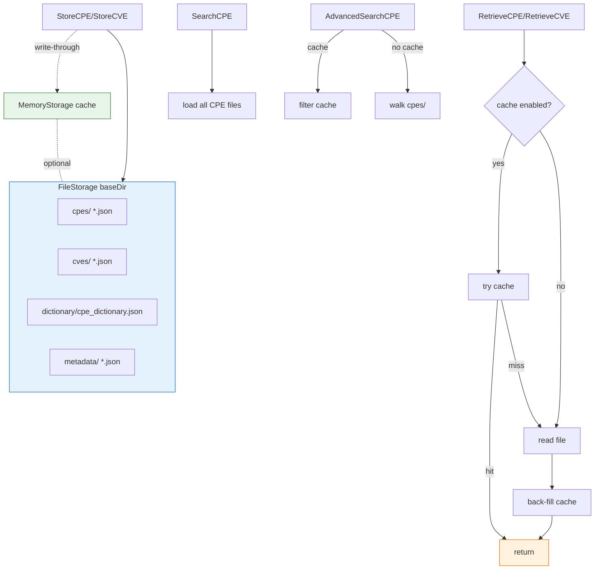

# 💾 FileStorage

The `file_storage` module provides `FileStorage`, a filesystem-backed implementation of the `Storage` interface. CPEs, CVEs, the dictionary, and metadata are persisted as JSON files under a base directory (`cpes/`, `cves/`, `dictionary/`, `metadata/`). An optional in-memory `MemoryStorage` cache layers reads for performance. File operations are guarded by a `sync.RWMutex`.

## Type: FileStorage

```go
type FileStorage struct {
    baseDir  string          // root directory for all data
    cache    *MemoryStorage  // optional in-memory cache
    useCache bool            // whether caching is enabled
    mutex    sync.RWMutex    // guards file operations
}
```

`FileStorage` implements the full `Storage` interface. All fields are unexported and accessed only through the methods below. The constructor creates the required subdirectory tree.

## 🏗️ NewFileStorage

```go
func NewFileStorage(baseDir string, useCache bool) (*FileStorage, error)
```

Creates a `FileStorage` rooted at `baseDir`, creating the directory and the `cpes`, `cves`, `dictionary`, `metadata` subdirectories (mode `0755`) if absent. When `useCache` is `true`, an internal `MemoryStorage` is created and initialized.

| Parameter | Type | Description |
| --- | --- | --- |
| `baseDir` | `string` | Root data directory; created if missing |
| `useCache` | `bool` | Whether to enable the in-memory read cache |

| Return | Type | Description |
| --- | --- | --- |
| #1 | `*FileStorage` | The new file store |
| #2 | `error` | Non-nil if a directory cannot be created |

```go
storage, err := cpeskills.NewFileStorage("/tmp/cpe-data", true)
if err != nil {
    log.Fatalf("create storage: %v", err)
}
defer storage.Close()
_ = storage.Initialize()
```

## 🟢 Initialize

```go
func (fs *FileStorage) Initialize() error
```

(Re-)initializes the in-memory cache when caching is enabled and records the `initialization` modification timestamp.

| Parameter | Type | Description |
| --- | --- | --- |
| Receiver | `*FileStorage` | The store |

| Return | Type | Description |
| --- | --- | --- |
| #1 | `error` | Non-nil if writing the timestamp file fails |

```go
_ = storage.Initialize()
```

## 🔴 Close

```go
func (fs *FileStorage) Close() error
```

Closes the in-memory cache when caching is enabled. Always returns `nil`.

| Parameter | Type | Description |
| --- | --- | --- |
| Receiver | `*FileStorage` | The store |

| Return | Type | Description |
| --- | --- | --- |
| #1 | `error` | Always `nil` |

```go
defer storage.Close()
```

## 📂 CPEFilePath

```go
func (fs *FileStorage) CPEFilePath(id string) string
```

Returns the JSON file path for the CPE with `id`. The id is hashed (a simple polynomial hash rendered as hex) to keep filenames short and filesystem-safe.

| Parameter | Type | Description |
| --- | --- | --- |
| Receiver | `*FileStorage` | The store |
| `id` | `string` | CPE identifier (its URI) |

| Return | Type | Description |
| --- | --- | --- |
| #1 | `string` | `<baseDir>/cpes/<hash>.json` |

```go
path := storage.CPEFilePath("cpe:2.3:a:apache:log4j:2.0:*:*:*:*:*:*:*")
```

## 📂 CVEFilePath

```go
func (fs *FileStorage) CVEFilePath(id string) string
```

Returns the JSON file path for the CVE with `id`. The id is sanitized (unsafe characters replaced with `_`) and used directly as the filename.

| Parameter | Type | Description |
| --- | --- | --- |
| Receiver | `*FileStorage` | The store |
| `id` | `string` | CVE identifier |

| Return | Type | Description |
| --- | --- | --- |
| #1 | `string` | `<baseDir>/cves/<sanitized>.json` |

```go
path := storage.CVEFilePath("CVE-2021-44228")
```

## 📂 DictionaryFilePath

```go
func (fs *FileStorage) DictionaryFilePath() string
```

Returns the path to the single dictionary JSON file.

| Parameter | Type | Description |
| --- | --- | --- |
| Receiver | `*FileStorage` | The store |

| Return | Type | Description |
| --- | --- | --- |
| #1 | `string` | `<baseDir>/dictionary/cpe_dictionary.json` |

```go
path := storage.DictionaryFilePath()
```

## 📂 MetadataFilePath

```go
func (fs *FileStorage) MetadataFilePath(key string) string
```

Returns the JSON file path for the metadata (timestamp) entry under `key`. The key is sanitized (unsafe characters replaced with `_`).

| Parameter | Type | Description |
| --- | --- | --- |
| Receiver | `*FileStorage` | The store |
| `key` | `string` | Metadata key |

| Return | Type | Description |
| --- | --- | --- |
| #1 | `string` | `<baseDir>/metadata/<sanitized>.json` |

```go
path := storage.MetadataFilePath("last_update")
```

## 💾 StoreCPE

```go
func (fs *FileStorage) StoreCPE(cpe *CPE) error
```

Serializes `cpe` to indented JSON and writes it to `CPEFilePath(cpe.GetURI())` (mode `0644`), updates the cache when enabled, and records the `last_cpe_update` timestamp. Returns `ErrInvalidData` if `cpe` is `nil`.

| Parameter | Type | Description |
| --- | --- | --- |
| Receiver | `*FileStorage` | The store |
| `cpe` | `*CPE` | The CPE to store |

| Return | Type | Description |
| --- | --- | --- |
| #1 | `error` | `ErrInvalidData` if `nil`; non-nil on write/timestamp failure |

```go
_ = storage.StoreCPE(&cpeskills.CPE{
    Cpe23:       "cpe:2.3:a:apache:log4j:2.0:*:*:*:*:*:*:*",
    Vendor:      cpeskills.Vendor("apache"),
    ProductName: cpeskills.Product("log4j"),
    Version:     cpeskills.Version("2.0"),
})
```

## 🔍 RetrieveCPE

```go
func (fs *FileStorage) RetrieveCPE(id string) (*CPE, error)
```

Returns the CPE for `id`. With caching enabled, tries the cache first; on a miss reads `CPEFilePath(id)` from disk and back-fills the cache. Returns `ErrNotFound` if the file does not exist.

| Parameter | Type | Description |
| --- | --- | --- |
| Receiver | `*FileStorage` | The store |
| `id` | `string` | CPE identifier (its URI) |

| Return | Type | Description |
| --- | --- | --- |
| #1 | `*CPE` | The CPE |
| #2 | `error` | `ErrNotFound` if missing; non-nil on read/parse failure |

```go
cpe, err := storage.RetrieveCPE("cpe:2.3:a:microsoft:windows:10:*:*:*:*:*:*:*")
```

## ✏️ UpdateCPE

```go
func (f *FileStorage) UpdateCPE(cpe *CPE) error
```

Updates a CPE record by storing the new `cpe` (overwriting any existing file at its URI) and, when caching is enabled, updating the cache. Returns `ErrInvalidData` if `cpe` is `nil`.

| Parameter | Type | Description |
| --- | --- | --- |
| Receiver | `*FileStorage` | The store |
| `cpe` | `*CPE` | The replacement CPE |

| Return | Type | Description |
| --- | --- | --- |
| #1 | `error` | `ErrInvalidData` if `nil`; non-nil on store failure |

```go
cpe.Version = cpeskills.Version("2.1")
_ = storage.UpdateCPE(cpe)
```

## 🗑️ DeleteCPE

```go
func (f *FileStorage) DeleteCPE(uri string) error
```

Removes the CPE file at `CPEFilePath(uri)`. When caching is enabled, the cache entry is evicted first (best-effort). A missing file is not an error: the method returns `nil`.

| Parameter | Type | Description |
| --- | --- | --- |
| Receiver | `*FileStorage` | The store |
| `uri` | `string` | CPE identifier to remove |

| Return | Type | Description |
| --- | --- | --- |
| #1 | `error` | Non-nil only on `os.Stat`/`os.Remove` failure (other than not-exist) |

```go
_ = storage.DeleteCPE("cpe:2.3:a:apache:log4j:2.0:*:*:*:*:*:*:*")
```

## 🔎 SearchCPE

```go
func (f *FileStorage) SearchCPE(criteria *CPE, options *MatchOptions) ([]*CPE, error)
```

Loads all CPE files from the `cpes/` directory, then returns those matching `criteria` under `options` (via the package-level `Search`). A `nil` criteria returns all CPEs.

| Parameter | Type | Description |
| --- | --- | --- |
| Receiver | `*FileStorage` | The store |
| `criteria` | `*CPE` | Match criteria; `nil` matches all |
| `options` | `*MatchOptions` | Match options |

| Return | Type | Description |
| --- | --- | --- |
| #1 | `[]*CPE` | Matching CPEs |
| #2 | `error` | Always `nil` |

```go
results, _ := storage.SearchCPE(&cpeskills.CPE{
    Vendor: cpeskills.Vendor("microsoft"),
}, &cpeskills.MatchOptions{IgnoreVersion: true})
```

## 📥 StoreCVE

```go
func (fs *FileStorage) StoreCVE(cve *CVEReference) error
```

Serializes `cve` to indented JSON and writes it to `CVEFilePath(cve.CVEID)` (mode `0644`), updates the cache when enabled, and records the `last_cve_update` timestamp. Returns `ErrInvalidData` (wrapped) if `cve` is `nil` or `CVEID` is empty.

| Parameter | Type | Description |
| --- | --- | --- |
| Receiver | `*FileStorage` | The store |
| `cve` | `*CVEReference` | The CVE to store |

| Return | Type | Description |
| --- | --- | --- |
| #1 | `error` | `ErrInvalidData` if `nil`/empty ID; non-nil on write failure |

```go
cve := cpeskills.NewCVEReference("CVE-2021-44228")
_ = storage.StoreCVE(cve)
```

## 🔍 RetrieveCVE

```go
func (fs *FileStorage) RetrieveCVE(cveID string) (*CVEReference, error)
```

Returns the CVE for `cveID`. With caching enabled, tries the cache first; on a miss reads `CVEFilePath(cveID)` and back-fills the cache. Returns `ErrNotFound` if the file does not exist.

| Parameter | Type | Description |
| --- | --- | --- |
| Receiver | `*FileStorage` | The store |
| `cveID` | `string` | CVE identifier |

| Return | Type | Description |
| --- | --- | --- |
| #1 | `*CVEReference` | The CVE |
| #2 | `error` | `ErrNotFound` if missing; non-nil on read/parse failure |

```go
cve, err := storage.RetrieveCVE("CVE-2021-44228")
```

## ✏️ UpdateCVE

```go
func (fs *FileStorage) UpdateCVE(cve *CVEReference) error
```

Updates the CVE at `cve.CVEID`. Verifies the file exists (returns `ErrNotFound` otherwise), then overwrites it. Updates the cache when enabled and records the `last_cve_update` timestamp. Returns `ErrInvalidData` (wrapped) if `cve` is `nil` or `CVEID` is empty.

| Parameter | Type | Description |
| --- | --- | --- |
| Receiver | `*FileStorage` | The store |
| `cve` | `*CVEReference` | The replacement CVE |

| Return | Type | Description |
| --- | --- | --- |
| #1 | `error` | `ErrInvalidData`, `ErrNotFound`, or write error |

```go
cve.CVSSScore = 10.0
_ = storage.UpdateCVE(cve)
```

## 🗑️ DeleteCVE

```go
func (fs *FileStorage) DeleteCVE(cveID string) error
```

Removes the CVE file at `CVEFilePath(cveID)` and evicts the cache entry when caching is enabled. Returns `ErrNotFound` if the file does not exist.

| Parameter | Type | Description |
| --- | --- | --- |
| Receiver | `*FileStorage` | The store |
| `cveID` | `string` | CVE identifier to remove |

| Return | Type | Description |
| --- | --- | --- |
| #1 | `error` | `ErrNotFound` if missing; non-nil on delete failure |

```go
_ = storage.DeleteCVE("CVE-2021-44228")
```

## 🔎 SearchCVE

```go
func (fs *FileStorage) SearchCVE(query string, options *SearchOptions) ([]*CVEReference, error)
```

Loads all CVEs from disk (or the cache when enabled), loads them into a temporary `MemoryStorage`, and delegates the query to its `SearchCVE`. Supports the same substring matching, filters, and pagination as `MemoryStorage.SearchCVE`.

| Parameter | Type | Description |
| --- | --- | --- |
| Receiver | `*FileStorage` | The store |
| `query` | `string` | Substring query |
| `options` | `*SearchOptions` | Filters and pagination |

| Return | Type | Description |
| --- | --- | --- |
| #1 | `[]*CVEReference` | Matching CVEs |
| #2 | `error` | Non-nil if loading CVEs fails |

```go
opts := cpeskills.NewSearchOptions()
results, _ := storage.SearchCVE("log4j", opts)
```

## 🔗 FindCVEsByCPE

```go
func (fs *FileStorage) FindCVEsByCPE(cpe *CPE) ([]*CVEReference, error)
```

Loads all CPEs and CVEs into a temporary `MemoryStorage` and delegates to its `FindCVEsByCPE`.

| Parameter | Type | Description |
| --- | --- | --- |
| Receiver | `*FileStorage` | The store |
| `cpe` | `*CPE` | The CPE to look up |

| Return | Type | Description |
| --- | --- | --- |
| #1 | `[]*CVEReference` | Linked CVEs |
| #2 | `error` | Non-nil if loading CVEs fails |

```go
cves, _ := storage.FindCVEsByCPE(&cpeskills.CPE{
    Cpe23: "cpe:2.3:a:apache:log4j:2.0:*:*:*:*:*:*:*",
})
```

## 🔗 FindCPEsByCVE

```go
func (fs *FileStorage) FindCPEsByCVE(cveID string) ([]*CPE, error)
```

Loads all CPEs and CVEs into a temporary `MemoryStorage` and delegates to its `FindCPEsByCVE`.

| Parameter | Type | Description |
| --- | --- | --- |
| Receiver | `*FileStorage` | The store |
| `cveID` | `string` | CVE identifier |

| Return | Type | Description |
| --- | --- | --- |
| #1 | `[]*CPE` | Linked CPEs |
| #2 | `error` | Non-nil if loading CVEs fails |

```go
cpes, _ := storage.FindCPEsByCVE("CVE-2021-44228")
```

## 📚 StoreDictionary

```go
func (fs *FileStorage) StoreDictionary(dict *CPEDictionary) error
```

Serializes `dict` to indented JSON and writes it to `DictionaryFilePath()` (mode `0644`), updates the cache when enabled, and records the `last_dictionary_update` timestamp. Returns `ErrInvalidData` if `dict` is `nil`.

| Parameter | Type | Description |
| --- | --- | --- |
| Receiver | `*FileStorage` | The store |
| `dict` | `*CPEDictionary` | The dictionary to store |

| Return | Type | Description |
| --- | --- | --- |
| #1 | `error` | `ErrInvalidData` if `nil`; non-nil on write failure |

```go
dict, _ := cpeskills.ParseDictionary(file)
_ = storage.StoreDictionary(dict)
```

## 📖 RetrieveDictionary

```go
func (fs *FileStorage) RetrieveDictionary() (*CPEDictionary, error)
```

Returns the dictionary. With caching enabled, tries the cache first; on a miss reads `DictionaryFilePath()` and back-fills the cache. Returns `ErrNotFound` if the file does not exist.

| Parameter | Type | Description |
| --- | --- | --- |
| Receiver | `*FileStorage` | The store |

| Return | Type | Description |
| --- | --- | --- |
| #1 | `*CPEDictionary` | The dictionary |
| #2 | `error` | `ErrNotFound` if missing; non-nil on read/parse failure |

```go
dict, err := storage.RetrieveDictionary()
```

## ⏱️ StoreModificationTimestamp

```go
func (fs *FileStorage) StoreModificationTimestamp(key string, timestamp time.Time) error
```

Writes a `{key, timestamp}` JSON object to `MetadataFilePath(key)` (mode `0644`) and updates the cache when enabled.

| Parameter | Type | Description |
| --- | --- | --- |
| Receiver | `*FileStorage` | The store |
| `key` | `string` | Metadata key |
| `timestamp` | `time.Time` | The timestamp to record |

| Return | Type | Description |
| --- | --- | --- |
| #1 | `error` | Non-nil if the write fails |

```go
_ = storage.StoreModificationTimestamp("last_update", time.Now())
```

## ⏱️ RetrieveModificationTimestamp

```go
func (fs *FileStorage) RetrieveModificationTimestamp(key string) (time.Time, error)
```

Returns the timestamp stored under `key`. With caching enabled, tries the cache first; on a miss reads `MetadataFilePath(key)` and back-fills the cache. Returns the zero `time.Time` and `ErrNotFound` if the file is absent.

| Parameter | Type | Description |
| --- | --- | --- |
| Receiver | `*FileStorage` | The store |
| `key` | `string` | Metadata key |

| Return | Type | Description |
| --- | --- | --- |
| #1 | `time.Time` | The recorded timestamp |
| #2 | `error` | `ErrNotFound` if missing; non-nil on read/parse failure |

```go
ts, err := storage.RetrieveModificationTimestamp("last_update")
```

## 🎯 AdvancedSearchCPE

```go
func (f *FileStorage) AdvancedSearchCPE(criteria *CPE, options *AdvancedMatchOptions) ([]*CPE, error)
```

Performs an advanced CPE search. With caching enabled, filters the cached CPEs via `AdvancedMatchCPE`. Without caching, walks the `cpes/` directory and matches each file's CPE.

| Parameter | Type | Description |
| --- | --- | --- |
| Receiver | `*FileStorage` | The store |
| `criteria` | `*CPE` | Match criteria |
| `options` | `*AdvancedMatchOptions` | Advanced match options |

| Return | Type | Description |
| --- | --- | --- |
| #1 | `[]*CPE` | Matching CPEs |
| #2 | `error` | Non-nil only on directory walk failure (no-cache path) |

```go
results, _ := storage.AdvancedSearchCPE(criteria, &cpeskills.AdvancedMatchOptions{})
```

## 🧭 FileStorage 布局与缓存流


