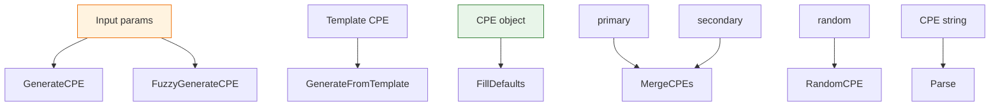

# ⚙️ CPE Generator

This module provides capabilities for generating, templating, merging and fuzzily generating CPE objects, useful for programmatic construction of CPEs.

## 🏗️ GenerateCPE

```go
func GenerateCPE(part, vendor, product, version string) *CPE
```

Generates a CPE object from part, vendor, product and version.

| Parameter | Type | Description |
| --- | --- | --- |
| `part` | `string` | Part type |
| `vendor` | `string` | Vendor |
| `product` | `string` | Product name |
| `version` | `string` | Version |

| Return | Type | Description |
| --- | --- | --- |
| #1 | `*CPE` | The generated CPE object |

```go
cpe := cpeskills.GenerateCPE("a", "microsoft", "windows", "10")
```

## 📋 GenerateFromTemplate

```go
func GenerateFromTemplate(template *CPE, overrides map[string]string) *CPE
```

Generates a new CPE from a template, applying the field overrides in `overrides`.

| Parameter | Type | Description |
| --- | --- | --- |
| `template` | `*CPE` | The template CPE |
| `overrides` | `map[string]string` | Field override map |

| Return | Type | Description |
| --- | --- | --- |
| #1 | `*CPE` | The new generated CPE object |

```go
tmpl := cpeskills.MustParse("cpe:2.3:a:microsoft:windows:10:*:*:*:*:*:*:*")
cpe := cpeskills.GenerateFromTemplate(tmpl, map[string]string{"version": "11"})
```

## 🛠️ FillDefaults

```go
func FillDefaults(cpe *CPE) *CPE
```

Fills empty fields of a CPE object with default values (e.g. `*`).

| Parameter | Type | Description |
| --- | --- | --- |
| `cpe` | `*CPE` | The CPE object to fill |

| Return | Type | Description |
| --- | --- | --- |
| #1 | `*CPE` | The filled CPE object |

```go
cpe := &cpeskills.CPE{Part: *part}
cpe = cpeskills.FillDefaults(cpe)
```

## 🔀 MergeCPEs

```go
func MergeCPEs(primary, secondary *CPE) *CPE
```

Merges two CPEs: `primary` takes precedence, and its empty fields are backfilled from `secondary`.

| Parameter | Type | Description |
| --- | --- | --- |
| `primary` | `*CPE` | The primary CPE (takes precedence) |
| `secondary` | `*CPE` | The fallback CPE |

| Return | Type | Description |
| --- | --- | --- |
| #1 | `*CPE` | The merged CPE object |

```go
merged := cpeskills.MergeCPEs(primary, secondary)
```

## 🌫️ FuzzyGenerateCPE

```go
func FuzzyGenerateCPE(part, vendor, product, version string) *CPE
```

Fuzzily generates a CPE, normalizing and tolerating noisy input.

| Parameter | Type | Description |
| --- | --- | --- |
| `part` | `string` | Part type |
| `vendor` | `string` | Vendor |
| `product` | `string` | Product name |
| `version` | `string` | Version |

| Return | Type | Description |
| --- | --- | --- |
| #1 | `*CPE` | The generated CPE object |

```go
cpe := cpeskills.FuzzyGenerateCPE("a", "Microsoft", "Windows 10", "10")
```

## 🎲 RandomCPE

```go
func RandomCPE() *CPE
```

Generates a random CPE object, useful for tests.

| Return | Type | Description |
| --- | --- | --- |
| #1 | `*CPE` | A random CPE object |

```go
cpe := cpeskills.RandomCPE()
```

## 📥 Parse

```go
func Parse(cpeStr string) (*CPE, error)
```

General-purpose parse entry that auto-detects the 2.2 or 2.3 form.

| Parameter | Type | Description |
| --- | --- | --- |
| `cpeStr` | `string` | The CPE string |

| Return | Type | Description |
| --- | --- | --- |
| #1 | `*CPE` | The parsed CPE object |
| #2 | `error` | An error if parsing fails |

```go
cpe, err := cpeskills.Parse("cpe:2.3:a:microsoft:windows:10:*:*:*:*:*:*:*")
```

## 🧭 Generator Map


