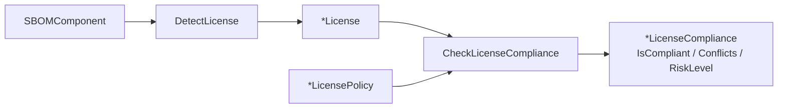
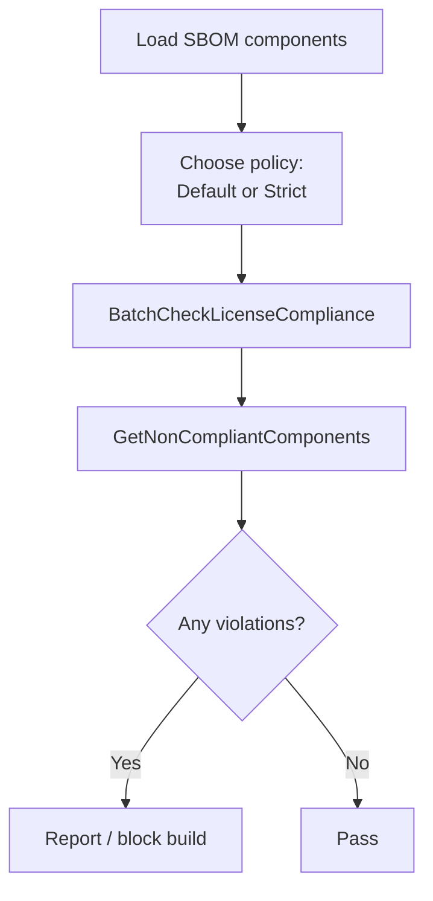

# 🛡️ License Detection

The `license_detection` module (`license_detection.go`) provides license compliance checking for SBOM components. It detects declared licenses, compares them against a configurable policy, and reports conflicts, risk level, and overall compliance.



## Types

### LicenseCompliance

```go
type LicenseCompliance struct {
    Component        *SBOMComponent `json:"component"`
    DetectedLicense  *License       `json:"detectedLicense,omitempty"`
    DeclaredLicense  *License       `json:"declaredLicense,omitempty"`
    Conflicts        []string       `json:"conflicts,omitempty"`
    RiskLevel        string         `json:"riskLevel"`
    IsCompliant      bool           `json:"isCompliant"`
}
```

Holds the result of a compliance check for a single component.

### LicensePolicy

```go
type LicensePolicy struct {
    AllowedLicenses    []string `json:"allowedLicenses"`
    DeniedLicenses     []string `json:"deniedLicenses"`
    AllowCopyleft      bool     `json:"allowCopyleft"`
    RequireOSIApproved bool     `json:"requireOSIApproved"`
}
```

Configurable policy. `AllowedLicenses` / `DeniedLicenses` are SPDX IDs.

## Functions

### DefaultLicensePolicy

```go
func DefaultLicensePolicy() *LicensePolicy
```

Returns a lenient default policy: allows MIT, Apache-2.0, BSD-2-Clause, BSD-3-Clause, ISC, Unlicense, CC0-1.0, Zlib, PostgreSQL; denies AGPL-3.0-only and AGPL-3.0-or-later; copyleft allowed; OSI approval required.

**Returns:**
- `*LicensePolicy` — lenient policy

### StrictLicensePolicy

```go
func StrictLicensePolicy() *LicensePolicy
```

Returns a strict policy (read `license_detection.go` for the exact allowed list — narrower than the default).

**Returns:**
- `*LicensePolicy` — strict policy

### DetectLicense

```go
func DetectLicense(component *SBOMComponent) *License
```

Detects the license of a component from its `Licenses` field.

**Parameters:**
- `component` — the SBOM component

**Returns:**
- `*License` — detected license, or `nil` if none found

### CheckLicenseCompliance

```go
func CheckLicenseCompliance(component *SBOMComponent, policy *LicensePolicy) *LicenseCompliance
```

Checks a single component against the given policy.

**Parameters:**
- `component` — the SBOM component
- `policy` — the license policy

**Returns:**
- `*LicenseCompliance` — compliance result

**Example:**
```go
component := cpeskills.NewSBOMComponent("mylib", "1.0.0")
component.Licenses = []*cpeskills.License{cpeskills.NewLicense("MIT", "MIT License")}

result := cpeskills.CheckLicenseCompliance(component, cpeskills.DefaultLicensePolicy())
fmt.Println(result.IsCompliant) // true
fmt.Println(result.RiskLevel)
```

### BatchCheckLicenseCompliance

```go
func BatchCheckLicenseCompliance(components []*SBOMComponent, policy *LicensePolicy) []*LicenseCompliance
```

Checks multiple components against the same policy.

**Parameters:**
- `components` — list of SBOM components
- `policy` — the license policy

**Returns:**
- `[]*LicenseCompliance` — one result per component

### GetNonCompliantComponents

```go
func GetNonCompliantComponents(complianceResults []*LicenseCompliance) []*LicenseCompliance
```

Filters a list of compliance results, returning only the non-compliant ones.

**Parameters:**
- `complianceResults` — results from `BatchCheckLicenseCompliance`

**Returns:**
- `[]*LicenseCompliance` — non-compliant results only

**Example:**
```go
results := cpeskills.BatchCheckLicenseCompliance(components, cpeskills.StrictLicensePolicy())
violations := cpeskills.GetNonCompliantComponents(results)
for _, v := range violations {
    fmt.Printf("%s: %v\n", v.Component.Name, v.Conflicts)
}
```

## Workflow


