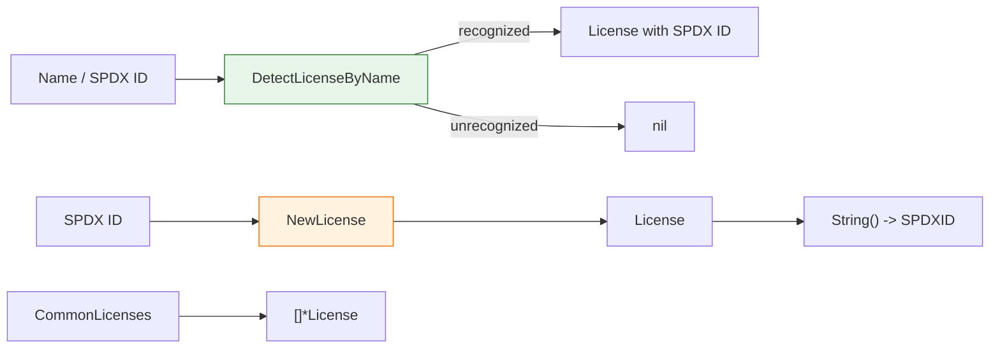

# 📜 License

The `cpeskills` package models software licenses based on the SPDX license list standard, with helpers to construct, identify and inspect common licenses.

## Type: License

```go
type License struct {
    SPDXID       string   `json:"id"`
    Name         string   `json:"name"`
    URL          string   `json:"url,omitempty"`
    IsCopyleft   bool     `json:"isCopyleft"`
    IsOSIApproved bool    `json:"isOSIApproved"`
    Restrictions []string `json:"restrictions,omitempty"`
}
```

Represents a software license based on the SPDX license list standard.

| Field | Type | JSON | Description |
| --- | --- | --- | --- |
| `SPDXID` | `string` | `id` | SPDX license identifier (e.g. `"MIT"`, `"Apache-2.0"`, `"GPL-3.0-only"`) |
| `Name` | `string` | `name` | Full license name |
| `URL` | `string` | `url,omitempty` | Link to the license text |
| `IsCopyleft` | `bool` | `isCopyleft` | Whether it is a Copyleft license |
| `IsOSIApproved` | `bool` | `isOSIApproved` | Whether it is OSI approved |
| `Restrictions` | `[]string` | `restrictions,omitempty` | Usage restrictions |

## 🆕 NewLicense

```go
func NewLicense(spdxID, name string) *License
```

Creates a new license. `IsOSIApproved` and `IsCopyleft` are derived automatically from the SPDX ID.

| Parameter | Type | Description |
| --- | --- | --- |
| `spdxID` | `string` | The SPDX license identifier |
| `name` | `string` | The full license name |

| Return | Type | Description |
| --- | --- | --- |
| #1 | `*License` | A new `License` with OSI/Copyleft flags populated |

```go
lic := cpeskills.NewLicense("MIT", "MIT License")
```

## 🏷️ License.String

```go
func (l *License) String() string
```

Returns the SPDX identifier of the license. Returns an empty string if the receiver is nil.

| Return | Type | Description |
| --- | --- | --- |
| #1 | `string` | The SPDX ID |

```go
lic := cpeskills.NewLicense("Apache-2.0", "Apache License 2.0")
fmt.Println(lic.String()) // Apache-2.0
```

## 📚 CommonLicenses

```go
func CommonLicenses() []*License
```

Returns a list of common licenses (MIT, Apache-2.0, BSD-3-Clause, BSD-2-Clause, GPL-3.0-only, GPL-3.0-or-later, LGPL-3.0-only, MPL-2.0, ISC, Unlicense).

| Return | Type | Description |
| --- | --- | --- |
| #1 | `[]*License` | Common SPDX licenses |

```go
for _, lic := range cpeskills.CommonLicenses() {
    fmt.Println(lic.SPDXID)
}
```

## 🔍 DetectLicenseByName

```go
func DetectLicenseByName(name string) *License
```

Detects a license from a human-readable name or SPDX ID (case-insensitive). Recognizes common aliases such as `apache 2.0`, `bsd3`, `gpl3`, `cc0`, etc. Returns `nil` if the name is not recognized.

| Parameter | Type | Description |
| --- | --- | --- |
| `name` | `string` | The license name or SPDX ID |

| Return | Type | Description |
| --- | --- | --- |
| #1 | `*License` | The detected license, or `nil` if unrecognized |

```go
lic := cpeskills.DetectLicenseByName("Apache 2.0")
if lic != nil {
    fmt.Println(lic.SPDXID) // Apache-2.0
}
```

## 🧭 License Detection


