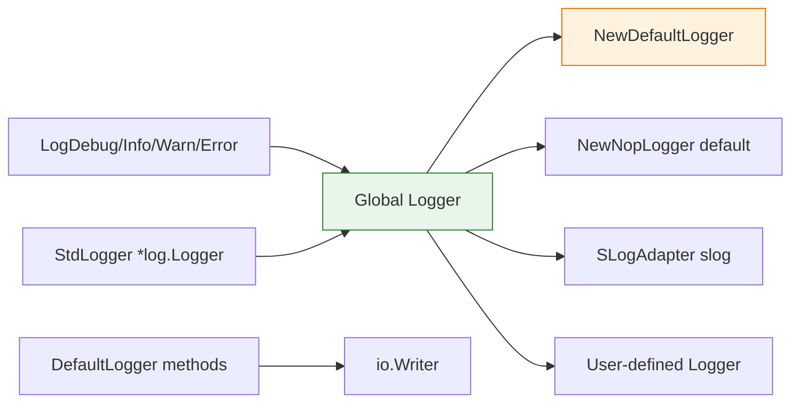

# 📋 Logger

The `cpeskills` package exposes a structured-logging interface (`Logger`) with a built-in `DefaultLogger`, a package-level global logger, and convenience top-level functions. The interface is compatible with Go's `log/slog` and free of external dependencies.

## Type: LogLevel

```go
type LogLevel int
```

Represents the severity of a log message.

### Constants

| Constant | Type | Value | Description |
| --- | --- | --- | --- |
| `LogLevelDebug` | `LogLevel` | `0` (iota) | Detailed debug information |
| `LogLevelInfo` | `LogLevel` | `1` | Informational messages |
| `LogLevelWarn` | `LogLevel` | `2` | Warning messages |
| `LogLevelError` | `LogLevel` | `3` | Error messages |
| `LogLevelOff` | `LogLevel` | `4` | Disables all logging |

```go
_ = cpeskills.LogLevelDebug
_ = cpeskills.LogLevelInfo
_ = cpeskills.LogLevelWarn
_ = cpeskills.LogLevelError
_ = cpeskills.LogLevelOff
```

## Type: Logger

```go
type Logger interface {
    Debug(msg string, keyvals ...interface{})
    Info(msg string, keyvals ...interface{})
    Warn(msg string, keyvals ...interface{})
    Error(msg string, keyvals ...interface{})
    With(keyvals ...interface{}) Logger
    SetLevel(level LogLevel)
}
```

The structured-logging interface. Plug in your own implementation (slog, zap, zerolog, logrus, etc.) or use the built-in `DefaultLogger`. All default implementations are concurrency-safe.

## Type: DefaultLogger

```go
type DefaultLogger struct {
    // contains unexported fields
}
```

A basic logger implementation writing to an `io.Writer` with structured `key=value` formatting.

## Type: SLogAdapter

```go
type SLogAdapter struct {
    // contains unexported fields
}
```

Adapts Go's standard library `log/slog` logger to the cpe `Logger` interface. Available for Go 1.21+ via conditional compilation.

## 🔤 LogLevel.String

```go
func (l LogLevel) String() string
```

Returns the string representation of the log level (`"DEBUG"`, `"INFO"`, `"WARN"`, `"ERROR"`, `"OFF"`, or `"UNKNOWN"`).

| Return | Type | Description |
| --- | --- | --- |
| #1 | `string` | The level name |

```go
fmt.Println(cpeskills.LogLevelInfo.String()) // INFO
```

## 🆕 NewDefaultLogger

```go
func NewDefaultLogger(writer io.Writer, level LogLevel) *DefaultLogger
```

Creates a new `DefaultLogger` writing to the given writer. If `writer` is nil, it defaults to `os.Stderr`.

| Parameter | Type | Description |
| --- | --- | --- |
| `writer` | `io.Writer` | The output writer |
| `level` | `LogLevel` | The minimum log level |

| Return | Type | Description |
| --- | --- | --- |
| #1 | `*DefaultLogger` | A new logger instance |

```go
logger := cpeskills.NewDefaultLogger(os.Stderr, cpeskills.LogLevelInfo)
```

## 🚫 NewNopLogger

```go
func NewNopLogger() Logger
```

Creates a logger that discards all output. This is the default logger used when none is configured.

| Return | Type | Description |
| --- | --- | --- |
| #1 | `Logger` | A no-op logger |

```go
cpeskills.SetLogger(cpeskills.NewNopLogger())
```

## 🐛 DefaultLogger.Debug

```go
func (l *DefaultLogger) Debug(msg string, keyvals ...interface{})
```

Logs a debug message with optional key-value pairs.

| Parameter | Type | Description |
| --- | --- | --- |
| `msg` | `string` | The log message |
| `keyvals` | `...interface{}` | Alternating key/value pairs |

```go
logger.Debug("scanning", "component", comp.Name)
```

## ℹ️ DefaultLogger.Info

```go
func (l *DefaultLogger) Info(msg string, keyvals ...interface{})
```

Logs an informational message.

| Parameter | Type | Description |
| --- | --- | --- |
| `msg` | `string` | The log message |
| `keyvals` | `...interface{}` | Alternating key/value pairs |

```go
logger.Info("scan complete", "count", n)
```

## ⚠️ DefaultLogger.Warn

```go
func (l *DefaultLogger) Warn(msg string, keyvals ...interface{})
```

Logs a warning message.

| Parameter | Type | Description |
| --- | --- | --- |
| `msg` | `string` | The log message |
| `keyvals` | `...interface{}` | Alternating key/value pairs |

```go
logger.Warn("deprecated CPE format", "cpe", cpeStr)
```

## 🚨 DefaultLogger.Error

```go
func (l *DefaultLogger) Error(msg string, keyvals ...interface{})
```

Logs an error message.

| Parameter | Type | Description |
| --- | --- | --- |
| `msg` | `string` | The log message |
| `keyvals` | `...interface{}` | Alternating key/value pairs |

```go
logger.Error("scan failed", "err", err)
```

## 🏷️ DefaultLogger.With

```go
func (l *DefaultLogger) With(keyvals ...interface{}) Logger
```

Returns a new `Logger` with the given key-value pairs pre-populated on every subsequent log line.

| Parameter | Type | Description |
| --- | --- | --- |
| `keyvals` | `...interface{}` | Alternating key/value pairs to attach |

| Return | Type | Description |
| --- | --- | --- |
| #1 | `Logger` | A child logger with the prefix |

```go
sub := logger.With("component", comp.Name)
sub.Info("matched")
```

## ⚙️ DefaultLogger.SetLevel

```go
func (l *DefaultLogger) SetLevel(level LogLevel)
```

Sets the minimum log level dynamically (concurrency-safe).

| Parameter | Type | Description |
| --- | --- | --- |
| `level` | `LogLevel` | The new minimum log level |

```go
logger.SetLevel(cpeskills.LogLevelWarn)
```

## 🌐 SetLogger

```go
func SetLogger(l Logger)
```

Sets the global logger for the entire library. Pass `nil` to disable logging.

| Parameter | Type | Description |
| --- | --- | --- |
| `l` | `Logger` | The logger to use globally |

```go
cpeskills.SetLogger(cpeskills.NewDefaultLogger(os.Stderr, cpeskills.LogLevelInfo))
```

## 🌐 GetLogger

```go
func GetLogger() Logger
```

Returns the current global logger.

| Return | Type | Description |
| --- | --- | --- |
| #1 | `Logger` | The current global logger |

```go
logger := cpeskills.GetLogger()
```

## 🐛 LogDebug

```go
func LogDebug(msg string, keyvals ...interface{})
```

Logs a debug message via the global logger.

| Parameter | Type | Description |
| --- | --- | --- |
| `msg` | `string` | The log message |
| `keyvals` | `...interface{}` | Alternating key/value pairs |

```go
cpeskills.LogDebug("starting scan")
```

## ℹ️ LogInfo

```go
func LogInfo(msg string, keyvals ...interface{})
```

Logs an informational message via the global logger.

| Parameter | Type | Description |
| --- | --- | --- |
| `msg` | `string` | The log message |
| `keyvals` | `...interface{}` | Alternating key/value pairs |

```go
cpeskills.LogInfo("scan complete", "count", n)
```

## ⚠️ LogWarn

```go
func LogWarn(msg string, keyvals ...interface{})
```

Logs a warning message via the global logger.

| Parameter | Type | Description |
| --- | --- | --- |
| `msg` | `string` | The log message |
| `keyvals` | `...interface{}` | Alternating key/value pairs |

```go
cpeskills.LogWarn("deprecated format")
```

## 🚨 LogError

```go
func LogError(msg string, keyvals ...interface{})
```

Logs an error message via the global logger.

| Parameter | Type | Description |
| --- | --- | --- |
| `msg` | `string` | The log message |
| `keyvals` | `...interface{}` | Alternating key/value pairs |

```go
cpeskills.LogError("scan failed", "err", err)
```

## 📜 StdLogger

```go
func StdLogger() *log.Logger
```

Returns a `*log.Logger` that writes through the global `Logger`. Useful for passing to third-party libraries that expect a `*log.Logger`.

| Return | Type | Description |
| --- | --- | --- |
| #1 | `*log.Logger` | A standard-library logger bridging the global logger |

```go
stdLog := cpeskills.StdLogger()
stdLog.Println("via stdlib")
```

## 🧭 Logging Architecture


