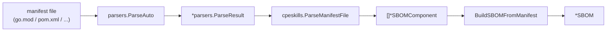
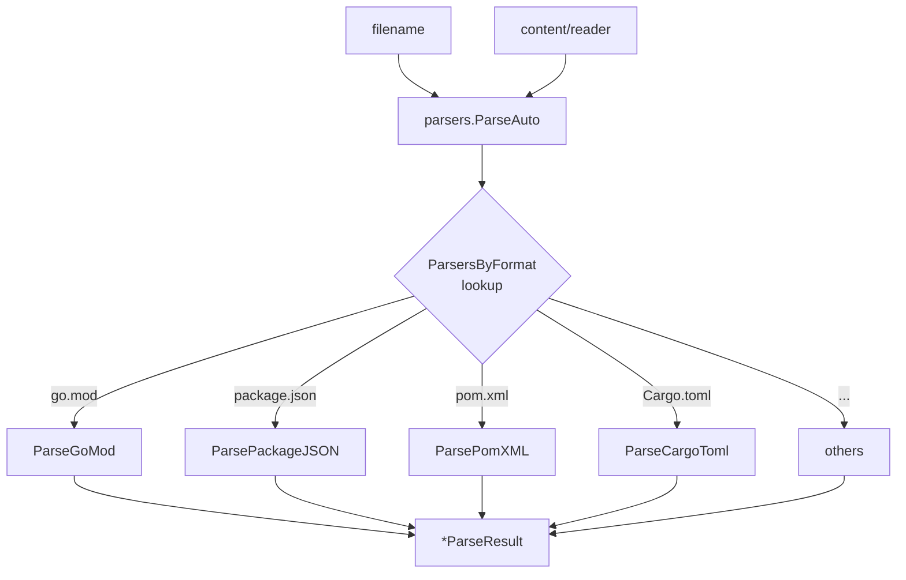

# 🌉 Manifest Bridge

The manifest-bridge module spans two packages:

- Top-level package `cpeskills` (`manifest_bridge.go`) — bridges parsed manifest results into SBOM components and SBOM documents.
- Sub-package `parsers` (`github.com/scagogogo/cpe-skills/pkg/parsers`, file `pkg/parsers/parsers.go`) — parses native manifest/lockfile formats (go.mod, package.json, pom.xml, Cargo.toml, etc.) into standardized `ParseResult` values.

This lets you generate an SBOM directly from a source repository without external tools.



## Top-level functions (`cpeskills`)

### ParseManifestFile

```go
func ParseManifestFile(filename string, content string) ([]*SBOMComponent, error)
```

Parses a manifest file (by filename, content provided as a string), auto-detecting the format via `parsers.ParseAuto`, and returns SBOM components.

**Parameters:**
- `filename` — filename (used for format detection, e.g. `"go.mod"`, `"package.json"`)
- `content` — file contents

**Returns:**
- `[]*SBOMComponent` — parsed components
- `error` — parse error

### ConvertMappingsToComponents

```go
func ConvertMappingsToComponents(mappings []parsers.ComponentMapping) []*SBOMComponent
```

Converts `parsers.ComponentMapping` values (from `parsers.ConvertToSBOMComponents`) into `SBOMComponent` pointers, populating name, version, group/namespace, PURL and ecosystem.

**Parameters:**
- `mappings` — component mappings from the parsers sub-package

**Returns:**
- `[]*SBOMComponent` — SBOM components

### BuildSBOMFromManifest

```go
func BuildSBOMFromManifest(filename string, content string, sbomName string) (*SBOM, error)
```

Parses a manifest and assembles a complete `SBOM` document with the given name.

**Parameters:**
- `filename` — manifest filename
- `content` — manifest contents
- `sbomName` — SBOM document name

**Returns:**
- `*SBOM` — assembled SBOM
- `error` — parse error

**Example:**
```go
content := `module example.com/myapp
go 1.23
require github.com/scagogogo/versions v1.0.0
`
sbom, err := cpeskills.BuildSBOMFromManifest("go.mod", content, "myapp-sbom")
if err != nil {
    log.Fatal(err)
}
fmt.Println(sbom.ComponentCount())
```

### ParseManifestToComponents

```go
func ParseManifestToComponents(filename string, content string) (*parsers.ParseResult, error)
```

Parses a manifest and returns the raw `parsers.ParseResult` (before conversion to SBOM components), exposing ecosystem, PURL type, and the full `ComponentInfo` list.

**Parameters:**
- `filename` — manifest filename
- `content` — manifest contents

**Returns:**
- `*parsers.ParseResult` — raw parse result
- `error` — parse error

## Sub-package types (`parsers`)

### ParseResult

```go
type ParseResult struct {
    Ecosystem  string            `json:"ecosystem"`
    PURLType   string            `json:"purlType"`
    Components []*ComponentInfo  `json:"components"`
    Name       string            `json:"name,omitempty"`
    Version    string            `json:"version,omitempty"`
    Metadata   map[string]interface{} `json:"metadata,omitempty"`
}
```

### ComponentInfo

```go
type ComponentInfo struct {
    Name      string `json:"name"`
    Version   string `json:"version"`
    Namespace string `json:"namespace,omitempty"`
    IsDirect  bool   `json:"isDirect"`
    IsDev     bool   `json:"isDev,omitempty"`
    Scope     string `json:"scope,omitempty"`
    Checksum  string `json:"checksum,omitempty"`
    Resolved  string `json:"resolved,omitempty"`
}
```

### ParseFunc

```go
type ParseFunc func(reader io.Reader) (*ParseResult, error)
```

Function type for a manifest parser.

### ComponentMapping

```go
type ComponentMapping struct { /* fields read from source */ }
```

Intermediate mapping used by `ConvertToSBOMComponents` before conversion to `SBOMComponent`. (Read `pkg/parsers/parsers.go` for exact fields.)

### ParsersByFormat

```go
var ParsersByFormat = map[string]ParseFunc{ /* ... */ }
```

Registry mapping file extensions/names to their parser functions.

## Sub-package parse functions (`parsers`)

```go
func ParseGoMod(reader io.Reader) (*ParseResult, error)
func ParsePackageJSON(reader io.Reader) (*ParseResult, error)
func ParsePackageLockJSON(reader io.Reader) (*ParseResult, error)
func ParseRequirementsTxt(reader io.Reader) (*ParseResult, error)
func ParsePomXML(reader io.Reader) (*ParseResult, error)
func ParseCargoToml(reader io.Reader) (*ParseResult, error)
func ParseComposerJSON(reader io.Reader) (*ParseResult, error)
func ParseComposerLock(reader io.Reader) (*ParseResult, error)
func ParseGemfile(reader io.Reader) (*ParseResult, error)
func ParseAuto(filename string, reader io.Reader) (*ParseResult, error)
func ConvertToSBOMComponents(result *ParseResult) []ComponentMapping
```

Each `ParseX` function reads a single manifest format from an `io.Reader`. `ParseAuto` dispatches by filename to the right parser. `ConvertToSBOMComponents` turns a `ParseResult` into `ComponentMapping` values consumed by `cpeskills.ConvertMappingsToComponents`.

## Two-package import example

```go
import (
    "github.com/scagogogo/cpe-skills"
    "github.com/scagogogo/cpe-skills/pkg/parsers"
    "strings"
)

func main() {
    // Use the parsers sub-package directly
    pr, err := parsers.ParseGoMod(strings.NewReader("module example.com/app\ngo 1.23\n"))
    if err != nil {
        log.Fatal(err)
    }
    fmt.Println(pr.Ecosystem) // golang

    // Or use the top-level bridge
    sbom, err := cpeskills.BuildSBOMFromManifest("go.mod", "module example.com/app\ngo 1.23\n", "app")
    _ = sbom
}
```

## Auto-detection flow


