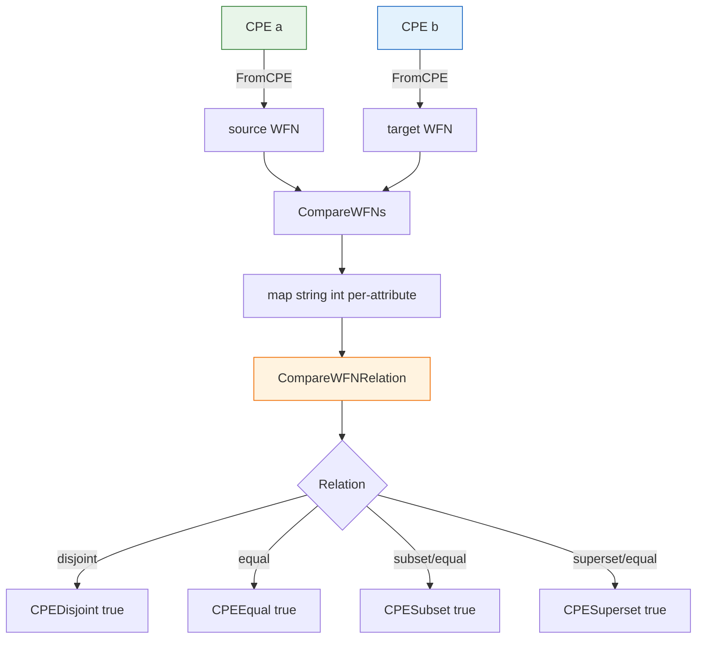

# 🧮 Matching and Relation Comparison

The `matching` module implements the CPE Name Matching specification (NISTIR 7696). It compares two CPE Well-Formed Names (WFNs) attribute by attribute and reduces the per-attribute results into a single set relation: equal, superset, subset, disjoint, or overlap.

## Type: Relation

```go
type Relation int
```

`Relation` enumerates the possible set relations between two CPEs, as defined by the CPE Name Matching specification.

```go
const (
    RelationDisjoint Relation = iota // 0, no overlap
    RelationSubset                   // 1, source is a subset of target
    RelationSuperset                 // 2, source is a superset of target
    RelationEqual                    // 3, the two CPEs are equal
    RelationOverlap                  // 4, partial overlap, neither fully contains the other
    RelationUnknown                  // 5, relation cannot be determined
)
```

## 🏷️ Relation.String

```go
func (r Relation) String() string
```

Returns the lowercase string representation of the relation: `"disjoint"`, `"subset"`, `"superset"`, `"equal"`, `"overlap"`, or `"unknown"`.

| Parameter | Type | Description |
| --- | --- | --- |
| Receiver | `Relation` | The relation value |

| Return | Type | Description |
| --- | --- | --- |
| #1 | `string` | The relation name |

```go
a := cpeskills.MustParse("cpe:2.3:a:microsoft:windows:*:*:*:*:*:*:*:*")
b := cpeskills.MustParse("cpe:2.3:a:microsoft:windows:10:*:*:*:*:*:*:*")
fmt.Println(a.CompareTo(b).String()) // superset
```

## ⚖️ CompareAttributes

```go
func CompareAttributes(source, target string) int
```

Compares two WFN attribute values according to the NISTIR 7696 attribute-comparison rules. Empty strings are treated as `ANY`. The result encodes the relation of `source` relative to `target`:

- `1` — `source` is a superset of `target` (e.g. `source` is `ANY` or a wildcard while `target` is more specific)
- `0` — the two values are equal
- `-1` — `source` is a subset of `target`
- `-2` — the two values are disjoint (no possible overlap, including `NA` against a non-`NA` value)

| Parameter | Type | Description |
| --- | --- | --- |
| `source` | `string` | The source attribute value (`ANY`, `NA`, literal, or wildcard pattern) |
| `target` | `string` | The target attribute value |

| Return | Type | Description |
| --- | --- | --- |
| #1 | `int` | `1` superset, `0` equal, `-1` subset, `-2` disjoint |

```go
fmt.Println(cpeskills.CompareAttributes("*", "10"))   // 1  (ANY is superset)
fmt.Println(cpeskills.CompareAttributes("10", "*"))   // -1 (literal is subset of ANY)
fmt.Println(cpeskills.CompareAttributes("10", "10"))  // 0  (equal)
fmt.Println(cpeskills.CompareAttributes("10", "11"))  // -2 (disjoint)
```

## 🔁 CompareWFNs

```go
func CompareWFNs(source, target *WFN) map[string]int
```

Compares two Well-Formed Names attribute by attribute and returns a map keyed by attribute name (`part`, `vendor`, `product`, `version`, `update`, `edition`, `language`, `sw_edition`, `target_sw`, `target_hw`, `other`) with the per-attribute comparison result (same encoding as `CompareAttributes`). A `nil` WFN is treated as an empty (all-`ANY`) WFN.

| Parameter | Type | Description |
| --- | --- | --- |
| `source` | `*WFN` | The source Well-Formed Name, `nil` treated as empty |
| `target` | `*WFN` | The target Well-Formed Name, `nil` treated as empty |

| Return | Type | Description |
| --- | --- | --- |
| #1 | `map[string]int` | Per-attribute comparison results |

```go
source := cpeskills.FromCPE(cpeskills.MustParse("cpe:2.3:a:microsoft:windows:*:*:*:*:*:*:*:*"))
target := cpeskills.FromCPE(cpeskills.MustParse("cpe:2.3:a:microsoft:windows:10:*:*:*:*:*:*:*"))
comparisons := cpeskills.CompareWFNs(source, target)
for attr, rel := range comparisons {
    fmt.Printf("%s: %d\n", attr, rel)
}
```

## 🧭 CompareWFNRelation

```go
func CompareWFNRelation(comparisons map[string]int) Relation
```

Reduces a per-attribute comparison map (as produced by `CompareWFNs`) into a single overall `Relation`. Decision rules:

- If any attribute is disjoint (`-2`), the result is `RelationDisjoint`.
- If both a superset (`1`) and a subset (`-1`) exist among attributes, the result is `RelationOverlap`.
- If only supersets exist, the result is `RelationSuperset`.
- If only subsets exist, the result is `RelationSubset`.
- Otherwise (all equal), the result is `RelationEqual`.

| Parameter | Type | Description |
| --- | --- | --- |
| `comparisons` | `map[string]int` | Per-attribute comparison results |

| Return | Type | Description |
| --- | --- | --- |
| #1 | `Relation` | The overall relation between the two CPEs |

```go
comparisons := cpeskills.CompareWFNs(source, target)
switch cpeskills.CompareWFNRelation(comparisons) {
case cpeskills.RelationEqual:
    fmt.Println("equal")
case cpeskills.RelationSuperset:
    fmt.Println("source is a superset")
case cpeskills.RelationDisjoint:
    fmt.Println("disjoint")
}
```

## 🚫 CPEDisjoint

```go
func CPEDisjoint(a, b *CPE) bool
```

Reports whether two CPEs are disjoint (no overlap). Returns `true` if either argument is `nil`.

| Parameter | Type | Description |
| --- | --- | --- |
| `a` | `*CPE` | The first CPE |
| `b` | `*CPE` | The second CPE |

| Return | Type | Description |
| --- | --- | --- |
| #1 | `bool` | `true` if disjoint (or either is `nil`), `false` otherwise |

```go
a := cpeskills.MustParse("cpe:2.3:a:microsoft:windows:*:*:*:*:*:*:*:*")
b := cpeskills.MustParse("cpe:2.3:a:adobe:reader:*:*:*:*:*:*:*:*")
fmt.Println(cpeskills.CPEDisjoint(a, b)) // true
```

## 🟰 CPEEqual

```go
func CPEEqual(a, b *CPE) bool
```

Reports whether two CPEs are equal. Returns `false` if either argument is `nil`.

| Parameter | Type | Description |
| --- | --- | --- |
| `a` | `*CPE` | The first CPE |
| `b` | `*CPE` | The second CPE |

| Return | Type | Description |
| --- | --- | --- |
| #1 | `bool` | `true` if equal, `false` otherwise |

```go
a := cpeskills.MustParse("cpe:2.3:a:microsoft:windows:10:*:*:*:*:*:*:*")
b := cpeskills.MustParse("cpe:2.3:a:microsoft:windows:10:*:*:*:*:*:*:*")
fmt.Println(cpeskills.CPEEqual(a, b)) // true
```

## ⬇️ CPESubset

```go
func CPESubset(a, b *CPE) bool
```

Reports whether CPE `a` is a subset of CPE `b`. A CPE is considered a subset when the overall relation is `RelationSubset` or `RelationEqual` (an equal CPE is trivially a subset). Returns `false` if either argument is `nil`.

| Parameter | Type | Description |
| --- | --- | --- |
| `a` | `*CPE` | The candidate subset |
| `b` | `*CPE` | The candidate superset |

| Return | Type | Description |
| --- | --- | --- |
| #1 | `bool` | `true` if `a` is a subset of (or equal to) `b` |

```go
a := cpeskills.MustParse("cpe:2.3:a:microsoft:windows:10:*:*:*:*:*:*:*")
b := cpeskills.MustParse("cpe:2.3:a:microsoft:windows:*:*:*:*:*:*:*:*")
fmt.Println(cpeskills.CPESubset(a, b)) // true
```

## ⬆️ CPESuperset

```go
func CPESuperset(a, b *CPE) bool
```

Reports whether CPE `a` is a superset of CPE `b`. A CPE is considered a superset when the overall relation is `RelationSuperset` or `RelationEqual` (an equal CPE is trivially a superset). Returns `false` if either argument is `nil`.

| Parameter | Type | Description |
| --- | --- | --- |
| `a` | `*CPE` | The candidate superset |
| `b` | `*CPE` | The candidate subset |

| Return | Type | Description |
| --- | --- | --- |
| #1 | `bool` | `true` if `a` is a superset of (or equal to) `b` |

```go
a := cpeskills.MustParse("cpe:2.3:a:microsoft:windows:*:*:*:*:*:*:*:*")
b := cpeskills.MustParse("cpe:2.3:a:microsoft:windows:10:*:*:*:*:*:*:*")
fmt.Println(cpeskills.CPESuperset(a, b)) // true
```

## 📐 Matching Flow Diagram


