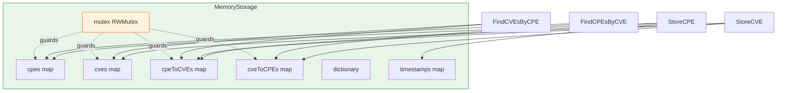

# 🧠 MemoryStorage

The `memory_storage` module provides `MemoryStorage`, an in-memory implementation of the `Storage` interface. All data (CPEs, CVEs, CPE↔CVE relationships, dictionary, timestamps) is held in maps guarded by a `sync.RWMutex`, making it safe for concurrent use. Because everything lives in process memory, it is fast but non-persistent: data is lost when the process exits. It is commonly used as a cache layer behind `FileStorage` or for tests.

## Type: MemoryStorage

```go
type MemoryStorage struct {
    cpes        map[string]*CPE          // CPE store, keyed by CPE ID
    cves        map[string]*CVEReference // CVE store, keyed by CVE ID
    cpeToCVEs   map[string][]string      // CPE → CVE IDs
    cveToCPEs   map[string][]string      // CVE → CPE IDs
    dictionary  *CPEDictionary           // CPE dictionary
    timestamps  map[string]time.Time     // modification timestamps
    mutex       sync.RWMutex             // guards all fields
}
```

`MemoryStorage` implements every method of the `Storage` interface. All fields are unexported and accessed only through the methods below.

## 🆕 NewMemoryStorage

```go
func NewMemoryStorage() *MemoryStorage
```

Creates a new, empty `MemoryStorage` with all maps initialized and `dictionary` set to `nil`.

| Parameter | Type | Description |
| --- | --- | --- |
| (none) | | |

| Return | Type | Description |
| --- | --- | --- |
| #1 | `*MemoryStorage` | A new in-memory store |

```go
storage := cpeskills.NewMemoryStorage()
_ = storage.Initialize()
```

## 🟢 Initialize

```go
func (ms *MemoryStorage) Initialize() error
```

Clears all data (CPEs, CVEs, relationships, dictionary, timestamps) and records the `initialization` timestamp. Always returns `nil`.

| Parameter | Type | Description |
| --- | --- | --- |
| Receiver | `*MemoryStorage` | The store |

| Return | Type | Description |
| --- | --- | --- |
| #1 | `error` | Always `nil` |

```go
storage := cpeskills.NewMemoryStorage()
_ = storage.Initialize()
```

## 🔴 Close

```go
func (ms *MemoryStorage) Close() error
```

Releases resources. In-memory storage holds no external connections, so this is a no-op that always returns `nil`.

| Parameter | Type | Description |
| --- | --- | --- |
| Receiver | `*MemoryStorage` | The store |

| Return | Type | Description |
| --- | --- | --- |
| #1 | `error` | Always `nil` |

```go
defer storage.Close()
```

## 💾 StoreCPE

```go
func (ms *MemoryStorage) StoreCPE(cpe *CPE) error
```

Stores a deep copy of `cpe` keyed by its URI (`cpe.GetURI()`). Updates the `last_cpe_update` timestamp. Returns `ErrInvalidData` if `cpe` is `nil`.

| Parameter | Type | Description |
| --- | --- | --- |
| Receiver | `*MemoryStorage` | The store |
| `cpe` | `*CPE` | The CPE to store |

| Return | Type | Description |
| --- | --- | --- |
| #1 | `error` | `ErrInvalidData` if `cpe` is `nil` |

```go
_ = storage.StoreCPE(&cpeskills.CPE{
    Cpe23:       "cpe:2.3:a:apache:log4j:2.0:*:*:*:*:*:*:*",
    Vendor:      cpeskills.Vendor("apache"),
    ProductName: cpeskills.Product("log4j"),
    Version:     cpeskills.Version("2.0"),
})
```

## 🔍 RetrieveCPE

```go
func (ms *MemoryStorage) RetrieveCPE(id string) (*CPE, error)
```

Returns a deep copy of the CPE for `id`. Returns `ErrNotFound` if no CPE is stored under that id.

| Parameter | Type | Description |
| --- | --- | --- |
| Receiver | `*MemoryStorage` | The store |
| `id` | `string` | CPE identifier (its URI) |

| Return | Type | Description |
| --- | --- | --- |
| #1 | `*CPE` | A deep copy of the CPE |
| #2 | `error` | `ErrNotFound` if missing |

```go
cpe, err := storage.RetrieveCPE("cpe:2.3:a:apache:log4j:2.0:*:*:*:*:*:*:*")
```

## ✏️ UpdateCPE

```go
func (ms *MemoryStorage) UpdateCPE(cpe *CPE) error
```

Replaces the stored CPE at `cpe.GetURI()` with a deep copy. Returns `ErrInvalidData` if `cpe` is `nil`, or `ErrNotFound` if no CPE exists under that URI. Updates the `last_cpe_update` timestamp.

| Parameter | Type | Description |
| --- | --- | --- |
| Receiver | `*MemoryStorage` | The store |
| `cpe` | `*CPE` | The replacement CPE |

| Return | Type | Description |
| --- | --- | --- |
| #1 | `error` | `ErrInvalidData` or `ErrNotFound` |

```go
cpe.Version = cpeskills.Version("2.1")
_ = storage.UpdateCPE(cpe)
```

## 🗑️ DeleteCPE

```go
func (ms *MemoryStorage) DeleteCPE(id string) error
```

Removes the CPE at `id` and prunes it from all CPE↔CVE relationship maps. Returns `ErrNotFound` if no such CPE exists. Updates the `last_cpe_update` timestamp.

| Parameter | Type | Description |
| --- | --- | --- |
| Receiver | `*MemoryStorage` | The store |
| `id` | `string` | CPE identifier to remove |

| Return | Type | Description |
| --- | --- | --- |
| #1 | `error` | `ErrNotFound` if missing |

```go
_ = storage.DeleteCPE("cpe:2.3:a:apache:log4j:2.0:*:*:*:*:*:*:*")
```

## 🔎 SearchCPE

```go
func (ms *MemoryStorage) SearchCPE(criteria *CPE, options *MatchOptions) ([]*CPE, error)
```

Returns deep copies of all CPEs matching `criteria` under `options`. A `nil` criteria returns all CPEs; a `nil` options uses a default `MatchOptions{}`. Always returns a `nil` error.

| Parameter | Type | Description |
| --- | --- | --- |
| Receiver | `*MemoryStorage` | The store |
| `criteria` | `*CPE` | Match criteria; `nil` matches all |
| `options` | `*MatchOptions` | Match options; `nil` uses defaults |

| Return | Type | Description |
| --- | --- | --- |
| #1 | `[]*CPE` | Matching CPEs (deep copies) |
| #2 | `error` | Always `nil` |

```go
results, _ := storage.SearchCPE(&cpeskills.CPE{
    Vendor: cpeskills.Vendor("apache"),
}, &cpeskills.MatchOptions{IgnoreVersion: true})
```

## 🎯 AdvancedSearchCPE

```go
func (ms *MemoryStorage) AdvancedSearchCPE(criteria *CPE, options *AdvancedMatchOptions) ([]*CPE, error)
```

Like `SearchCPE` but uses `AdvancedMatchCPE` (version ranges, regex filters) instead of `MatchCPE`. A `nil` criteria returns all CPEs; `nil` options default to `AdvancedMatchOptions{}`.

| Parameter | Type | Description |
| --- | --- | --- |
| Receiver | `*MemoryStorage` | The store |
| `criteria` | `*CPE` | Match criteria |
| `options` | `*AdvancedMatchOptions` | Advanced match options |

| Return | Type | Description |
| --- | --- | --- |
| #1 | `[]*CPE` | Matching CPEs (deep copies) |
| #2 | `error` | Always `nil` |

```go
results, _ := storage.AdvancedSearchCPE(criteria, &cpeskills.AdvancedMatchOptions{})
```

## 📥 StoreCVE

```go
func (ms *MemoryStorage) StoreCVE(cve *CVEReference) error
```

Stores a deep copy of `cve` keyed by `cve.CVEID` and rebuilds its CPE↔CVE relationships: each valid CPE URI in `cve.AffectedCPEs` is parsed (2.3 or 2.2) and linked. Returns `ErrInvalidData` (wrapped) if `cve` is `nil` or has an empty `CVEID`. Updates the `last_cve_update` timestamp.

| Parameter | Type | Description |
| --- | --- | --- |
| Receiver | `*MemoryStorage` | The store |
| `cve` | `*CVEReference` | The CVE to store |

| Return | Type | Description |
| --- | --- | --- |
| #1 | `error` | Non-nil if `cve` is `nil` or `CVEID` is empty |

```go
cve := cpeskills.NewCVEReference("CVE-2021-44228")
cve.AffectedCPEs = []string{"cpe:2.3:a:apache:log4j:2.0:*:*:*:*:*:*:*"}
_ = storage.StoreCVE(cve)
```

## 🔍 RetrieveCVE

```go
func (ms *MemoryStorage) RetrieveCVE(cveID string) (*CVEReference, error)
```

Returns a deep copy of the CVE for `cveID`. Returns `ErrNotFound` if absent.

| Parameter | Type | Description |
| --- | --- | --- |
| Receiver | `*MemoryStorage` | The store |
| `cveID` | `string` | CVE identifier |

| Return | Type | Description |
| --- | --- | --- |
| #1 | `*CVEReference` | A deep copy of the CVE |
| #2 | `error` | `ErrNotFound` if missing |

```go
cve, err := storage.RetrieveCVE("CVE-2021-44228")
```

## ✏️ UpdateCVE

```go
func (ms *MemoryStorage) UpdateCVE(cve *CVEReference) error
```

Replaces the stored CVE at `cve.CVEID`. First clears the old CPE↔CVE relationships for that CVE, then rebuilds them from the new `AffectedCPEs`. Returns `ErrInvalidData` (wrapped) if `cve` is `nil` or `CVEID` is empty, or `ErrNotFound` if the CVE does not exist. Updates the `last_cve_update` timestamp.

| Parameter | Type | Description |
| --- | --- | --- |
| Receiver | `*MemoryStorage` | The store |
| `cve` | `*CVEReference` | The replacement CVE |

| Return | Type | Description |
| --- | --- | --- |
| #1 | `error` | `ErrInvalidData`, `ErrNotFound`, or `nil` |

```go
cve.CVSSScore = 10.0
_ = storage.UpdateCVE(cve)
```

## 🗑️ DeleteCVE

```go
func (ms *MemoryStorage) DeleteCVE(cveID string) error
```

Removes the CVE at `cveID` and prunes it from all CPE↔CVE relationship maps. Returns `ErrNotFound` if absent. Updates the `last_cve_update` timestamp.

| Parameter | Type | Description |
| --- | --- | --- |
| Receiver | `*MemoryStorage` | The store |
| `cveID` | `string` | CVE identifier to remove |

| Return | Type | Description |
| --- | --- | --- |
| #1 | `error` | `ErrNotFound` if missing |

```go
_ = storage.DeleteCVE("CVE-2021-44228")
```

## 🔎 SearchCVE

```go
func (ms *MemoryStorage) SearchCVE(query string, options *SearchOptions) ([]*CVEReference, error)
```

Searches CVEs by case-insensitive substring match against CVE ID, description, or reference URLs. `SearchOptions` filters (CVSS range, date range, `severity`/`vendor`/`product` filters) are applied, then `Offset`/`Limit` pagination. An empty `query` returns all CVEs (subject to filters). `nil` options use `NewSearchOptions()`.

| Parameter | Type | Description |
| --- | --- | --- |
| Receiver | `*MemoryStorage` | The store |
| `query` | `string` | Substring query; empty matches all |
| `options` | `*SearchOptions` | Filters and pagination; `nil` uses defaults |

| Return | Type | Description |
| --- | --- | --- |
| #1 | `[]*CVEReference` | Matching CVEs (deep copies, paginated) |
| #2 | `error` | Always `nil` |

```go
opts := cpeskills.NewSearchOptions()
opts.MinCVSS = 7.0
results, _ := storage.SearchCVE("log4j", opts)
```

## 🔗 FindCVEsByCPE

```go
func (ms *MemoryStorage) FindCVEsByCPE(cpe *CPE) ([]*CVEReference, error)
```

Returns all CVEs linked to `cpe`. If no exact relationship is stored for `cpe.GetURI()`, it falls back to matching stored CPEs against `cpe` via `MatchCPE` and aggregates their CVEs. Returns `ErrInvalidData` if `cpe` is `nil`; returns an empty (non-nil) slice if nothing matches.

| Parameter | Type | Description |
| --- | --- | --- |
| Receiver | `*MemoryStorage` | The store |
| `cpe` | `*CPE` | The CPE to look up |

| Return | Type | Description |
| --- | --- | --- |
| #1 | `[]*CVEReference` | Linked CVEs (deep copies) |
| #2 | `error` | `ErrInvalidData` if `cpe` is `nil` |

```go
cves, _ := storage.FindCVEsByCPE(&cpeskills.CPE{
    Cpe23: "cpe:2.3:a:apache:log4j:2.0:*:*:*:*:*:*:*",
})
```

## 🔗 FindCPEsByCVE

```go
func (ms *MemoryStorage) FindCPEsByCVE(cveID string) ([]*CPE, error)
```

Returns deep copies of all CPEs linked to `cveID`. Returns an empty (non-nil) slice if no relationship exists.

| Parameter | Type | Description |
| --- | --- | --- |
| Receiver | `*MemoryStorage` | The store |
| `cveID` | `string` | CVE identifier |

| Return | Type | Description |
| --- | --- | --- |
| #1 | `[]*CPE` | Linked CPEs (deep copies) |
| #2 | `error` | Always `nil` |

```go
cpes, _ := storage.FindCPEsByCVE("CVE-2021-44228")
```

## 📚 StoreDictionary

```go
func (ms *MemoryStorage) StoreDictionary(dict *CPEDictionary) error
```

Stores a deep copy of `dict`. Returns `ErrInvalidData` if `dict` is `nil`. Updates the `last_dictionary_update` timestamp.

| Parameter | Type | Description |
| --- | --- | --- |
| Receiver | `*MemoryStorage` | The store |
| `dict` | `*CPEDictionary` | The dictionary to store |

| Return | Type | Description |
| --- | --- | --- |
| #1 | `error` | `ErrInvalidData` if `dict` is `nil` |

```go
dict, _ := cpeskills.ParseDictionary(file)
_ = storage.StoreDictionary(dict)
```

## 📖 RetrieveDictionary

```go
func (ms *MemoryStorage) RetrieveDictionary() (*CPEDictionary, error)
```

Returns a deep copy of the stored dictionary. Returns `ErrNotFound` if no dictionary has been stored.

| Parameter | Type | Description |
| --- | --- | --- |
| Receiver | `*MemoryStorage` | The store |

| Return | Type | Description |
| --- | --- | --- |
| #1 | `*CPEDictionary` | A deep copy of the dictionary |
| #2 | `error` | `ErrNotFound` if absent |

```go
dict, err := storage.RetrieveDictionary()
```

## ⏱️ StoreModificationTimestamp

```go
func (ms *MemoryStorage) StoreModificationTimestamp(key string, timestamp time.Time) error
```

Stores `timestamp` under `key`. Always returns `nil`.

| Parameter | Type | Description |
| --- | --- | --- |
| Receiver | `*MemoryStorage` | The store |
| `key` | `string` | Timestamp key |
| `timestamp` | `time.Time` | The timestamp to record |

| Return | Type | Description |
| --- | --- | --- |
| #1 | `error` | Always `nil` |

```go
_ = storage.StoreModificationTimestamp("last_update", time.Now())
```

## ⏱️ RetrieveModificationTimestamp

```go
func (ms *MemoryStorage) RetrieveModificationTimestamp(key string) (time.Time, error)
```

Returns the timestamp stored under `key`. Returns the zero `time.Time` and `ErrNotFound` if absent.

| Parameter | Type | Description |
| --- | --- | --- |
| Receiver | `*MemoryStorage` | The store |
| `key` | `string` | Timestamp key |

| Return | Type | Description |
| --- | --- | --- |
| #1 | `time.Time` | The recorded timestamp |
| #2 | `error` | `ErrNotFound` if missing |

```go
ts, err := storage.RetrieveModificationTimestamp("last_update")
```

## 🌐 ParseURI

```go
func ParseURI(uri string) (*CPE, error)
```

Dispatches URI parsing by prefix: `cpe:2.3:` delegates to `ParseCpe23`, `cpe:/` delegates to `ParseCpe22`. Any other prefix returns an invalid-format error.

| Parameter | Type | Description |
| --- | --- | --- |
| `uri` | `string` | CPE URI (2.2 or 2.3 form) |

| Return | Type | Description |
| --- | --- | --- |
| #1 | `*CPE` | The parsed CPE |
| #2 | `error` | Non-nil on invalid format |

```go
cpe, err := cpeskills.ParseURI("cpe:2.3:a:apache:log4j:2.0:*:*:*:*:*:*:*")
```

## 🧭 MemoryStorage 内部结构


