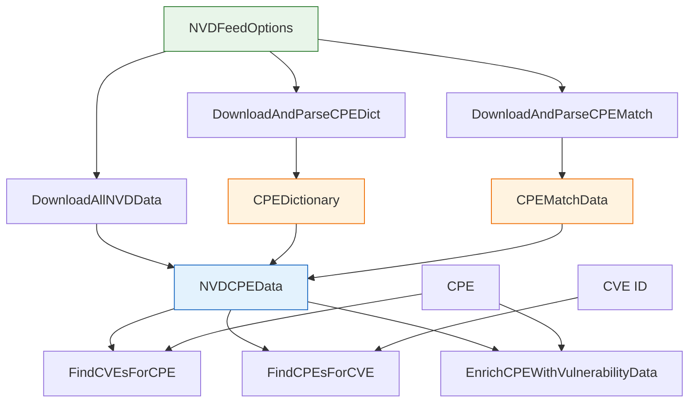

# 📡 NVD

The `nvd` module downloads and parses feeds from the U.S. National Vulnerability Database (NVD): the official CPE dictionary, the CPE–CVE match feed, and combined `NVDCPEData` that supports bidirectional CPE↔CVE lookup and CPE enrichment. It also exposes NVD API 2.0 endpoint constants.

## Constants

```go
const (
    NVDApiBaseURL    = "https://services.nvd.nist.gov/rest/json/cves/2.0"
    NVDApiCPEsURL    = "https://services.nvd.nist.gov/rest/json/cpes/2.0"
    NVDCPEMatch      = "https://nvd.nist.gov/feeds/json/cpematch/1.0/nvdcpematch-1.0.json.gz"
    NVDCPEDict       = "https://nvd.nist.gov/feeds/xml/cpe/dictionary/official-cpe-dictionary_v2.3.xml.gz"
    NVDCVERecentURL  = "https://nvd.nist.gov/feeds/json/cve/1.1/nvdcve-1.1-recent.json.gz"
    NVDResultsPerPage = 2000
)
```

`NVDApiBaseURL` / `NVDApiCPEsURL` are the API 2.0 JSON endpoints for CVEs and CPEs. `NVDCPEMatch` and `NVDCPEDict` are the legacy gzipped feed URLs. `NVDResultsPerPage` is the page size used for paginated API 2.0 requests.

## Type: NVDFeedOptions

```go
type NVDFeedOptions struct {
    CacheDir               string        // cache directory; default is <tmp>/cpe-cache
    CacheMaxAge            int           // cache TTL in hours; default 24
    MaxConcurrentDownloads int           // max concurrent downloads; default 3
    ShowProgress           bool          // print progress to stdout; default true
    HTTPClient             *http.Client  // custom HTTP client; default 60s timeout
}
```

Configures download behavior. Use `DefaultNVDFeedOptions()` and override only the fields you need.

## Type: NVDCPEData

```go
type NVDCPEData struct {
    CPEDictionary *CPEDictionary  // all officially registered CPE entries
    CPEMatchData  *CPEMatchData   // bidirectional CPE-CVE mapping
    DownloadTime  time.Time       // when the data was downloaded
    // mu sync.RWMutex protects concurrent access to cached query results
}
```

Aggregates the CPE dictionary and the CPE–CVE match data into a single queryable object.

## Type: CPEMatchData

```go
type CPEMatchData struct {
    CVEToCPEs map[string][]string  // CVE ID -> affected CPE URIs
    CPEToCVEs map[string][]string  // CPE URI -> affecting CVE IDs
}
```

Bidirectional map between CVE IDs and CPE URIs.

## ⚙️ DefaultNVDFeedOptions

```go
func DefaultNVDFeedOptions() *NVDFeedOptions
```

Returns an `NVDFeedOptions` with sensible defaults: `CacheDir` = `<tmp>/cpe-cache`, `CacheMaxAge` = 24, `MaxConcurrentDownloads` = 3, `ShowProgress` = true, `HTTPClient` = 60-second timeout.

| Return | Type | Description |
| --- | --- | --- |
| #1 | `*NVDFeedOptions` | Default options; modify fields before use |

```go
opts := cpeskills.DefaultNVDFeedOptions()
opts.CacheDir = "/var/cache/nvd"
```

## 📥 DownloadAndParseCPEDict

```go
func DownloadAndParseCPEDict(options *NVDFeedOptions) (*CPEDictionary, error)
```

Downloads (or reads from cache) and parses the NVD official CPE dictionary (`NVDCPEDict`), returning a `CPEDictionary` with all registered CPE entries.

| Parameter | Type | Description |
| --- | --- | --- |
| `options` | `*NVDFeedOptions` | Download/cache options |

| Return | Type | Description |
| --- | --- | --- |
| #1 | `*CPEDictionary` | Parsed CPE dictionary |
| #2 | `error` | Download or parse error |

```go
dict, err := cpeskills.DownloadAndParseCPEDict(cpeskills.DefaultNVDFeedOptions())
```

## 📥 DownloadAndParseCPEMatch

```go
func DownloadAndParseCPEMatch(options *NVDFeedOptions) (*CPEMatchData, error)
```

Downloads (or reads from cache) and parses the NVD CPE match feed (`NVDCPEMatch`), returning the bidirectional `CPEMatchData`.

| Parameter | Type | Description |
| --- | --- | --- |
| `options` | `*NVDFeedOptions` | Download/cache options |

| Return | Type | Description |
| --- | --- | --- |
| #1 | `*CPEMatchData` | Parsed CPE–CVE mapping |
| #2 | `error` | Download or parse error |

```go
match, err := cpeskills.DownloadAndParseCPEMatch(cpeskills.DefaultNVDFeedOptions())
```

## 📦 DownloadAllNVDData

```go
func DownloadAllNVDData(options *NVDFeedOptions) (*NVDCPEData, error)
```

Downloads and parses both the CPE dictionary and the CPE match feed, returning a combined `NVDCPEData`.

| Parameter | Type | Description |
| --- | --- | --- |
| `options` | `*NVDFeedOptions` | Download/cache options |

| Return | Type | Description |
| --- | --- | --- |
| #1 | `*NVDCPEData` | Combined dictionary + match data |
| #2 | `error` | Download or parse error |

```go
data, err := cpeskills.DownloadAllNVDData(cpeskills.DefaultNVDFeedOptions())
```

## 🔎 FindCVEsForCPE

```go
func (data *NVDCPEData) FindCVEsForCPE(cpe *CPE) []string
```

Returns the CVE IDs that affect the given CPE, looked up via the match data's `CPEToCVEs` map (with fuzzy matching as a fallback).

| Parameter | Type | Description |
| --- | --- | --- |
| `cpe` | `*CPE` | The CPE to look up |

| Return | Type | Description |
| --- | --- | --- |
| #1 | `[]string` | CVE IDs affecting the CPE; empty slice if none |

```go
cpe, _ := cpeskills.ParseCpe23("cpe:2.3:o:microsoft:windows:10:*:*:*:*:*:*:*")
cves := data.FindCVEsForCPE(cpe)
```

## 🔎 FindCPEsForCVE

```go
func (data *NVDCPEData) FindCPEsForCVE(cveID string) []*CPE
```

Returns the CPEs affected by the given CVE ID, looked up via the match data's `CVEToCPEs` map.

| Parameter | Type | Description |
| --- | --- | --- |
| `cveID` | `string` | CVE identifier |

| Return | Type | Description |
| --- | --- | --- |
| #1 | `[]*CPE` | CPEs affected by the CVE; empty slice if none |

```go
cpes := data.FindCPEsForCVE("CVE-2021-44228")
```

## ✨ EnrichCPEWithVulnerabilityData

```go
func (data *NVDCPEData) EnrichCPEWithVulnerabilityData(cpe *CPE)
```

Augments the given `CPE` in place with vulnerability data derived from the match data (e.g. populates the CPE's associated CVE list).

| Parameter | Type | Description |
| --- | --- | --- |
| `cpe` | `*CPE` | The CPE to enrich (modified in place) |

```go
cpe, _ := cpeskills.ParseCpe23("cpe:2.3:a:apache:log4j:2.0:*:*:*:*:*:*:*")
data.EnrichCPEWithVulnerabilityData(cpe)
```

## 🧭 NVD Download & Query Flow


