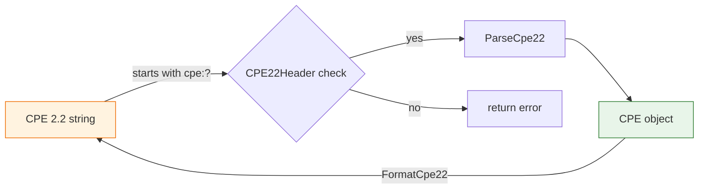

# 🔍 CPE 2.2 Parser

This module provides parsing and formatting for the CPE 2.2 form (the legacy URI prefixed with `cpe:`).

## Constant

```go
const CPE22Header = "cpe"
```

`CPE22Header` is the fixed prefix of a CPE 2.2 URI; every well-formed 2.2 string begins with `cpe:`.

## 📥 ParseCpe22

```go
func ParseCpe22(cpe22 string) (*CPE, error)
```

Parses a CPE 2.2-formatted string into a `CPE` object. The string should start with the `cpe:` prefix and carry attributes such as `part:vendor:product:version`.

| Parameter | Type | Description |
| --- | --- | --- |
| `cpe22` | `string` | The CPE 2.2 string to parse |

| Return | Type | Description |
| --- | --- | --- |
| #1 | `*CPE` | The parsed CPE object |
| #2 | `error` | An error if parsing fails |

```go
package main

import (
    "fmt"
    "github.com/scagogogo/cpe-skills"
)

func main() {
    cpe, err := cpeskills.ParseCpe22("cpe:/a:microsoft:windows:10")
    if err != nil {
        panic(err)
    }
    fmt.Println(cpe.GetURI())
}
```

## 📤 FormatCpe22

```go
func FormatCpe22(cpe *CPE) string
```

Formats a `CPE` object into a CPE 2.2 URI string.

| Parameter | Type | Description |
| --- | --- | --- |
| `cpe` | `*CPE` | The CPE object to format |

| Return | Type | Description |
| --- | --- | --- |
| #1 | `string` | The CPE 2.2 URI string |

```go
cpe := cpeskills.MustParse("cpe:2.3:a:microsoft:windows:10:*:*:*:*:*:*:*")
fmt.Println(cpeskills.FormatCpe22(cpe))
```

## 🔄 Parse Flow


