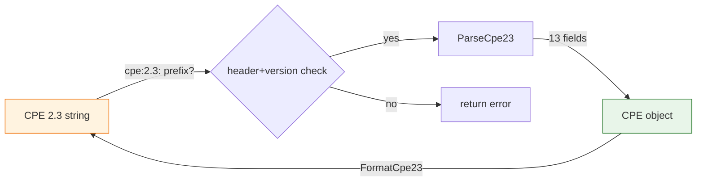

# 🔍 CPE 2.3 Parser

This module provides parsing and formatting for the CPE 2.3 form (the colon-delimited URI prefixed with `cpe:2.3:`), which is the current standard.

## Constants

```go
const CPE23Header = "cpe"
const CPE23Version = "2.3"
```

`CPE23Header` is the fixed prefix of a CPE 2.3 URI, and `CPE23Version` is the version segment embedded in every 2.3 string (`cpe:2.3:...`).

## 📥 ParseCpe23

```go
func ParseCpe23(cpe23 string) (*CPE, error)
```

Parses a CPE 2.3-formatted string into a `CPE` object. The string must start with `cpe:2.3:` and contain the 13 attribute fields defined by the specification.

| Parameter | Type | Description |
| --- | --- | --- |
| `cpe23` | `string` | The CPE 2.3 string to parse |

| Return | Type | Description |
| --- | --- | --- |
| #1 | `*CPE` | The parsed CPE object |
| #2 | `error` | An error if parsing fails |

```go
package main

import (
    "fmt"
    "github.com/scagogogo/cpe-skills"
)

func main() {
    cpe, err := cpeskills.ParseCpe23("cpe:2.3:a:microsoft:windows:10:*:*:*:*:*:*:*")
    if err != nil {
        panic(err)
    }
    fmt.Println(cpe.Vendor, cpe.ProductName)
}
```

## 📤 FormatCpe23

```go
func FormatCpe23(cpe *CPE) string
```

Formats a `CPE` object into a CPE 2.3 URI string.

| Parameter | Type | Description |
| --- | --- | --- |
| `cpe` | `*CPE` | The CPE object to format |

| Return | Type | Description |
| --- | --- | --- |
| #1 | `string` | The CPE 2.3 URI string |

```go
cpe := cpeskills.MustParse("cpe:2.3:a:microsoft:windows:10:*:*:*:*:*:*:*")
fmt.Println(cpeskills.FormatCpe23(cpe))
```

## 🔄 Parse Flow


