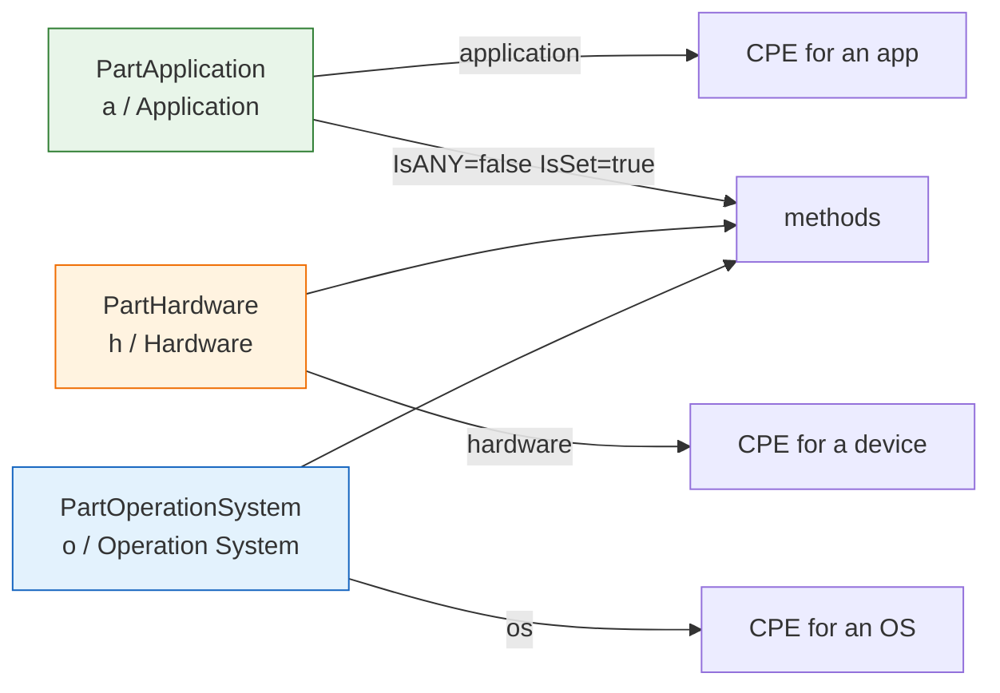

# 🧱 Part

`Part` represents the component type of a CPE identifier — the first attribute of every CPE, distinguishing applications (`a`), hardware (`h`), and operating systems (`o`). This module declares the `Part` struct, the three predefined `Part` values, and the inspection methods on `Part`.

## Type: Part

```go
type Part struct {
    ShortName   string
    LongName    string
    Description string
}
```

| Field | Type | Description |
| --- | --- | --- |
| `ShortName` | `string` | One-character short name used in CPE URIs: `a`, `h`, or `o` |
| `LongName` | `string` | Full name: `Application`, `Hardware`, or `Operation System` |
| `Description` | `string` | Human-readable description of the component type |

## Variables

```go
var PartApplication = &Part{
    ShortName:   "a",
    LongName:    "Application",
    Description: "表示软件应用程序，包括但不限于桌面应用、服务器应用、移动应用等",
}

var PartHardware = &Part{
    ShortName:   "h",
    LongName:    "Hardware",
    Description: "表示物理硬件设备，包括但不限于网络设备、服务器、存储设备等",
}

var PartOperationSystem = &Part{
    ShortName:   "o",
    LongName:    "Operation System",
    Description: "表示操作系统，用于管理计算机硬件与软件资源的系统软件",
}
```

The three predefined `Part` values, returned as pointers. Use them to set the `Part` field of a `CPE` struct (dereference when assigning by value, e.g. `*cpeskills.PartApplication`).

> Note: the variable name is `PartOperationSystem` (matching the source spelling), not `PartOperatingSystem`.

## ❓ IsANY

```go
func (p Part) IsANY() bool
```

Reports whether the part is the logical ANY value, i.e. its `ShortName` is `*`.

| Return | Type | Description |
| --- | --- | --- |
| #1 | `bool` | `true` if `ShortName == "*"` |

```go
p := *cpeskills.PartApplication
fmt.Println(p.IsANY()) // false
```

## ❓ IsNA

```go
func (p Part) IsNA() bool
```

Reports whether the part is the logical NA value, i.e. its `ShortName` is `-`.

| Return | Type | Description |
| --- | --- | --- |
| #1 | `bool` | `true` if `ShortName == "-"` |

```go
p := Part{ShortName: "-"}
fmt.Println(p.IsNA()) // true
```

## ✔️ IsSet

```go
func (p Part) IsSet() bool
```

Reports whether the part has a real value: `ShortName` is non-empty, non-ANY, and non-NA.

| Return | Type | Description |
| --- | --- | --- |
| #1 | `bool` | `true` if the part is a concrete value |

```go
p := *cpeskills.PartApplication
fmt.Println(p.IsSet()) // true
```

## 🧹 Normalize

```go
func (p Part) Normalize() string
```

Returns the lowercased `ShortName`.

| Return | Type | Description |
| --- | --- | --- |
| #1 | `string` | The lowercased short name |

```go
p := Part{ShortName: "A"}
fmt.Println(p.Normalize()) // a
```

## 📐 Part Values Diagram


