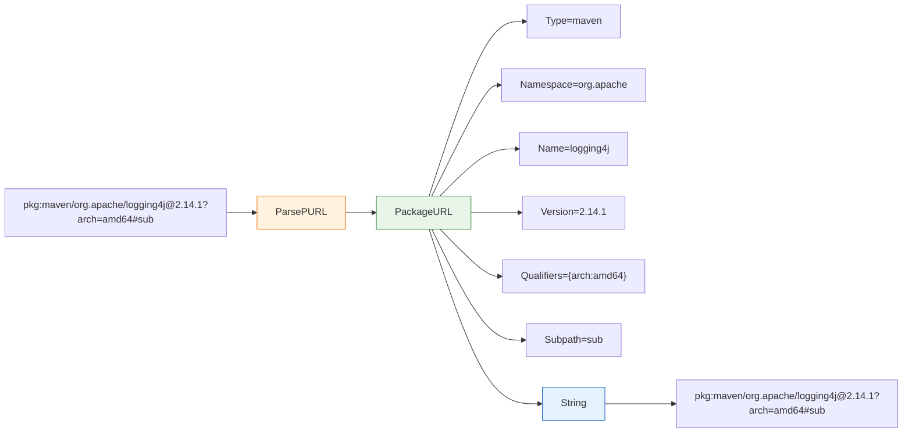

# 📦 Package URL (PURL)

`PackageURL` represents a Package URL — a standardized package identifier used across SCA tools, SBOMs, and vulnerability databases to uniquely identify software packages. The format follows the [purl-spec](https://github.com/package-url/purl-spec): `scheme:type/namespace/name@version?qualifiers#subpath`. This module declares the `PackageURL` struct together with parsing, formatting, and comparison helpers.

## Type: PackageURL

```go
type PackageURL struct {
    Type       string
    Namespace  string
    Name       string
    Version    string
    Qualifiers map[string]string
    Subpath    string
}
```

| Field | Type | Description |
| --- | --- | --- |
| `Type` | `string` | Package type / ecosystem (`npm`, `maven`, `pypi`, `golang`, `nuget`, etc.) |
| `Namespace` | `string` | Namespace (`@scope` for npm, groupId for Maven) |
| `Name` | `string` | Package name |
| `Version` | `string` | Package version |
| `Qualifiers` | `map[string]string` | Qualifiers as key-value pairs, e.g. `{"arch": "amd64", "os": "linux"}` |
| `Subpath` | `string` | Subpath |

## 🔍 ParsePURL

```go
func ParsePURL(raw string) (*PackageURL, error)
```

Parses a PURL string into a `PackageURL` struct. Supports the formats `pkg:type/name@version`, `pkg:type/namespace/name@version`, `pkg:type/namespace/name@version?key=value&key2=value2`, and `pkg:type/namespace/name@version?key=value#subpath`. Each segment is URL-decoded.

| Parameter | Type | Description |
| --- | --- | --- |
| `raw` | `string` | The raw PURL string, must start with `pkg:` |

| Return | Type | Description |
| --- | --- | --- |
| #1 | `*PackageURL` | The parsed PURL, or `nil` on error |
| #2 | `error` | Non-nil if the string is empty, lacks the `pkg:` scheme, or is malformed |

```go
p, err := cpeskills.ParsePURL("pkg:maven/org.apache.logging.log4j/log4j-core@2.14.1")
if err != nil {
    log.Fatal(err)
}
fmt.Println(p.Type, p.Namespace, p.Name, p.Version)
// maven org.apache.logging.log4j log4j-core 2.14.1
```

## 📝 String

```go
func (p *PackageURL) String() string
```

Formats the `PackageURL` as a canonical PURL string. Qualifier keys are emitted in alphabetical order to guarantee stable output. Returns an empty string when `p` is nil.

| Return | Type | Description |
| --- | --- | --- |
| #1 | `string` | The canonical PURL string |

```go
p, _ := cpeskills.ParsePURL("pkg:npm/@vue/cli@5.0.0")
fmt.Println(p.String()) // pkg:npm/%40vue/cli@5.0.0
```

## ✅ IsValid

```go
func (p *PackageURL) IsValid() bool
```

Reports whether the PURL is valid: both `Type` and `Name` must be non-empty. Returns `false` when `p` is nil.

| Return | Type | Description |
| --- | --- | --- |
| #1 | `bool` | `true` if `Type != ""` and `Name != ""` |

```go
p := &cpeskills.PackageURL{Type: "npm", Name: "express"}
fmt.Println(p.IsValid()) // true
```

## 🌐 Ecosystem

```go
func (p *PackageURL) Ecosystem() Ecosystem
```

Returns the `Ecosystem` corresponding to the PURL `Type`, falling back to `EcosystemGeneric` when `p` is nil or the type is unrecognized.

| Return | Type | Description |
| --- | --- | --- |
| #1 | `Ecosystem` | The ecosystem mapped from `Type` |

```go
p, _ := cpeskills.ParsePURL("pkg:cargo/serde@1.0")
fmt.Println(p.Ecosystem()) // cargo
```

## 🏷️ FullName

```go
func (p *PackageURL) FullName() string
```

Returns the full package name including the namespace, e.g. `org.apache.logging.log4j/log4j-core` or just `express` when there is no namespace. Returns an empty string when `p` is nil.

| Return | Type | Description |
| --- | --- | --- |
| #1 | `string` | `Namespace + "/" + Name`, or `Name` when `Namespace` is empty |

```go
p, _ := cpeskills.ParsePURL("pkg:maven/org.apache.logging.log4j/log4j-core@2.14.1")
fmt.Println(p.FullName()) // org.apache.logging.log4j/log4j-core
```

## 📋 Copy

```go
func (p *PackageURL) Copy() *PackageURL
```

Creates a deep copy of the PURL, including a fresh `Qualifiers` map. Returns `nil` when `p` is nil.

| Return | Type | Description |
| --- | --- | --- |
| #1 | `*PackageURL` | A deep copy of `p` |

```go
p, _ := cpeskills.ParsePURL("pkg:pypi/django@4.2?arch=amd64")
cp := p.Copy()
cp.Version = "4.2.1"
fmt.Println(p.Version, cp.Version) // 4.2 4.2.1
```

## 🚫 WithoutVersion

```go
func (p *PackageURL) WithoutVersion() *PackageURL
```

Returns a copy of the PURL with the `Version` field cleared.

| Return | Type | Description |
| --- | --- | --- |
| #1 | `*PackageURL` | A copy of `p` with `Version == ""` |

```go
p, _ := cpeskills.ParsePURL("pkg:npm/express@4.17.1")
fmt.Println(p.WithoutVersion().String()) // pkg:npm/express
```

## 🏷️ WithVersion

```go
func (p *PackageURL) WithVersion(version string) *PackageURL
```

Returns a copy of the PURL with the `Version` field set to `version`.

| Parameter | Type | Description |
| --- | --- | --- |
| `version` | `string` | The version to set |

| Return | Type | Description |
| --- | --- | --- |
| #1 | `*PackageURL` | A copy of `p` with the given version |

```go
p, _ := cpeskills.ParsePURL("pkg:npm/express")
fmt.Println(p.WithVersion("4.18.0").String()) // pkg:npm/express@4.18.0
```

## ⚖️ Equals

```go
func (p *PackageURL) Equals(other *PackageURL) bool
```

Reports whether two PURLs are equal, ignoring qualifier order. Two nil PURLs are considered equal; a nil and a non-nil PURL are not.

| Parameter | Type | Description |
| --- | --- | --- |
| `other` | `*PackageURL` | The PURL to compare against |

| Return | Type | Description |
| --- | --- | --- |
| #1 | `bool` | `true` if type, namespace, name, version, subpath, and qualifiers all match |

```go
a, _ := cpeskills.ParsePURL("pkg:npm/express@4.17.1?os=linux&arch=amd64")
b, _ := cpeskills.ParsePURL("pkg:npm/express@4.17.1?arch=amd64&os=linux")
fmt.Println(a.Equals(b)) // true
```

## 🆕 NewPURL

```go
func NewPURL(purlType, namespace, name, version string) *PackageURL
```

Constructs a new `PackageURL` with an initialized (empty) `Qualifiers` map.

| Parameter | Type | Description |
| --- | --- | --- |
| `purlType` | `string` | Package type / ecosystem |
| `namespace` | `string` | Namespace (may be empty) |
| `name` | `string` | Package name |
| `version` | `string` | Package version (may be empty) |

| Return | Type | Description |
| --- | --- | --- |
| #1 | `*PackageURL` | A new PURL with an empty qualifiers map |

```go
p := cpeskills.NewPURL("npm", "@vue", "cli", "5.0.0")
fmt.Println(p.String()) // pkg:npm/%40vue/cli@5.0.0
```

## 🌐 NewPURLWithEcosystem

```go
func NewPURLWithEcosystem(ecosystem Ecosystem, namespace, name, version string) (*PackageURL, error)
```

Constructs a PURL using an `Ecosystem` value; the PURL `Type` is taken from the ecosystem's `PURLType`. Returns an error if the ecosystem is unknown.

| Parameter | Type | Description |
| --- | --- | --- |
| `ecosystem` | `Ecosystem` | The ecosystem to derive the PURL type from |
| `namespace` | `string` | Namespace (may be empty) |
| `name` | `string` | Package name |
| `version` | `string` | Package version (may be empty) |

| Return | Type | Description |
| --- | --- | --- |
| #1 | `*PackageURL` | The new PURL, or `nil` on error |
| #2 | `error` | Non-nil if the ecosystem is not registered |

```go
p, err := cpeskills.NewPURLWithEcosystem(cpeskills.EcosystemMaven, "org.springframework", "spring-core", "5.3.20")
if err != nil {
    log.Fatal(err)
}
fmt.Println(p.String()) // pkg:maven/org.springframework/spring-core@5.3.20
```

## 📐 PURL Structure Diagram


