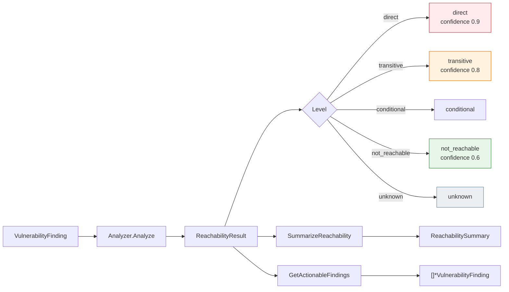

# 🎯 Reachability

The reachability module assesses how directly a vulnerability can be reached through the dependency graph — from a directly-used API (`direct`) down to `not_reachable`. It defines the `ReachabilityLevel` type and its constants, the `ReachabilityResult` and `ReachabilitySummary` structs, a pluggable `ReachabilityAnalyzer` interface, the default `DependencyGraphReachabilityAnalyzer` implementation, and batch/summary helpers.

## Type: ReachabilityLevel

```go
type ReachabilityLevel string
```

Describes how directly a vulnerability can be reached.

## Constants

```go
const (
    ReachabilityDirect       ReachabilityLevel = "direct"
    ReachabilityTransitive   ReachabilityLevel = "transitive"
    ReachabilityConditional  ReachabilityLevel = "conditional"
    ReachabilityNotReachable ReachabilityLevel = "not_reachable"
    ReachabilityUnknown      ReachabilityLevel = "unknown"
)
```

| Constant | Value | Description |
| --- | --- | --- |
| `ReachabilityDirect` | `direct` | The vulnerability is in a directly-used API |
| `ReachabilityTransitive` | `transitive` | The vulnerability is in a transitive dependency |
| `ReachabilityConditional` | `conditional` | Reachable only under certain conditions |
| `ReachabilityNotReachable` | `not_reachable` | The vulnerability cannot be reached |
| `ReachabilityUnknown` | `unknown` | Reachability cannot be determined |

## Type: ReachabilityResult

```go
type ReachabilityResult struct {
    Vulnerability *VulnerabilityFinding `json:"vulnerability"`
    Level         ReachabilityLevel     `json:"level"`
    Path          []string              `json:"path,omitempty"`
    Evidence      string                `json:"evidence,omitempty"`
    Confidence    float64               `json:"confidence"`
}
```

| Field | Type | Description |
| --- | --- | --- |
| `Vulnerability` | `*VulnerabilityFinding` | The vulnerability finding being analyzed |
| `Level` | `ReachabilityLevel` | The reachability assessment |
| `Path` | `[]string` | Call/dependency path from root to the vulnerable component |
| `Evidence` | `string` | How the reachability was determined |
| `Confidence` | `float64` | Confidence in the assessment (`0.0`–`1.0`) |

## Type: ReachabilityAnalyzer

```go
type ReachabilityAnalyzer interface {
    Analyze(graph *DependencyGraph, findings []*VulnerabilityFinding) ([]*ReachabilityResult, error)
    AnalyzeComponent(graph *DependencyGraph, component *SBOMComponent, findings []*VulnerabilityFinding) ([]*ReachabilityResult, error)
}
```

A pluggable interface for reachability analysis, allowing implementations ranging from simple dependency-graph traversal to full static analysis.

## Type: DependencyGraphReachabilityAnalyzer

```go
type DependencyGraphReachabilityAnalyzer struct {
    MaxDepth               int
    IncludeDevDependencies bool
}
```

The default, lightweight analyzer suitable for most SCA use cases. It determines reachability from whether a component is a direct or transitive dependency.

| Field | Type | Description |
| --- | --- | --- |
| `MaxDepth` | `int` | Maximum dependency depth to analyze (0 = unlimited) |
| `IncludeDevDependencies` | `bool` | Whether to include development dependencies |

## Type: ReachabilitySummary

```go
type ReachabilitySummary struct {
    Total           int    `json:"total"`
    Direct          int    `json:"direct"`
    Transitive      int    `json:"transitive"`
    Conditional     int    `json:"conditional"`
    NotReachable    int    `json:"notReachable"`
    Unknown         int    `json:"unknown"`
    HighestRiskLevel string `json:"highestRiskLevel"`
}
```

| Field | Type | Description |
| --- | --- | --- |
| `Total` | `int` | Total vulnerabilities analyzed |
| `Direct` | `int` | Count of directly reachable vulnerabilities |
| `Transitive` | `int` | Count of transitively reachable vulnerabilities |
| `Conditional` | `int` | Count of conditionally reachable vulnerabilities |
| `NotReachable` | `int` | Count of unreachable vulnerabilities |
| `Unknown` | `int` | Count of vulnerabilities with unknown reachability |
| `HighestRiskLevel` | `string` | Highest risk reachability level with count > 0 |

## 🆕 NewDependencyGraphReachabilityAnalyzer

```go
func NewDependencyGraphReachabilityAnalyzer() *DependencyGraphReachabilityAnalyzer
```

Creates a default analyzer with unlimited depth (`MaxDepth == 0`) and dev dependencies excluded.

| Return | Type | Description |
| --- | --- | --- |
| #1 | `*DependencyGraphReachabilityAnalyzer` | A new default analyzer |

```go
a := cpeskills.NewDependencyGraphReachabilityAnalyzer()
```

## 🔬 Analyze

```go
func (a *DependencyGraphReachabilityAnalyzer) Analyze(graph *DependencyGraph, findings []*VulnerabilityFinding) ([]*ReachabilityResult, error)
```

Analyzes reachability for all findings against the dependency graph. Depths are recomputed first. Each finding is matched to a graph node by CVE CPE or OSV package name and assessed. Unmatched findings get `ReachabilityUnknown`.

| Parameter | Type | Description |
| --- | --- | --- |
| `graph` | `*DependencyGraph` | The dependency graph |
| `findings` | `[]*VulnerabilityFinding` | The vulnerability findings to assess |

| Return | Type | Description |
| --- | --- | --- |
| #1 | `[]*ReachabilityResult` | Reachability result per finding |
| #2 | `error` | Non-nil if `graph` is nil |

```go
results, err := analyzer.Analyze(graph, findings)
if err != nil {
    log.Fatal(err)
}
for _, r := range results {
    fmt.Println(r.Level, r.Confidence)
}
```

## 🔬 AnalyzeComponent

```go
func (a *DependencyGraphReachabilityAnalyzer) AnalyzeComponent(graph *DependencyGraph, component *SBOMComponent, findings []*VulnerabilityFinding) ([]*ReachabilityResult, error)
```

Analyzes reachability for the findings against a single component's node in the graph.

| Parameter | Type | Description |
| --- | --- | --- |
| `graph` | `*DependencyGraph` | The dependency graph |
| `component` | `*SBOMComponent` | The component to assess |
| `findings` | `[]*VulnerabilityFinding` | The vulnerability findings to assess |

| Return | Type | Description |
| --- | --- | --- |
| #1 | `[]*ReachabilityResult` | Reachability result per finding |
| #2 | `error` | Non-nil if `graph` is nil or the component is not in the graph |

```go
results, err := analyzer.AnalyzeComponent(graph, comp, findings)
```

## ⚡ QuickReachabilityCheck

```go
func QuickReachabilityCheck(graph *DependencyGraph, component *SBOMComponent, finding *VulnerabilityFinding) *ReachabilityResult
```

A convenience function that runs the default analyzer on a single component/finding. On any error it returns a result with `ReachabilityUnknown` and `Confidence == 0.0`.

| Parameter | Type | Description |
| --- | --- | --- |
| `graph` | `*DependencyGraph` | The dependency graph |
| `component` | `*SBOMComponent` | The component to assess |
| `finding` | `*VulnerabilityFinding` | The single finding to assess |

| Return | Type | Description |
| --- | --- | --- |
| #1 | `*ReachabilityResult` | The reachability result (never nil) |

```go
r := cpeskills.QuickReachabilityCheck(graph, comp, finding)
fmt.Println(r.Level, r.Evidence)
```

## 📦 BatchReachabilityAnalysis

```go
func BatchReachabilityAnalysis(graphs []*DependencyGraph, findings []*VulnerabilityFinding) (map[string][]*ReachabilityResult, error)
```

Runs reachability analysis across multiple dependency graphs — useful for monorepos where each sub-project has its own graph. Result keys are derived from the first direct root node's component name, falling back to `graph-<index>`.

| Parameter | Type | Description |
| --- | --- | --- |
| `graphs` | `[]*DependencyGraph` | The dependency graphs to analyze |
| `findings` | `[]*VulnerabilityFinding` | The vulnerability findings to assess |

| Return | Type | Description |
| --- | --- | --- |
| #1 | `map[string][]*ReachabilityResult` | Map of graph name to results |
| #2 | `error` | Always nil; per-graph failures yield a `nil` entry |

```go
results, _ := cpeskills.BatchReachabilityAnalysis(graphs, findings)
for name, rs := range results {
    fmt.Println(name, len(rs))
}
```

## 📊 SummarizeReachability

```go
func SummarizeReachability(results []*ReachabilityResult) *ReachabilitySummary
```

Aggregates reachability results into a summary, counting results by level and determining the highest risk level present.

| Parameter | Type | Description |
| --- | --- | --- |
| `results` | `[]*ReachabilityResult` | The results to summarize |

| Return | Type | Description |
| --- | --- | --- |
| #1 | `*ReachabilitySummary` | The aggregated summary |

```go
summary := cpeskills.SummarizeReachability(results)
fmt.Printf("direct=%d transitive=%d highest=%s\n", summary.Direct, summary.Transitive, summary.HighestRiskLevel)
```

## ✅ GetActionableFindings

```go
func GetActionableFindings(results []*ReachabilityResult) []*VulnerabilityFinding
```

Filters results to the actionable findings — those whose level is not `ReachabilityNotReachable`. (`ReachabilityUnknown` findings are retained since they warrant investigation.)

| Parameter | Type | Description |
| --- | --- | --- |
| `results` | `[]*ReachabilityResult` | The results to filter |

| Return | Type | Description |
| --- | --- | --- |
| #1 | `[]*VulnerabilityFinding` | Findings that are not `not_reachable` |

```go
actionable := cpeskills.GetActionableFindings(results)
for _, f := range actionable {
    fmt.Println(f.CVE.CVEID)
}
```

## 📐 Reachability Levels Diagram


