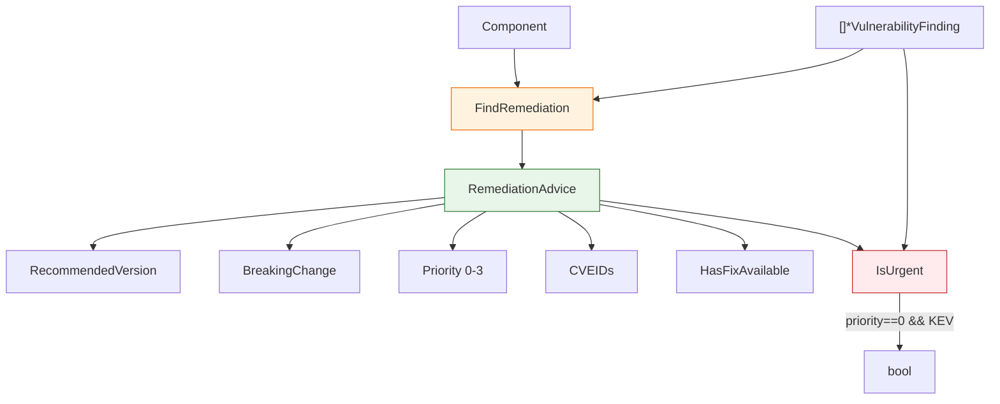

# 🛠️ Remediation

The remediation module produces upgrade advice for a component given its vulnerability findings — the recommended fixed version, whether the upgrade is breaking, the affected CVE IDs, and a priority level. It declares the `RemediationAdvice` struct and the `FindRemediation` constructor plus the two inspection methods on `RemediationAdvice`.

## Type: RemediationAdvice

```go
type RemediationAdvice struct {
    Component          *SBOMComponent `json:"component"`
    CurrentVersion     string         `json:"currentVersion"`
    RecommendedVersion string         `json:"recommendedVersion"`
    BreakingChange     bool           `json:"breakingChange"`
    CVEIDs             []string       `json:"cveIDs"`
    Priority           int            `json:"priority"`
    Summary            string         `json:"summary"`
}
```

| Field | Type | Description |
| --- | --- | --- |
| `Component` | `*SBOMComponent` | The component needing remediation |
| `CurrentVersion` | `string` | Current version |
| `RecommendedVersion` | `string` | Recommended fix version (empty if none found) |
| `BreakingChange` | `bool` | Whether the upgrade is a breaking change |
| `CVEIDs` | `[]string` | CVE IDs this remediation addresses |
| `Priority` | `int` | Remediation priority (`0`=highest, `1`=high, `2`=medium, `3`=low) |
| `Summary` | `string` | Remediation advice summary |

## 🔎 FindRemediation

```go
func FindRemediation(component *SBOMComponent, findings []*VulnerabilityFinding) *RemediationAdvice
```

Builds remediation advice for `component` based on its findings. It collects fixed versions from each finding (including OSV data), picks the most frequently suggested version, flags a breaking change when the major version differs, gathers CVE IDs, and sets the priority from the highest severity seen (Critical → 0, High → 1, Medium → 2, else → 3).

| Parameter | Type | Description |
| --- | --- | --- |
| `component` | `*SBOMComponent` | The component to remediate |
| `findings` | `[]*VulnerabilityFinding` | The vulnerability findings for the component |

| Return | Type | Description |
| --- | --- | --- |
| #1 | `*RemediationAdvice` | The remediation advice (never nil) |

```go
advice := cpeskills.FindRemediation(component, findings)
fmt.Printf("upgrade %s -> %s (priority %d): %s\n",
    advice.CurrentVersion, advice.RecommendedVersion, advice.Priority, advice.Summary)
```

## ✅ HasFixAvailable

```go
func (r *RemediationAdvice) HasFixAvailable() bool
```

Reports whether a recommended fix version was found.

| Return | Type | Description |
| --- | --- | --- |
| #1 | `bool` | `true` if `RecommendedVersion != ""` |

```go
if advice.HasFixAvailable() {
    fmt.Println("fix:", advice.RecommendedVersion)
}
```

## 🚨 IsUrgent

```go
func (r *RemediationAdvice) IsUrgent(findings []*VulnerabilityFinding) bool
```

Reports whether remediation is urgent — the priority must be `0` (Critical) and at least one finding must be listed in the Known Exploited Vulnerabilities (KEV) catalog.

| Parameter | Type | Description |
| --- | --- | --- |
| `findings` | `[]*VulnerabilityFinding` | The findings to check for KEV listing |

| Return | Type | Description |
| --- | --- | --- |
| #1 | `bool` | `true` if priority is 0 and any finding is KEV-listed |

```go
if advice.IsUrgent(findings) {
    fmt.Println("URGENT: Critical + KEV-listed, remediate immediately")
}
```

## 📐 Remediation Flow Diagram


