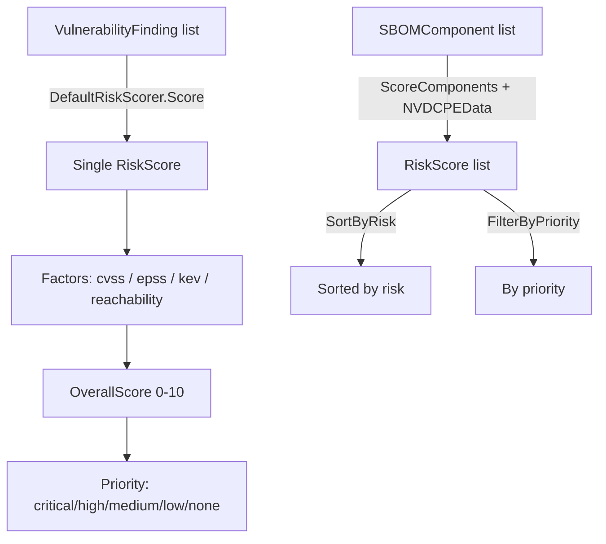

# ⚖️ Risk Scoring

The `risk_scoring` module scores components by combining CVSS, EPSS, KEV listing, and reachability into a single 0-10 `OverallScore` and a `RiskPriority`. It provides a `RiskScorer` interface, a default weighted implementation, batch scoring, and sort/filter helpers.

## Type: RiskPriority

```go
type RiskPriority string
```

Enumerates risk priority levels.

| Constant | Type | Value |
| --- | --- | --- |
| `RiskPriorityCritical` | `RiskPriority` | `"critical"` |
| `RiskPriorityHigh` | `RiskPriority` | `"high"` |
| `RiskPriorityMedium` | `RiskPriority` | `"medium"` |
| `RiskPriorityLow` | `RiskPriority` | `"low"` |
| `RiskPriorityNone` | `RiskPriority` | `"none"` |

## Type: RiskScore

```go
type RiskScore struct {
    Component       *SBOMComponent    // assessed component
    OverallScore    float64           // aggregate risk score (0-10)
    CVSSMax         float64           // highest CVSS score
    EPSSScore       float64           // EPSS exploit prediction score (0.0-1.0)
    KEVListed       bool              // whether listed in CISA KEV
    ExploitMaturity string            // exploit maturity
    Reachability    string            // reachability
    Priority        RiskPriority      // risk priority
    Factors         map[string]float64 // per-factor contributions
}
```

## Type: RiskScorer

```go
type RiskScorer interface {
    Score(findings []*VulnerabilityFinding, component *SBOMComponent) *RiskScore
}
```

The risk scorer interface. Implementations compute a `RiskScore` for a single component given its findings.

## Type: DefaultRiskScorer

```go
type DefaultRiskScorer struct {
    CVSSWeight        float64 // CVSS score weight
    EPSSWeight        float64 // EPSS score weight
    KEVWeight         float64 // KEV listing weight
    ReachabilityWeight float64 // reachability weight
}
```

The default scorer combines CVSS, EPSS, KEV, and reachability with configurable weights.

## 🆕 NewDefaultRiskScorer

```go
func NewDefaultRiskScorer() *DefaultRiskScorer
```

Creates a default scorer with weights `CVSSWeight: 0.5`, `EPSSWeight: 0.2`, `KEVWeight: 0.2`, `ReachabilityWeight: 0.1`.

| Return | Type | Description |
| --- | --- | --- |
| #1 | `*DefaultRiskScorer` | configured scorer |

```go
scorer := cpeskills.NewDefaultRiskScorer()
```

## ⚖️ Score

```go
func (s *DefaultRiskScorer) Score(findings []*VulnerabilityFinding, component *SBOMComponent) *RiskScore
```

Computes a `RiskScore` for one component. With no findings, returns a score with `Priority: RiskPriorityNone`. Otherwise it derives the max CVSS, max EPSS, any KEV listing, and a reachability score (`direct` → 1.0, `transitive` → 0.5), then computes the weighted `OverallScore` (capped at 10.0). The `Factors` map records the `cvss`, `epss`, `kev`, and `reachability` contributions. Priority is determined by score thresholds and KEV status.

| Parameter | Type | Description |
| --- | --- | --- |
| `findings` | `[]*VulnerabilityFinding` | findings for the component |
| `component` | `*SBOMComponent` | component being scored |

| Return | Type | Description |
| --- | --- | --- |
| #1 | `*RiskScore` | computed risk score |

```go
score := scorer.Score(findings, comp)
fmt.Printf("%.1f %s\n", score.OverallScore, score.Priority)
```

## ⚖️ ScoreComponents

```go
func ScoreComponents(components []*SBOMComponent, nvdData *NVDCPEData) []*RiskScore
```

Scores a batch of components. For each component with a CPE and non-nil `nvdData`, CVE IDs are looked up via `nvdData.FindCVEsForCPE` and wrapped into `VulnerabilityFinding` values (with `Reachability: "unknown"`), then scored with a fresh `DefaultRiskScorer`.

| Parameter | Type | Description |
| --- | --- | --- |
| `components` | `[]*SBOMComponent` | components to score |
| `nvdData` | `*NVDCPEData` | NVD data for CVE lookup (may be nil) |

| Return | Type | Description |
| --- | --- | --- |
| #1 | `[]*RiskScore` | risk scores, one per component |

```go
scores := cpeskills.ScoreComponents(sbom.Components, nvdData)
```

## ↕️ SortByRisk

```go
func SortByRisk(scores []*RiskScore)
```

Sorts the slice in place by `OverallScore` descending.

| Parameter | Type | Description |
| --- | --- | --- |
| `scores` | `[]*RiskScore` | scores to sort in place |

```go
cpeskills.SortByRisk(scores)
```

## 🔍 FilterByPriority

```go
func FilterByPriority(scores []*RiskScore, priority RiskPriority) []*RiskScore
```

Returns the scores whose `Priority` equals `priority`.

| Parameter | Type | Description |
| --- | --- | --- |
| `scores` | `[]*RiskScore` | input scores |
| `priority` | `RiskPriority` | target priority |

| Return | Type | Description |
| --- | --- | --- |
| #1 | `[]*RiskScore` | matching scores |

```go
critical := cpeskills.FilterByPriority(scores, cpeskills.RiskPriorityCritical)
```

## Risk Scoring Pipeline


