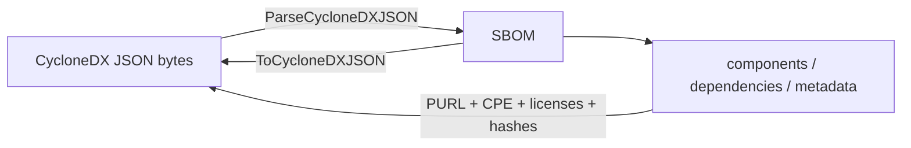

# 🔄 SBOM CycloneDX

The `sbom_cyclonedx` module provides parse/serialize bridges between the library's vendor-neutral `SBOM` model and the CycloneDX JSON format (bom format `"CycloneDX"`, spec version `1.5`). It maps components, dependencies, metadata, tools, authors, licenses, hashes, properties, and external references in both directions.

## 📥 ParseCycloneDXJSON

```go
func ParseCycloneDXJSON(data []byte) (*SBOM, error)
```

Parses CycloneDX JSON bytes into an `SBOM`. A new SBOM is created with format `SBOMFormatCycloneDX`; the spec version, serial number, metadata (timestamp, tools, authors, subject component), components, and dependencies are populated from the CycloneDX document. PURL and CPE strings on each component are parsed into `*PackageURL` and `*CPE`; license IDs/names/URLs become `*License`; hash `alg` values are lower-cased as keys.

| Parameter | Type | Description |
| --- | --- | --- |
| `data` | `[]byte` | CycloneDX JSON document bytes |

| Return | Type | Description |
| --- | --- | --- |
| #1 | `*SBOM` | parsed SBOM |
| #2 | `error` | wrapped `json.Unmarshal` error |

```go
data, _ := os.ReadFile("bom.cdx.json")
sbom, err := cpeskills.ParseCycloneDXJSON(data)
if err != nil {
    log.Fatal(err)
}
fmt.Printf("%d components\n", sbom.ComponentCount())
```

## 📤 ToCycloneDXJSON

```go
func (s *SBOM) ToCycloneDXJSON() ([]byte, error)
```

Serializes the `SBOM` to CycloneDX JSON (`bomFormat: "CycloneDX"`, `version: 1`) with 2-space indentation. Metadata timestamp is formatted as RFC3339 (`2006-01-02T15:04:05Z`); each component's PURL (if valid) and CPE URI are emitted; licenses, hashes, supplier, properties, and external references are converted to their CycloneDX representations.

| Return | Type | Description |
| --- | --- | --- |
| #1 | `[]byte` | CycloneDX JSON document |
| #2 | `error` | serialization error |

```go
sbom := cpeskills.NewSBOM(cpeskills.SBOMFormatCycloneDX, "my-app")
sbom.AddComponent(cpeskills.NewSBOMComponent("log4j-core", "2.14.0"))
out, err := sbom.ToCycloneDXJSON()
if err != nil {
    log.Fatal(err)
}
os.WriteFile("bom.cdx.json", out, 0644)
```

## CycloneDX Round-trip


