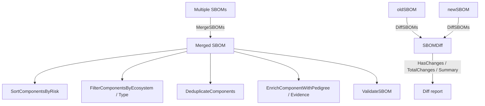

# 🧬 SBOM Enhanced

The `sbom_enhanced` module adds advanced SBOM operations on top of the core model: merging multiple SBOMs, diffing two SBOMs, sorting/filtering/deduplicating components, enriching components with pedigree and forensic evidence, and basic validation.

## Type: SBOMEvidence

```go
type SBOMEvidence struct {
    Field      string  // evidence field (e.g. "filename", "hash", "snippet")
    Value      string  // evidence value
    Confidence float64 // detection confidence (0.0-1.0)
}
```

## Type: SBOMPedigree

```go
type SBOMPedigree struct {
    Ancestors   []*SBOMComponent // ancestor components
    Descendants []*SBOMComponent // descendant components
    Variants    []*SBOMComponent // variant components
    Commits     []*SBOMCommit    // VCS commits
    Patches     []*SBOMPatch     // patches applied
    Notes       string           // additional notes
}
```

## Type: SBOMCommit

```go
type SBOMCommit struct {
    UID     string        // commit hash
    URL     string        // repository URL
    Author  *SBOMAuthor   // commit author
    Message string        // commit message
}
```

## Type: SBOMPatch

```go
type SBOMPatch struct {
    Type     string   // patch type (backport, cherry-pick, monkey, etc.)
    Diff     string   // diff content or URL
    Resolves []string // issue IDs resolved by this patch
}
```

## Type: SBOMDiff

```go
type SBOMDiff struct {
    Added     []*SBOMComponent        // in new SBOM but not old
    Removed   []*SBOMComponent        // in old SBOM but not new
    Changed   []*SBOMComponentChange  // present in both, different version
    Unchanged int                     // unchanged component count
}
```

## Type: SBOMComponentChange

```go
type SBOMComponentChange struct {
    Component  *SBOMComponent // the changed component
    OldVersion string         // previous version
    NewVersion string         // new version
    ChangeType string         // upgrade, downgrade, or sidegrade
}
```

## 🔀 MergeSBOMs

```go
func MergeSBOMs(sboms []*SBOM, format SBOMFormat, name string) (*SBOM, error)
```

Merges multiple SBOMs into one. Components are deduplicated by PURL (preferred), then CPE 2.3, then bom-ref, then name; when a duplicate is found, the higher version (per `CompareVersions`) wins. All dependencies and metadata tools/authors from every source SBOM are preserved.

| Parameter | Type | Description |
| --- | --- | --- |
| `sboms` | `[]*SBOM` | source SBOMs |
| `format` | `SBOMFormat` | format of the merged SBOM |
| `name` | `string` | merged document name |

| Return | Type | Description |
| --- | --- | --- |
| #1 | `*SBOM` | merged SBOM |
| #2 | `error` | non-nil if the input slice is empty |

```go
merged, err := cpeskills.MergeSBOMs([]*cpeskills.SBOM{sbom1, sbom2}, cpeskills.SBOMFormatCycloneDX, "merged")
```

## 🔍 DiffSBOMs

```go
func DiffSBOMs(oldSBOM, newSBOM *SBOM) *SBOMDiff
```

Computes the difference between two SBOMs. Returns a `SBOMDiff` with added, removed, and changed components plus the unchanged count. A changed component's `ChangeType` is `"upgrade"` when the new version is higher and `"downgrade"` when lower (via `CompareVersions`). If either argument is nil, all components of the other side are reported as added/removed.

| Parameter | Type | Description |
| --- | --- | --- |
| `oldSBOM` | `*SBOM` | baseline SBOM |
| `newSBOM` | `*SBOM` | current SBOM |

| Return | Type | Description |
| --- | --- | --- |
| #1 | `*SBOMDiff` | computed diff |

```go
diff := cpeskills.DiffSBOMs(oldSBOM, newSBOM)
fmt.Println(diff.Summary())
```

## ❓ HasChanges

```go
func (d *SBOMDiff) HasChanges() bool
```

Returns true if the diff has any added, removed, or changed components.

| Return | Type | Description |
| --- | --- | --- |
| #1 | `bool` | true if any changes exist |

```go
if diff.HasChanges() {
    fmt.Println("SBOM changed")
}
```

## 🔢 TotalChanges

```go
func (d *SBOMDiff) TotalChanges() int
```

Returns the total number of added, removed, and changed components.

| Return | Type | Description |
| --- | --- | --- |
| #1 | `int` | total change count |

```go
fmt.Printf("%d total changes\n", diff.TotalChanges())
```

## 📝 Summary

```go
func (d *SBOMDiff) Summary() string
```

Returns a human-readable summary such as `"3 added, 1 removed, 2 changed"`. When there are no changes, returns `"No changes (N components unchanged)"`.

| Return | Type | Description |
| --- | --- | --- |
| #1 | `string` | summary text |

```go
fmt.Println(diff.Summary())
```

## ↕️ SortComponentsByName

```go
func SortComponentsByName(components []*SBOMComponent)
```

Sorts the slice in place alphabetically by component `Name` (ascending).

| Parameter | Type | Description |
| --- | --- | --- |
| `components` | `[]*SBOMComponent` | slice to sort in place |

```go
cpeskills.SortComponentsByName(sbom.Components)
```

## ↕️ SortComponentsByRisk

```go
func SortComponentsByRisk(components []*SBOMComponent, nvdData *NVDCPEData) []*RiskScore
```

Scores the components via `ScoreComponents` (using `nvdData`), sorts the scores in descending risk order via `SortByRisk`, and returns the sorted scores. The input slice is not reordered.

| Parameter | Type | Description |
| --- | --- | --- |
| `components` | `[]*SBOMComponent` | components to score |
| `nvdData` | `*NVDCPEData` | NVD data used for CVE lookup |

| Return | Type | Description |
| --- | --- | --- |
| #1 | `[]*RiskScore` | scores sorted by descending `OverallScore` |

```go
scores := cpeskills.SortComponentsByRisk(sbom.Components, nvdData)
for _, s := range scores {
    fmt.Printf("%s: %.1f\n", s.Component.Name, s.OverallScore)
}
```

## 🔍 FilterComponentsByEcosystem

```go
func FilterComponentsByEcosystem(components []*SBOMComponent, ecosystem Ecosystem) []*SBOMComponent
```

Returns the components whose PURL maps to the given ecosystem (via `PackageURL.Ecosystem()`).

| Parameter | Type | Description |
| --- | --- | --- |
| `components` | `[]*SBOMComponent` | input components |
| `ecosystem` | `Ecosystem` | target ecosystem |

| Return | Type | Description |
| --- | --- | --- |
| #1 | `[]*SBOMComponent` | matching components |

```go
maven := cpeskills.FilterComponentsByEcosystem(sbom.Components, cpeskills.EcosystemMaven)
```

## 🔍 FilterComponentsByType

```go
func FilterComponentsByType(components []*SBOMComponent, compType string) []*SBOMComponent
```

Returns the components whose `Type` matches `compType` case-insensitively.

| Parameter | Type | Description |
| --- | --- | --- |
| `components` | `[]*SBOMComponent` | input components |
| `compType` | `string` | target type (e.g. `"library"`) |

| Return | Type | Description |
| --- | --- | --- |
| #1 | `[]*SBOMComponent` | matching components |

```go
libs := cpeskills.FilterComponentsByType(sbom.Components, "library")
```

## 🧹 DeduplicateComponents

```go
func DeduplicateComponents(components []*SBOMComponent) []*SBOMComponent
```

Removes duplicates identified by PURL (preferred), CPE 2.3, bom-ref, or name. The first occurrence is kept.

| Parameter | Type | Description |
| --- | --- | --- |
| `components` | `[]*SBOMComponent` | input components |

| Return | Type | Description |
| --- | --- | --- |
| #1 | `[]*SBOMComponent` | deduplicated components |

```go
deduped := cpeskills.DeduplicateComponents(allComponents)
```

## 🧬 EnrichComponentWithPedigree

```go
func EnrichComponentWithPedigree(component *SBOMComponent, pedigree *SBOMPedigree)
```

Marks the component as having pedigree by setting `Properties["cpe:hasPedigree"] = "true"`. (The pedigree object itself is not attached to the component by this function.)

| Parameter | Type | Description |
| --- | --- | --- |
| `component` | `*SBOMComponent` | component to enrich |
| `pedigree` | `*SBOMPedigree` | pedigree information |

```go
pedigree := cpeskills.NewSBOMPedigree()
cpeskills.EnrichComponentWithPedigree(comp, pedigree)
```

## 🔬 EnrichComponentWithEvidence

```go
func EnrichComponentWithEvidence(component *SBOMComponent, evidence []*SBOMEvidence)
```

Writes forensic evidence into the component's `Properties`, keyed `cpe:evidence:<i>:field` and `cpe:evidence:<i>:value` for each evidence entry.

| Parameter | Type | Description |
| --- | --- | --- |
| `component` | `*SBOMComponent` | component to enrich |
| `evidence` | `[]*SBOMEvidence` | evidence entries |

```go
ev := []*cpeskills.SBOMEvidence{
    cpeskills.NewSBOMEvidence("filename", "log4j-core.jar", 0.95),
}
cpeskills.EnrichComponentWithEvidence(comp, ev)
```

## ⚙️ SetComponentCopyright

```go
func SetComponentCopyright(component *SBOMComponent, copyright string)
```

Stores the copyright string under `Properties["cpe:copyright"]`.

| Parameter | Type | Description |
| --- | --- | --- |
| `component` | `*SBOMComponent` | component to update |
| `copyright` | `string` | copyright text |

```go
cpeskills.SetComponentCopyright(comp, "Copyright 2026 Acme")
```

## 🆕 NewSBOMEvidence

```go
func NewSBOMEvidence(field, value string, confidence float64) *SBOMEvidence
```

Creates a new evidence entry.

| Parameter | Type | Description |
| --- | --- | --- |
| `field` | `string` | evidence field |
| `value` | `string` | evidence value |
| `confidence` | `float64` | confidence 0.0-1.0 |

| Return | Type | Description |
| --- | --- | --- |
| #1 | `*SBOMEvidence` | evidence entry |

```go
ev := cpeskills.NewSBOMEvidence("hash", "sha256:...", 1.0)
```

## 🆕 NewSBOMPedigree

```go
func NewSBOMPedigree() *SBOMPedigree
```

Creates a new empty pedigree with all slice fields initialized.

| Return | Type | Description |
| --- | --- | --- |
| #1 | `*SBOMPedigree` | empty pedigree |

```go
pedigree := cpeskills.NewSBOMPedigree()
```

## ➕ AddAncestor

```go
func (p *SBOMPedigree) AddAncestor(component *SBOMComponent)
```

Appends an ancestor component to the pedigree.

| Parameter | Type | Description |
| --- | --- | --- |
| `component` | `*SBOMComponent` | ancestor component |

```go
pedigree.AddAncestor(ancestorComp)
```

## ➕ AddCommit

```go
func (p *SBOMPedigree) AddCommit(uid, url, message string)
```

Appends a VCS commit to the pedigree's `Commits`.

| Parameter | Type | Description |
| --- | --- | --- |
| `uid` | `string` | commit hash |
| `url` | `string` | repository URL |
| `message` | `string` | commit message |

```go
pedigree.AddCommit("9f1b2c4", "https://github.com/acme/lib", "fix: vuln")
```

## ✅ ValidateSBOM

```go
func ValidateSBOM(sbom *SBOM) []string
```

Performs basic validation and returns a list of issue strings. Checks: nil SBOM (`["SBOM is nil"]`), unknown format, empty name, components with empty `BomRef`, and dependency refs/targets that do not match any component `BomRef`.

| Parameter | Type | Description |
| --- | --- | --- |
| `sbom` | `*SBOM` | SBOM to validate |

| Return | Type | Description |
| --- | --- | --- |
| #1 | `[]string` | list of validation issues |

```go
issues := cpeskills.ValidateSBOM(sbom)
for _, issue := range issues {
    fmt.Println(issue)
}
```

## ⏱️ UpdateSBOMTimestamp

```go
func UpdateSBOMTimestamp(sbom *SBOM)
```

Sets `sbom.CreatedAt` and `sbom.Metadata.Timestamp` to the current time.

| Parameter | Type | Description |
| --- | --- | --- |
| `sbom` | `*SBOM` | SBOM to refresh |

```go
cpeskills.UpdateSBOMTimestamp(sbom)
```

## SBOM Enhanced Operations


