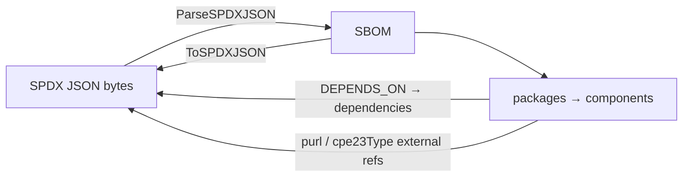

# 📄 SBOM SPDX

The `sbom_spdx` module provides parse/serialize bridges between the library's vendor-neutral `SBOM` model and the SPDX JSON format (SPDX 2.3). Packages map to components; `DEPENDS_ON` relationships map to dependencies; external refs of type `purl`, `cpe23Type`, and `cpe22Type` populate PURL/CPE.

## 📥 ParseSPDXJSON

```go
func ParseSPDXJSON(data []byte) (*SBOM, error)
```

Parses SPDX JSON bytes into an `SBOM`. A new SBOM is created with format `SBOMFormatSPDX` and the document's `name`; the spec version is taken from `spdxVersion`. From `creationInfo`, the `created` timestamp is parsed and `creators` (split on `": "`) become `SBOMAuthor` entries. Each SPDX package becomes a component whose `BomRef` is the package `SPDXID` (falling back to `pkg-<index>`). `checksums` populate `Hashes` (lower-cased algorithm keys); external refs of type `purl`/`cpe23Type`/`cpe22Type` populate PURL/CPE; a declared license other than `NOASSERTION`/`NONE` becomes a `*License`. `DEPENDS_ON` relationships become dependency edges.

| Parameter | Type | Description |
| --- | --- | --- |
| `data` | `[]byte` | SPDX JSON document bytes |

| Return | Type | Description |
| --- | --- | --- |
| #1 | `*SBOM` | parsed SBOM |
| #2 | `error` | wrapped `json.Unmarshal` error |

```go
data, _ := os.ReadFile("bom.spdx.json")
sbom, err := cpeskills.ParseSPDXJSON(data)
if err != nil {
    log.Fatal(err)
}
fmt.Printf("SPDX %s, %d packages\n", sbom.SpecVersion, sbom.ComponentCount())
```

## 📤 ToSPDXJSON

```go
func (s *SBOM) ToSPDXJSON() ([]byte, error)
```

Serializes the `SBOM` to an SPDX 2.3 JSON document with 2-space indentation. The document `SPDXID` is `SPDXRef-DOCUMENT`, the data license is `CC0-1.0`, and creators are `Organization: cpe-skills` and `Tool: cpe-skills-sbom`. Each component becomes a package (with `downloadLocation: NOASSERTION`, `filesAnalyzed: false`, `copyrightText: NOASSERTION`). PURL and CPE are emitted as `PACKAGE-MANAGER`/`SECURITY` external refs; declared/concluded licenses are joined with ` AND `, defaulting to `NOASSERTION`. Each dependency becomes a `DEPENDS_ON` relationship, and `documentDescribes` lists every package.

| Return | Type | Description |
| --- | --- | --- |
| #1 | `[]byte` | SPDX JSON document |
| #2 | `error` | serialization error |

```go
sbom := cpeskills.NewSBOM(cpeskills.SBOMFormatSPDX, "my-app")
sbom.AddComponent(cpeskills.NewSBOMComponent("log4j-core", "2.14.0"))
out, err := sbom.ToSPDXJSON()
if err != nil {
    log.Fatal(err)
}
os.WriteFile("bom.spdx.json", out, 0644)
```

## SPDX Round-trip


