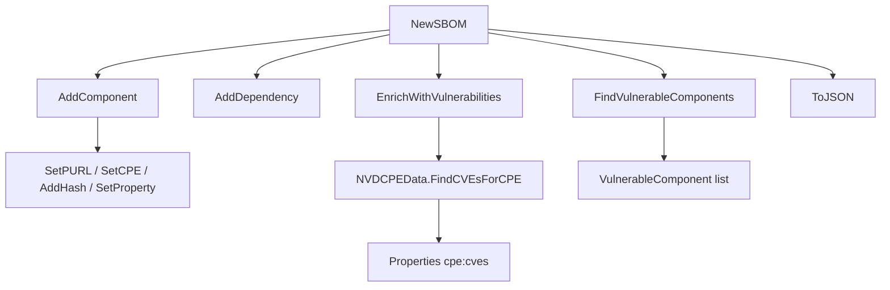

# 📦 SBOM

The `sbom` module provides a vendor-neutral Software Bill of Materials (SBOM) data model that maps to both CycloneDX and SPDX. As the core data structure of an SCA system, an `SBOM` holds the component list, dependency graph, and metadata, plus methods for vulnerability lookup and JSON serialization.

## Type: SBOMFormat

```go
type SBOMFormat string
```

Enumerates the supported SBOM document formats.

| Constant | Type | Value |
| --- | --- | --- |
| `SBOMFormatCycloneDX` | `SBOMFormat` | `"cyclonedx"` |
| `SBOMFormatSPDX` | `SBOMFormat` | `"spdx"` |
| `SBOMFormatUnknown` | `SBOMFormat` | `"unknown"` |

## Type: SBOM

```go
type SBOM struct {
    Format       SBOMFormat        // SBOM format (CycloneDX, SPDX)
    SpecVersion  string            // spec version
    SerialNumber string            // serial number, unique per document
    Name         string            // document name
    Components   []*SBOMComponent  // component list
    Dependencies []*SBOMDependency // dependency list
    Metadata     *SBOMMetadata     // document metadata
    CreatedAt    time.Time         // creation time
}
```

## Type: SBOMComponent

```go
type SBOMComponent struct {
    BomRef             string               // unique bom-ref identifier
    Type               string               // application, framework, library, container, operating-system, device, file
    Name               string               // component name
    Version            string               // component version
    Group              string               // group (e.g. Maven groupId)
    PURL               *PackageURL          // package URL
    CPE                *CPE                 // CPE
    Licenses           []*License           // license list
    Hashes             map[string]string    // alg → value
    Supplier           string               // supplier
    Description        string               // description
    Properties         map[string]string    // custom properties
    ExternalReferences []*ExternalReference // external references
}
```

## Type: SBOMDependency

```go
type SBOMDependency struct {
    Ref        string   // bom-ref of the depending component
    DependsOn  []string // bom-refs of the depended-on components
}
```

## Type: SBOMMetadata

```go
type SBOMMetadata struct {
    Timestamp  time.Time        // generation timestamp
    Tools      []*SBOMTool      // tools that produced the SBOM
    Authors    []*SBOMAuthor    // authors
    Component  *SBOMComponent   // top-level subject component
    Licenses   []*License       // document-level licenses
    Properties map[string]string // custom properties
}
```

## Type: SBOMTool

```go
type SBOMTool struct {
    Name    string // tool name
    Vendor  string // tool vendor
    Version string // tool version
}
```

## Type: SBOMAuthor

```go
type SBOMAuthor struct {
    Name  string // author name
    Email string // author email
}
```

## Type: ExternalReference

```go
type ExternalReference struct {
    Type    string // reference type (website, issue-tracker, vcs, etc.)
    URL     string // reference URL
    Comment string // comment
}
```

## Type: VulnerableComponent

```go
type VulnerableComponent struct {
    Component       *SBOMComponent            // the component
    Vulnerabilities []*VulnerabilityFinding   // matched findings
    MaxCVSS         float64                   // highest CVSS score
    MaxSeverity     string                    // highest severity
    CveCount        int                       // total CVE count
}
```

## 🆕 NewSBOM

```go
func NewSBOM(format SBOMFormat, name string) *SBOM
```

Creates a new `SBOM` with the given format and name. A unique serial number (`urn:uuid:<uuid>`) is generated, the spec version defaults to `"1.5"` for CycloneDX and `"2.3"` for SPDX, and the component/dependency slices and metadata are initialized.

| Parameter | Type | Description |
| --- | --- | --- |
| `format` | `SBOMFormat` | target SBOM format |
| `name` | `string` | document name |

| Return | Type | Description |
| --- | --- | --- |
| #1 | `*SBOM` | initialized SBOM |

```go
sbom := cpeskills.NewSBOM(cpeskills.SBOMFormatCycloneDX, "my-app")
fmt.Println(sbom.SpecVersion)  // 1.5
fmt.Println(sbom.SerialNumber) // urn:uuid:...
```

## ➕ AddComponent

```go
func (s *SBOM) AddComponent(component *SBOMComponent)
```

Appends a component. If `component.BomRef` is empty, one is generated from the PURL, the CPE URI, or `name@version` (in that order). A nil component is ignored.

| Parameter | Type | Description |
| --- | --- | --- |
| `component` | `*SBOMComponent` | component to add |

```go
sbom := cpeskills.NewSBOM(cpeskills.SBOMFormatCycloneDX, "app")
comp := cpeskills.NewSBOMComponent("log4j-core", "2.14.0")
sbom.AddComponent(comp)
```

## ➕ AddDependency

```go
func (s *SBOM) AddDependency(ref string, dependsOn []string)
```

Appends a dependency edge: the component identified by `ref` depends on the components listed in `dependsOn`.

| Parameter | Type | Description |
| --- | --- | --- |
| `ref` | `string` | bom-ref of the depending component |
| `dependsOn` | `[]string` | bom-refs of the depended-on components |

```go
sbom.AddDependency("pkg:app@1.0", []string{"pkg:lib/log4j@2.14.0"})
```

## 🔍 GetComponent

```go
func (s *SBOM) GetComponent(bomRef string) *SBOMComponent
```

Returns the component whose `BomRef` equals `bomRef`, or `nil` if none matches.

| Parameter | Type | Description |
| --- | --- | --- |
| `bomRef` | `string` | bom-ref to look up |

| Return | Type | Description |
| --- | --- | --- |
| #1 | `*SBOMComponent` | matching component, or `nil` |

```go
comp := sbom.GetComponent("pkg:lib/log4j@2.14.0")
```

## 🔍 FindVulnerableComponents

```go
func (s *SBOM) FindVulnerableComponents(cves []*CVEReference) []*VulnerableComponent
```

Matches the SBOM components against the provided CVE list using each component's CPE and PURL, and returns one `VulnerableComponent` per affected component with its findings, the highest CVSS score, the highest severity, and the CVE count.

| Parameter | Type | Description |
| --- | --- | --- |
| `cves` | `[]*CVEReference` | CVE references to match against |

| Return | Type | Description |
| --- | --- | --- |
| #1 | `[]*VulnerableComponent` | components with at least one matching finding |

```go
vuln := sbom.FindVulnerableComponents([]*cpeskills.CVEReference{cveRef})
for _, v := range vuln {
    fmt.Printf("%s: %d CVEs, max CVSS %.1f\n", v.Component.Name, v.CveCount, v.MaxCVSS)
}
```

## 🧪 EnrichWithVulnerabilities

```go
func (s *SBOM) EnrichWithVulnerabilities(nvdData *NVDCPEData) error
```

For every component that has a CPE, looks up the matching CVE IDs via `nvdData.FindCVEsForCPE` and stores them in the component's `Properties` under the keys `cpe:cves` (comma-separated list) and `cpe:cveCount`.

| Parameter | Type | Description |
| --- | --- | --- |
| `nvdData` | `*NVDCPEData` | NVD CPE data to query |

| Return | Type | Description |
| --- | --- | --- |
| #1 | `error` | non-nil if `nvdData` is nil |

```go
if err := sbom.EnrichWithVulnerabilities(nvdData); err != nil {
    log.Fatal(err)
}
```

## 📤 ToJSON

```go
func (s *SBOM) ToJSON() ([]byte, error)
```

Serializes the SBOM to pretty-printed (2-space indented) JSON.

| Return | Type | Description |
| --- | --- | --- |
| #1 | `[]byte` | JSON document |
| #2 | `error` | serialization error |

```go
data, err := sbom.ToJSON()
if err != nil {
    log.Fatal(err)
}
fmt.Println(string(data))
```

## 🔢 ComponentCount

```go
func (s *SBOM) ComponentCount() int
```

Returns the number of components in the SBOM.

| Return | Type | Description |
| --- | --- | --- |
| #1 | `int` | component count |

```go
fmt.Println(sbom.ComponentCount())
```

## 🔢 DependencyCount

```go
func (s *SBOM) DependencyCount() int
```

Returns the number of dependency edges in the SBOM.

| Return | Type | Description |
| --- | --- | --- |
| #1 | `int` | dependency count |

```go
fmt.Println(sbom.DependencyCount())
```

## 🆕 NewSBOMComponent

```go
func NewSBOMComponent(name, version string) *SBOMComponent
```

Creates a new component with the given name and version. `Hashes` and `Properties` are initialized to empty maps.

| Parameter | Type | Description |
| --- | --- | --- |
| `name` | `string` | component name |
| `version` | `string` | component version |

| Return | Type | Description |
| --- | --- | --- |
| #1 | `*SBOMComponent` | initialized component |

```go
comp := cpeskills.NewSBOMComponent("spring-core", "5.3.0")
```

## ⚙️ SetPURL

```go
func (c *SBOMComponent) SetPURL(purl *PackageURL)
```

Sets the component's `PURL` field.

| Parameter | Type | Description |
| --- | --- | --- |
| `purl` | `*PackageURL` | package URL |

```go
purl, _ := cpeskills.ParsePURL("pkg:maven/org.springframework/spring-core@5.3.0")
comp.SetPURL(purl)
```

## ⚙️ SetCPE

```go
func (c *SBOMComponent) SetCPE(cpe *CPE)
```

Sets the component's `CPE` field.

| Parameter | Type | Description |
| --- | --- | --- |
| `cpe` | `*CPE` | CPE |

```go
cpe, _ := cpeskills.Parse("cpe:2.3:a:pivotal:spring-core:5.3.0:*:*:*:*:*:*:*")
comp.SetCPE(cpe)
```

## ➕ AddHash

```go
func (c *SBOMComponent) AddHash(algorithm, value string)
```

Adds or overwrites a hash entry under `algorithm`. Initializes the `Hashes` map if needed.

| Parameter | Type | Description |
| --- | --- | --- |
| `algorithm` | `string` | hash algorithm (e.g. `"SHA-256"`) |
| `value` | `string` | hex digest |

```go
comp.AddHash("SHA-256", "e3b0c44298fc1c149afbf4c8996fb92427ae41e4649b934ca495991b7852b855")
```

## ⚙️ SetProperty

```go
func (c *SBOMComponent) SetProperty(key, value string)
```

Adds or overwrites a custom property. Initializes the `Properties` map if needed.

| Parameter | Type | Description |
| --- | --- | --- |
| `key` | `string` | property key |
| `value` | `string` | property value |

```go
comp.SetProperty("cpe:copyright", "Copyright 2026 Acme")
```

## SBOM Module Data Flow


