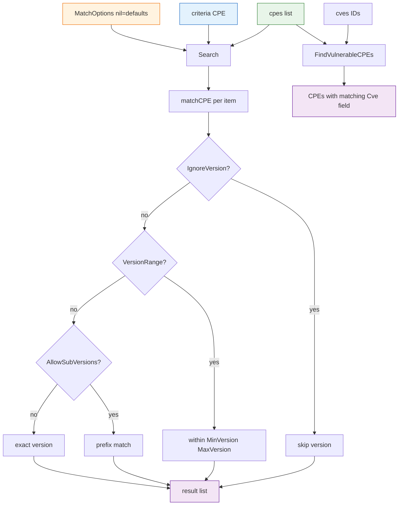

# 🔎 Search

The `search` module provides CPE-list search driven by a criteria CPE and a `MatchOptions` configuration. It supports exact, sub-version-prefix, and version-range matching, optional regex matching on string fields, and a convenience helper to find CPEs tagged with specific CVE IDs.

## Type: MatchOptions

```go
type MatchOptions struct {
    IgnoreVersion    bool   // when true, the Version field is not compared
    AllowSubVersions bool   // when true, criteria version "1.0" matches "1.0", "1.0.1", etc.
    UseRegex         bool   // when true, Vendor/Product/Update are matched as regexps
    VersionRange     bool   // when true, match versions within [MinVersion, MaxVersion]
    MinVersion       string // range lower bound (inclusive)
    MaxVersion       string // range upper bound (inclusive)
}
```

Notes: `VersionRange` takes precedence over `AllowSubVersions`. Both are ignored when `IgnoreVersion` is `true`. The `"*"` value in a criteria field is a wildcard that matches anything; empty criteria fields do not participate in matching.

## 🛠️ DefaultMatchOptions

```go
func DefaultMatchOptions() *MatchOptions
```

Returns a pointer to a `MatchOptions` with defaults: `IgnoreVersion = false`, `AllowSubVersions = true`, `UseRegex = false`, `VersionRange = false`.

| Return | Type | Description |
| --- | --- | --- |
| #1 | `*MatchOptions` | Default match options |

```go
opts := cpeskills.DefaultMatchOptions()
opts.UseRegex = true
```

## 🔍 Search

```go
func Search(cpes []*CPE, criteria *CPE, options *MatchOptions) []*CPE
```

Returns every CPE in `cpes` that matches `criteria` under `options`. When `options` is `nil`, default options are used. Matching is conjunctive: every non-empty, non-`*` criteria field must match. Version handling follows `options`:

- `IgnoreVersion = true` — version skipped.
- `VersionRange = true` — version must lie within `[MinVersion, MaxVersion]` (inclusive), compared via the `versions` package.
- else `AllowSubVersions = true` — target version must have the criteria version as a string prefix.
- otherwise — exact version equality.

| Parameter | Type | Description |
| --- | --- | --- |
| `cpes` | `[]*CPE` | The CPE list to search |
| `criteria` | `*CPE` | The search criteria; empty/`*` fields are skipped |
| `options` | `*MatchOptions` | Match options, `nil` for defaults |

| Return | Type | Description |
| --- | --- | --- |
| #1 | `[]*CPE` | All matching CPEs, empty slice when none match |

```go
// All Microsoft Windows products
criteria := &cpeskills.CPE{
    Vendor:      cpeskills.Vendor("microsoft"),
    ProductName: cpeskills.Product("windows"),
}
results := cpeskills.Search(allCPEs, criteria, nil)

// Apache versions 2.0–3.0
criteria = &cpeskills.CPE{Vendor: cpeskills.Vendor("apache")}
opts := cpeskills.DefaultMatchOptions()
opts.VersionRange = true
opts.MinVersion = "2.0"
opts.MaxVersion = "3.0"
results = cpeskills.Search(allCPEs, criteria, opts)

// Regex: products containing "sql"
criteria = &cpeskills.CPE{ProductName: cpeskills.Product(".*sql.*")}
opts = cpeskills.DefaultMatchOptions()
opts.UseRegex = true
results = cpeskills.Search(allCPEs, criteria, opts)
```

## 🐛 FindVulnerableCPEs

```go
func FindVulnerableCPEs(cpes []*CPE, cves []string) []*CPE
```

Returns every CPE in `cpes` whose `Cve` field equals any of the provided CVE IDs. Each CPE appears at most once even if it matches multiple CVEs. Original order is preserved. A CPE with an unset `Cve` field never matches.

| Parameter | Type | Description |
| --- | --- | --- |
| `cpes` | `[]*CPE` | The CPE list to inspect |
| `cves` | `[]string` | CVE IDs to look for |

| Return | Type | Description |
| --- | --- | --- |
| #1 | `[]*CPE` | CPEs tagged with any of the given CVE IDs |

```go
cveIDs := []string{"CVE-2021-44228", "CVE-2021-45046"}
vulnerable := cpeskills.FindVulnerableCPEs(allCPEs, cveIDs)
fmt.Printf("found %d vulnerable CPEs\n", len(vulnerable))
for _, c := range vulnerable {
    fmt.Printf("- %s: %s %s %s\n", c.Cve, c.Vendor, c.ProductName, c.Version)
}
```

## 📐 Search Flow Diagram


