# 🗂️ CPE Set

The `set` module provides `CPESet`, a collection of unique CPEs keyed by their URI, with set-algebra operations (union, intersection, difference), filtering (basic and advanced), sorting, relation checks (subset/superset/equal), and related-CPE discovery. The standalone `FromArray` constructor builds a set from a slice.

## Type: CPESet

```go
type CPESet struct {
    items       map[string]*CPE // keyed by URI
    Name        string
    Description string
}
```

A set of unique CPEs. Uniqueness is based on the CPE URI (`GetURI`). The `items` map is unexported; use the provided methods to read and mutate the set.

## 🆕 NewCPESet

```go
func NewCPESet(name string, description string) *CPESet
```

Creates an empty `CPESet` with the given name and description.

| Parameter | Type | Description |
| --- | --- | --- |
| `name` | `string` | Set name |
| `description` | `string` | Set description |

| Return | Type | Description |
| --- | --- | --- |
| #1 | `*CPESet` | A new empty set |

```go
ms := cpeskills.NewCPESet("Microsoft Products", "Collection of Microsoft CPEs")
```

## ➕ Add

```go
func (s *CPESet) Add(cpe *CPE)
```

Adds a CPE to the set. A `nil` CPE or one with an empty URI is ignored. Adding an already-present CPE (same URI) has no effect.

| Parameter | Type | Description |
| --- | --- | --- |
| `cpe` | `*CPE` | The CPE to add |

```go
windows := cpeskills.MustParse("cpe:2.3:a:microsoft:windows:10:*:*:*:*:*:*:*")
ms.Add(windows)
```

## ➖ Remove

```go
func (s *CPESet) Remove(cpe *CPE) bool
```

Removes a CPE from the set. Returns `true` if the CPE was present and removed, `false` otherwise (including `nil` or empty-URI input).

| Parameter | Type | Description |
| --- | --- | --- |
| `cpe` | `*CPE` | The CPE to remove |

| Return | Type | Description |
| --- | --- | --- |
| #1 | `bool` | `true` if removed, `false` if not present |

```go
removed := ms.Remove(windows)
fmt.Println(removed) // true
```

## ❓ Contains

```go
func (s *CPESet) Contains(cpe *CPE) bool
```

Reports whether the set contains a CPE with the same URI. Returns `false` for `nil` or empty-URI input.

| Parameter | Type | Description |
| --- | --- | --- |
| `cpe` | `*CPE` | The CPE to look up |

| Return | Type | Description |
| --- | --- | --- |
| #1 | `bool` | `true` if present, `false` otherwise |

```go
fmt.Println(ms.Contains(windows)) // true
```

## 🔢 Size

```go
func (s *CPESet) Size() int
```

Returns the number of CPEs in the set.

| Return | Type | Description |
| --- | --- | --- |
| #1 | `int` | The set size |

```go
fmt.Println(ms.Size())
```

## 🧹 Clear

```go
func (s *CPESet) Clear()
```

Removes all CPEs from the set, leaving it empty.

```go
ms.Clear()
fmt.Println(ms.Size()) // 0
```

## ∪ Union

```go
func (s *CPESet) Union(other *CPESet) *CPESet
```

Returns a new set containing every CPE in either `s` or `other`.

| Parameter | Type | Description |
| --- | --- | --- |
| `other` | `*CPESet` | The other set |

| Return | Type | Description |
| --- | --- | --- |
| #1 | `*CPESet` | A new set that is the union |

```go
all := ms.Union(appleSet)
fmt.Println(all.Size())
```

## ∩ Intersection

```go
func (s *CPESet) Intersection(other *CPESet) *CPESet
```

Returns a new set containing only the CPEs present in both `s` and `other`. Iterates the smaller set for efficiency.

| Parameter | Type | Description |
| --- | --- | --- |
| `other` | `*CPESet` | The other set |

| Return | Type | Description |
| --- | --- | --- |
| #1 | `*CPESet` | A new set that is the intersection |

```go
vulnWindows := windowsSet.Intersection(vulnerableSet)
```

## ∖ Difference

```go
func (s *CPESet) Difference(other *CPESet) *CPESet
```

Returns a new set containing the CPEs in `s` that are not in `other`.

| Parameter | Type | Description |
| --- | --- | --- |
| `other` | `*CPESet` | The set to subtract |

| Return | Type | Description |
| --- | --- | --- |
| #1 | `*CPESet` | A new set that is the difference `s \ other` |

```go
supported := allWindowsSet.Difference(outdatedSet)
```

## 🔍 Filter

```go
func (s *CPESet) Filter(criteria *CPE, options *MatchOptions) *CPESet
```

Returns a new set containing the CPEs in `s` that match `criteria` under `options` (using the same matching logic as `Search`). `options == nil` uses default options.

| Parameter | Type | Description |
| --- | --- | --- |
| `criteria` | `*CPE` | The filter criteria |
| `options` | `*MatchOptions` | Match options, `nil` for defaults |

| Return | Type | Description |
| --- | --- | --- |
| #1 | `*CPESet` | A new filtered set |

```go
criteria := &cpeskills.CPE{
    Vendor:      cpeskills.Vendor("microsoft"),
    ProductName: cpeskills.Product("windows"),
}
windows := all.Filter(criteria, nil)
```

## 🎛️ AdvancedFilter

```go
func (s *CPESet) AdvancedFilter(criteria *CPE, options *AdvancedMatchOptions) *CPESet
```

Returns a new set containing the CPEs in `s` that match `criteria` under the advanced options (via `AdvancedMatchCPE`). `options == nil` uses default advanced options.

| Parameter | Type | Description |
| --- | --- | --- |
| `criteria` | `*CPE` | The filter criteria |
| `options` | `*AdvancedMatchOptions` | Advanced options, `nil` for defaults |

| Return | Type | Description |
| --- | --- | --- |
| #1 | `*CPESet` | A new advanced-filtered set |

```go
opts := cpeskills.NewAdvancedMatchOptions()
opts.MatchMode = "distance"
opts.ScoreThreshold = 0.7
related := all.AdvancedFilter(criteria, opts)
```

## 📋 ToSlice

```go
func (s *CPESet) ToSlice() []*CPE
```

Returns a slice of all CPEs in the set. Order is not guaranteed (map iteration order).

| Return | Type | Description |
| --- | --- | --- |
| #1 | `[]*CPE` | All CPEs in the set |

```go
for _, c := range ms.ToSlice() {
    fmt.Println(c.GetURI())
}
```

## ↕️ Sort

```go
func (s *CPESet) Sort(sortBy string, ascending bool) []*CPE
```

Returns a sorted slice of the set's CPEs. The set itself is not modified. `sortBy` selects the field: `"part"`, `"vendor"`, `"product"`, `"version"` (compared via the `versions` package), or any other value (defaults to the 2.3 URI). `ascending` controls direction.

| Parameter | Type | Description |
| --- | --- | --- |
| `sortBy` | `string` | Sort field: `part`/`vendor`/`product`/`version`/other(URI) |
| `ascending` | `bool` | `true` ascending, `false` descending |

| Return | Type | Description |
| --- | --- | --- |
| #1 | `[]*CPE` | The sorted CPE slice |

```go
byProduct := ms.Sort("product", true)
byVersionDesc := ms.Sort("version", false)
```

## 🟰 Equals

```go
func (s *CPESet) Equals(other *CPESet) bool
```

Reports whether `s` and `other` contain exactly the same CPEs (same URIs). Returns `false` when sizes differ.

| Parameter | Type | Description |
| --- | --- | --- |
| `other` | `*CPESet` | The set to compare with |

| Return | Type | Description |
| --- | --- | --- |
| #1 | `bool` | `true` if equal, `false` otherwise |

```go
fmt.Println(set1.Equals(set2))
```

## ⊆ IsSubsetOf

```go
func (s *CPESet) IsSubsetOf(other *CPESet) bool
```

Reports whether every CPE in `s` is also in `other`. Returns `false` early when `s` is larger than `other`.

| Parameter | Type | Description |
| --- | --- | --- |
| `other` | `*CPESet` | The candidate superset |

| Return | Type | Description |
| --- | --- | --- |
| #1 | `bool` | `true` if `s ⊆ other`, `false` otherwise |

```go
fmt.Println(windows10Set.IsSubsetOf(windowsSet))
```

## ⊇ IsSupersetOf

```go
func (s *CPESet) IsSupersetOf(other *CPESet) bool
```

Reports whether every CPE in `other` is also in `s`. Implemented as `other.IsSubsetOf(s)`.

| Parameter | Type | Description |
| --- | --- | --- |
| `other` | `*CPESet` | The candidate subset |

| Return | Type | Description |
| --- | --- | --- |
| #1 | `bool` | `true` if `s ⊇ other`, `false` otherwise |

```go
fmt.Println(windowsSet.IsSupersetOf(windows10Set))
```

## 📝 ToString

```go
func (s *CPESet) ToString() string
```

Returns a multi-line textual summary: the set name, description, size, and each CPE's 2.3 URI (sorted by URI for stable output).

| Return | Type | Description |
| --- | --- | --- |
| #1 | `string` | The set's string representation |

```go
fmt.Println(ms.ToString())
```

## 🔗 FindRelated

```go
func (s *CPESet) FindRelated(cpe *CPE, options *AdvancedMatchOptions) *CPESet
```

Returns a new set of CPEs related to `cpe`, using distance-mode advanced matching with a relaxed threshold (`MatchMode = "distance"`, `ScoreThreshold = 0.6`). When `options` is `nil`, default advanced options are used and then overridden with the relaxed settings. Any `options` you pass is mutated in place to set `MatchMode` and `ScoreThreshold`.

| Parameter | Type | Description |
| --- | --- | --- |
| `cpe` | `*CPE` | The reference CPE |
| `options` | `*AdvancedMatchOptions` | Advanced options, `nil` for defaults |

| Return | Type | Description |
| --- | --- | --- |
| #1 | `*CPESet` | A new set of related CPEs |

```go
windows10 := cpeskills.MustParse("cpe:2.3:a:microsoft:windows:10:*:*:*:*:*:*:*")
related := all.FindRelated(windows10, nil)
fmt.Printf("%d related CPEs\n", related.Size())
```

## 🏗️ FromArray

```go
func FromArray(cpes []*CPE, name string, description string) *CPESet
```

Creates a new set from a CPE slice, adding each element. `nil` entries in the slice are ignored by `Add`.

| Parameter | Type | Description |
| --- | --- | --- |
| `cpes` | `[]*CPE` | The CPEs to seed the set with |
| `name` | `string` | Set name |
| `description` | `string` | Set description |

| Return | Type | Description |
| --- | --- | --- |
| #1 | `*CPESet` | A new set containing the given CPEs |

```go
set := cpeskills.FromArray([]*cpeskills.CPE{w10, w11}, "Microsoft", "Windows set")
```

## 📐 CPESet Operations Diagram

```mermaid
flowchart TD
    A[CPESet s] --> ADD[Add]
    A --> REM[Remove]
    A --> CON[Contains]
    A --> SZ[Size]
    A --> CLR[Clear]
    A --> UN[Union other]
    A --> IN[Intersection other]
    A --> DF[Difference other]
    A --> FL[Filter criteria MatchOptions]
    A --> AF[AdvancedFilter criteria AdvancedMatchOptions]
    A --> TS[ToSlice]
    A --> ST[Sort sortBy ascending]
    A --> EQ[Equals other]
    A --> SB[IsSubsetOf other]
    A --> SP[IsSupersetOf other]
    A --> TS2[ToString]
    A --> FR[FindRelated cpe options]
    FA[FromArray cpes name desc] --> NEW[NewCPESet + Add each]
    style A fill:#e8f5e9,stroke:#2e7d32
    style FA fill:#e3f2fd,stroke:#1565c0
    style NEW fill:#fff3e0,stroke:#ef6c00
```


