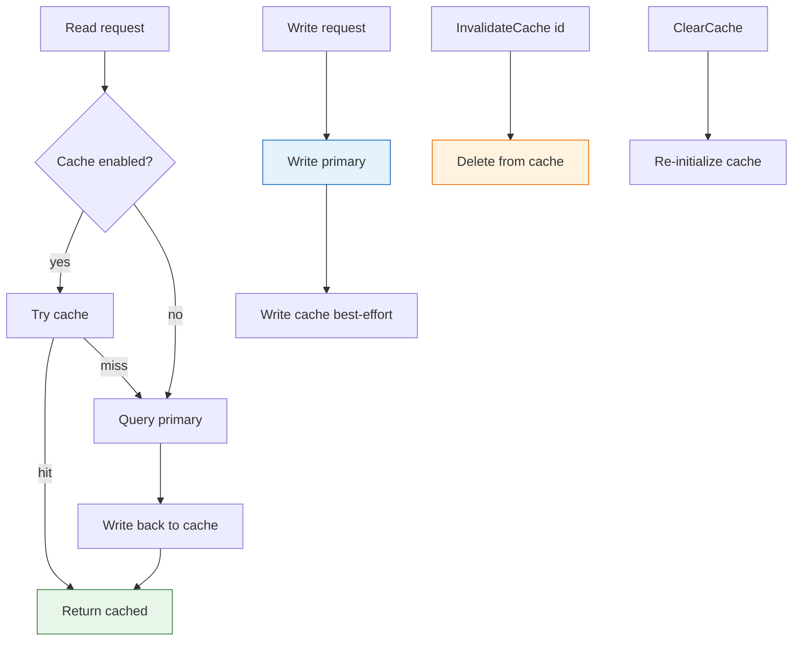

# 🗄️ Storage Interface and Manager

The `storage` module defines the unified `Storage` interface for persisting and querying CPE and CVE data, plus a `StorageManager` that layers a cache over a primary store. Different backends (in-memory, filesystem, database) implement the same interface so they can be swapped transparently.

## Type: Storage

```go
type Storage interface {
    Initialize() error
    Close() error
    StoreCPE(cpe *CPE) error
    RetrieveCPE(id string) (*CPE, error)
    UpdateCPE(cpe *CPE) error
    DeleteCPE(id string) error
    SearchCPE(criteria *CPE, options *MatchOptions) ([]*CPE, error)
    AdvancedSearchCPE(criteria *CPE, options *AdvancedMatchOptions) ([]*CPE, error)
    StoreCVE(cve *CVEReference) error
    RetrieveCVE(cveID string) (*CVEReference, error)
    UpdateCVE(cve *CVEReference) error
    DeleteCVE(cveID string) error
    SearchCVE(query string, options *SearchOptions) ([]*CVEReference, error)
    FindCVEsByCPE(cpe *CPE) ([]*CVEReference, error)
    FindCPEsByCVE(cveID string) ([]*CPE, error)
    StoreDictionary(dict *CPEDictionary) error
    RetrieveDictionary() (*CPEDictionary, error)
    StoreModificationTimestamp(key string, timestamp time.Time) error
    RetrieveModificationTimestamp(key string) (time.Time, error)
}
```

`Storage` is the contract every backend must satisfy. It covers lifecycle (`Initialize`/`Close`), CPE CRUD and search, CVE CRUD and search, CPE↔CVE relationship lookup, dictionary storage, and modification-timestamp tracking. Implementations include `MemoryStorage` and `FileStorage`.

## Type: SearchOptions

```go
type SearchOptions struct {
    Offset            int
    Limit             int
    SortBy            string
    SortAscending     bool
    Filters           map[string]interface{}
    FullTextQuery     string
    IncludeDeprecated bool
    DateStart         *time.Time
    DateEnd           *time.Time
    MinCVSS           float64
    MaxCVSS           float64
}
```

`SearchOptions` controls CVE search behavior: pagination (`Offset`/`Limit`), sorting (`SortBy`/`SortAscending`), custom `Filters`, full-text query, deprecation inclusion, date range, and CVSS score range.

## Type: StorageStats

```go
type StorageStats struct {
    TotalCPEs           int
    TotalCVEs           int
    TotalDictionaryItems int
    StorageBytes        int64
    LastUpdated         time.Time
}
```

`StorageStats` holds aggregate counters returned by `StorageManager.GetStats`.

## Type: StorageManager

```go
type StorageManager struct {
    Primary         Storage
    Cache           Storage
    CacheEnabled    bool
    CacheTTLSeconds int
}
```

`StorageManager` wraps a primary `Storage` and an optional cache `Storage`. When a cache is set, reads try the cache first and fall back to the primary, writing back on a miss; writes propagate to both.

## 🆕 NewSearchOptions

```go
func NewSearchOptions() *SearchOptions
```

Creates a `SearchOptions` with sensible defaults: `Offset=0`, `Limit=100`, `SortBy="id"`, `SortAscending=true`, empty `Filters`, `IncludeDeprecated=false`.

| Parameter | Type | Description |
| --- | --- | --- |
| (none) | | |

| Return | Type | Description |
| --- | --- | --- |
| #1 | `*SearchOptions` | Default-initialized search options |

```go
opts := cpeskills.NewSearchOptions()
opts.Limit = 50
opts.Filters["vendor"] = "microsoft"
results, _ := storage.SearchCVE("windows", opts)
```

## 🏗️ NewStorageManager

```go
func NewStorageManager(primary Storage) *StorageManager
```

Creates a `StorageManager` over the given primary store. The cache is disabled by default (`CacheEnabled=false`); `CacheTTLSeconds` defaults to 3600.

| Parameter | Type | Description |
| --- | --- | --- |
| `primary` | `Storage` | The persistent primary store; must not be `nil` |

| Return | Type | Description |
| --- | --- | --- |
| #1 | `*StorageManager` | A new manager with cache disabled |

```go
primary, _ := cpeskills.NewFileStorage("/tmp/cpe-data", true)
_ = primary.Initialize()
manager := cpeskills.NewStorageManager(primary)
```

## ⚡ SetCache

```go
func (sm *StorageManager) SetCache(cache Storage)
```

Attaches a cache store and enables caching. After this call, `GetCPE`/`GetCVE` read through the cache and `StoreCPE` writes through to it.

| Parameter | Type | Description |
| --- | --- | --- |
| Receiver | `*StorageManager` | The manager |
| `cache` | `Storage` | The cache backend (typically a `MemoryStorage`) |

| Return | Type | Description |
| --- | --- | --- |
| (none) | | |

```go
cache := cpeskills.NewMemoryStorage()
_ = cache.Initialize()
manager.SetCache(cache)
```

## 🔍 GetCPE

```go
func (sm *StorageManager) GetCPE(id string) (*CPE, error)
```

Returns the CPE for `id`. When caching is enabled, the cache is tried first; on a miss the primary is queried and the result is written back to the cache. Cache errors are swallowed; only primary-store errors propagate.

| Parameter | Type | Description |
| --- | --- | --- |
| Receiver | `*StorageManager` | The manager |
| `id` | `string` | CPE identifier (typically the CPE 2.3 URI) |

| Return | Type | Description |
| --- | --- | --- |
| #1 | `*CPE` | The located CPE |
| #2 | `error` | Non-nil if not found or the primary store fails |

```go
cpe, err := manager.GetCPE("cpe:2.3:o:microsoft:windows:10:*:*:*:*:*:*:*")
if err != nil {
    log.Printf("get cpe: %v", err)
}
```

## 💾 StoreCPE

```go
func (sm *StorageManager) StoreCPE(cpe *CPE) error
```

Persists `cpe` to the primary store and, if caching is enabled, also writes it to the cache. Cache write failures are ignored so a primary-store success is never rolled back.

| Parameter | Type | Description |
| --- | --- | --- |
| Receiver | `*StorageManager` | The manager |
| `cpe` | `*CPE` | The CPE to store |

| Return | Type | Description |
| --- | --- | --- |
| #1 | `error` | Non-nil if the primary store fails |

```go
_ = manager.StoreCPE(&cpeskills.CPE{
    Cpe23:       "cpe:2.3:a:apache:log4j:2.0:*:*:*:*:*:*:*",
    Vendor:      cpeskills.Vendor("apache"),
    ProductName: cpeskills.Product("log4j"),
    Version:     cpeskills.Version("2.0"),
})
```

## 🔎 GetCVE

```go
func (sm *StorageManager) GetCVE(cveID string) (*CVEReference, error)
```

Returns the CVE reference for `cveID`, with the same cache-read-through behavior as `GetCPE`.

| Parameter | Type | Description |
| --- | --- | --- |
| Receiver | `*StorageManager` | The manager |
| `cveID` | `string` | CVE identifier, e.g. `CVE-2021-44228` |

| Return | Type | Description |
| --- | --- | --- |
| #1 | `*CVEReference` | The located CVE reference |
| #2 | `error` | Non-nil if not found or the primary store fails |

```go
cve, err := manager.GetCVE("CVE-2021-44228")
if err != nil {
    log.Printf("get cve: %v", err)
}
```

## 📋 Search

```go
func (sm *StorageManager) Search(criteria *CPE, options *MatchOptions) ([]*CPE, error)
```

Searches the primary store (cache is bypassed) for CPEs matching `criteria` according to `options`. A `nil` criteria returns all CPEs.

| Parameter | Type | Description |
| --- | --- | --- |
| Receiver | `*StorageManager` | The manager |
| `criteria` | `*CPE` | Match criteria; `nil` matches all |
| `options` | `*MatchOptions` | Match options; `nil` uses defaults |

| Return | Type | Description |
| --- | --- | --- |
| #1 | `[]*CPE` | Matching CPEs (empty slice if none) |
| #2 | `error` | Non-nil on store failure |

```go
results, _ := manager.Search(&cpeskills.CPE{
    Vendor:      cpeskills.Vendor("microsoft"),
    ProductName: cpeskills.Product("windows"),
}, &cpeskills.MatchOptions{})
fmt.Println(len(results))
```

## 🎯 AdvancedSearch

```go
func (sm *StorageManager) AdvancedSearch(criteria *CPE, options *AdvancedMatchOptions) ([]*CPE, error)
```

Searches the primary store (cache bypassed) using advanced match options such as version ranges and regex filters.

| Parameter | Type | Description |
| --- | --- | --- |
| Receiver | `*StorageManager` | The manager |
| `criteria` | `*CPE` | Match criteria |
| `options` | `*AdvancedMatchOptions` | Advanced match options |

| Return | Type | Description |
| --- | --- | --- |
| #1 | `[]*CPE` | Matching CPEs |
| #2 | `error` | Non-nil on store failure |

```go
results, _ := manager.AdvancedSearch(criteria, &cpeskills.AdvancedMatchOptions{})
```

## 🧹 InvalidateCache

```go
func (sm *StorageManager) InvalidateCache(id string)
```

Removes the CPE with the given id from the cache (best-effort). No-op when caching is disabled. Errors are swallowed.

| Parameter | Type | Description |
| --- | --- | --- |
| Receiver | `*StorageManager` | The manager |
| `id` | `string` | CPE identifier to evict |

| Return | Type | Description |
| --- | --- | --- |
| (none) | | |

```go
manager.InvalidateCache("cpe:2.3:o:microsoft:windows:10:*:*:*:*:*:*:*")
```

## 🧽 ClearCache

```go
func (sm *StorageManager) ClearCache() error
```

Clears the entire cache by re-initializing the cache store. No-op (returns `nil`) when caching is disabled or the cache is `nil`.

| Parameter | Type | Description |
| --- | --- | --- |
| Receiver | `*StorageManager` | The manager |

| Return | Type | Description |
| --- | --- | --- |
| #1 | `error` | Non-nil if cache re-initialization fails |

```go
if err := manager.ClearCache(); err != nil {
    log.Printf("clear cache: %v", err)
}
```

## 📊 GetStats

```go
func (sm *StorageManager) GetStats() (*StorageStats, error)
```

Collects statistics from the primary store: total CPE count (via a full search), total CVE count (via an empty CVE search), dictionary item count, and the `last_update` modification timestamp (falling back to `time.Now()` if absent).

| Parameter | Type | Description |
| --- | --- | --- |
| Receiver | `*StorageManager` | The manager |

| Return | Type | Description |
| --- | --- | --- |
| #1 | `*StorageStats` | Aggregate counters |
| #2 | `error` | Non-nil if a primary-store query fails |

```go
stats, _ := manager.GetStats()
fmt.Printf("CPEs=%d CVEs=%d items=%d\n", stats.TotalCPEs, stats.TotalCVEs, stats.TotalDictionaryItems)
```

## 🧭 Storage Manager Data Flow


