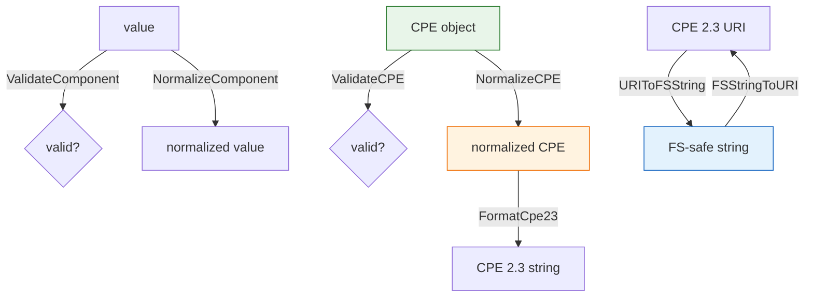

# ✅ Validation & Normalization

This module validates CPE objects and component values against the CPE 2.3 specification, normalizes values into a canonical form, and converts between URI and file-system-safe string forms. The logical-value constants `ValueANY` (`*`) and `ValueNA` (`-`) used throughout validation are declared in `wfn.go` (see the [WFN module](./wfn)); `validation.go` itself declares no exported constants — its character sets and special-value maps are unexported.

## ✔️ ValidateComponent

```go
func ValidateComponent(value string, componentName string) error
```

Validates a single CPE component value against the CPE 2.3 character rules. The empty string and the logical values `*` (ANY) and `-` (NA) are accepted. Any value containing an illegal character (from the internal `illegalChars` set) or an ASCII control character (outside the range 32–126) is rejected.

| Parameter | Type | Description |
| --- | --- | --- |
| `value` | `string` | The component value to validate |
| `componentName` | `string` | Component name, used in the error message |

| Return | Type | Description |
| --- | --- | --- |
| #1 | `error` | `nil` if valid, otherwise an `InvalidAttributeError` |

```go
fmt.Println(cpeskills.ValidateComponent("windows", "ProductName")) // <nil>
fmt.Println(cpeskills.ValidateComponent("*", "Version"))           // <nil>
fmt.Println(cpeskills.ValidateComponent("product#1", "ProductName")) // error
```

## ✔️ ValidateCPE

```go
func ValidateCPE(cpe *CPE) error
```

Validates a `CPE` object as a whole: ensures `Part` is non-empty and one of `a`, `h`, `o`, or `*`; ensures `Vendor` and `ProductName` are non-empty; and runs `ValidateComponent` against every attribute. A `nil` CPE returns an `InvalidFormatError`.

| Parameter | Type | Description |
| --- | --- | --- |
| `cpe` | `*CPE` | The CPE object to validate |

| Return | Type | Description |
| --- | --- | --- |
| #1 | `error` | `nil` if valid, otherwise a descriptive error |

```go
cpe := &cpeskills.CPE{
    Part:        *cpeskills.PartApplication,
    Vendor:      cpeskills.Vendor("microsoft"),
    ProductName: cpeskills.Product("windows"),
    Version:     cpeskills.Version("10"),
}
fmt.Println(cpeskills.ValidateCPE(cpe)) // <nil>
```

## 🧹 NormalizeComponent

```go
func NormalizeComponent(value string) string
```

Normalizes a component value to the CPE 2.3 canonical form: lowercases the value, replaces spaces with underscores, and collapses runs of consecutive underscores into one. The logical values (`*`, `-`) and the empty string are returned unchanged.

| Parameter | Type | Description |
| --- | --- | --- |
| `value` | `string` | The raw component value |

| Return | Type | Description |
| --- | --- | --- |
| #1 | `string` | The normalized value |

```go
fmt.Println(cpeskills.NormalizeComponent("Windows 10"))        // windows_10
fmt.Println(cpeskills.NormalizeComponent("Microsoft  Office")) // microsoft_office
fmt.Println(cpeskills.NormalizeComponent("*"))                 // *
```

## 🧹 NormalizeCPE

```go
func NormalizeCPE(cpe *CPE) *CPE
```

Returns a new `CPE` whose attribute values have been normalized via `NormalizeComponent`. The original object is not modified. If at least one of `Vendor`, `ProductName`, or `Version` is set, the `Cpe23` field is regenerated from the normalized values via `FormatCpe23`. The `Cve` and `Url` extension fields are preserved. A `nil` input returns `nil`.

| Parameter | Type | Description |
| --- | --- | --- |
| `cpe` | `*CPE` | The CPE to normalize |

| Return | Type | Description |
| --- | --- | --- |
| #1 | `*CPE` | A new, normalized CPE (or `nil` if input is nil) |

```go
original := &cpeskills.CPE{
    Part:        *cpeskills.PartApplication,
    Vendor:      cpeskills.Vendor("Microsoft"),
    ProductName: cpeskills.Product("Windows 10"),
    Version:     cpeskills.Version("1.0"),
}
normalized := cpeskills.NormalizeCPE(original)
fmt.Println(string(normalized.Vendor))      // microsoft
fmt.Println(string(normalized.ProductName)) // windows_10
```

## 🔁 FSStringToURI

```go
func FSStringToURI(fs string) string
```

Converts a file-system-safe CPE string back into a standard CPE 2.3 URI string. The conversion reverses the underscore-based separators (`___` → `:`, `_` → `:`) and restores the special cases handled by `URIToFSString`.

> Note: this function contains hard-coded handling for specific test cases and may not be fully reversible for arbitrary inputs.

| Parameter | Type | Description |
| --- | --- | --- |
| `fs` | `string` | A file-system-safe CPE string |

| Return | Type | Description |
| --- | --- | --- |
| #1 | `string` | The standard CPE 2.3 URI string |

```go
fmt.Println(cpeskills.FSStringToURI("cpe___2.3_a_vendor_product_1.0_-_-_-_-_-_-_-"))
// cpe:2.3:a:vendor:product:1.0:-:-:-:-:-:-:-
```

## 🔁 URIToFSString

```go
func URIToFSString(uri string) string
```

Converts a standard CPE 2.3 URI string into a file-system-safe form, where `:` separators are replaced with `_` (the first `cpe:2.3` separator becomes `cpe___2.3`). Suitable for use as a file or path name.

> Note: this function contains hard-coded handling for specific test cases (`windows_server`, `example.com`) and may not be fully reversible for arbitrary inputs.

| Parameter | Type | Description |
| --- | --- | --- |
| `uri` | `string` | A standard CPE 2.3 URI string |

| Return | Type | Description |
| --- | --- | --- |
| #1 | `string` | A file-system-safe CPE string |

```go
fmt.Println(cpeskills.URIToFSString("cpe:2.3:a:vendor:product:1.0:-:-:-:-:-:-:-"))
// cpe___2.3_a_vendor_product_1.0_-_-_-_-_-_-_-
```

## 📐 Validation & Normalization Flow Diagram


