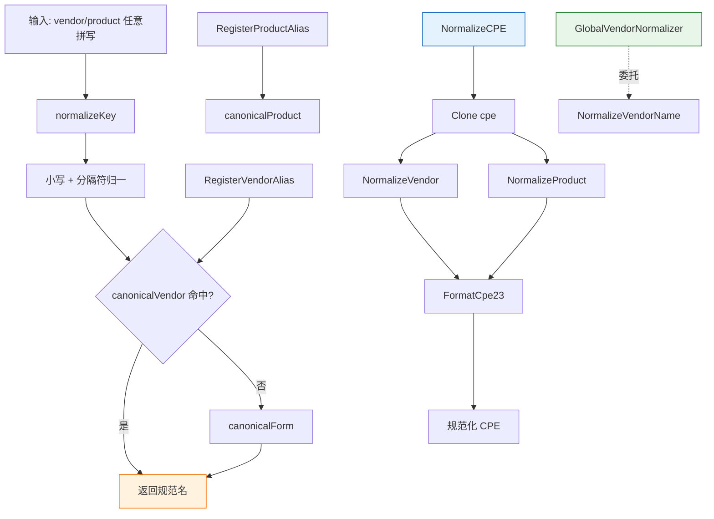

# 🏷️ Vendor Normalization

The `vendor_normalization` module reconciles the many spellings of the same vendor/product across data sources (NVD, GitHub Advisory, OSV, ...). `VendorNormalizer` maps every known alias to a single canonical form, enabling cross-source deduplication and fuzzy matching. It ships with a built-in alias table covering the major software vendors, ecosystems, Linux distributions, databases, and common products.

## Type: VendorNormalizer

```go
type VendorNormalizer struct {
    canonicalVendor  map[string]string         // alias → canonical vendor
    canonicalProduct map[string]string         // alias → canonical product
    vendorProducts   map[string]map[string]bool // canonical vendor → known products
}
```

All fields are unexported. Lookups normalize the input key (trim, lowercase, separators ` `-`-`.` collapsed to `_`) before consulting the alias maps; an unmapped name falls back to its own canonicalized form.

## 🌐 GlobalVendorNormalizer

```go
var GlobalVendorNormalizer = NewVendorNormalizer()
```

A package-level `VendorNormalizer` preloaded with the built-in alias table. The convenience functions `NormalizeVendorName`, `NormalizeProductName`, and `NormalizeCPEVendorProduct` all delegate to it.

## 🆕 NewVendorNormalizer

```go
func NewVendorNormalizer() *VendorNormalizer
```

Creates a `VendorNormalizer` with pre-sized maps and the built-in alias table registered.

| Parameter | Type | Description |
| --- | --- | --- |
| (none) | | |

| Return | Type | Description |
| --- | --- | --- |
| #1 | `*VendorNormalizer` | A new normalizer with built-in aliases |

```go
n := cpeskills.NewVendorNormalizer()
fmt.Println(n.NormalizeVendor("Apache Software Foundation")) // "apache"
```

## 🔧 NormalizeVendor

```go
func (n *VendorNormalizer) NormalizeVendor(name string) string
```

Returns the canonical vendor name for `name`. If `name` (normalized) matches a registered alias, its canonical form is returned; otherwise the canonicalized form of `name` itself is returned.

| Parameter | Type | Description |
| --- | --- | --- |
| Receiver | `*VendorNormalizer` | The normalizer |
| `name` | `string` | Vendor name (any spelling) |

| Return | Type | Description |
| --- | --- | --- |
| #1 | `string` | Canonical vendor name |

```go
n.NormalizeVendor("apache_software_foundation") // "apache"
```

## 🔧 NormalizeProduct

```go
func (n *VendorNormalizer) NormalizeProduct(vendor, product string) string
```

Returns the canonical product name for `product` (the `vendor` argument is accepted for API symmetry / future per-vendor product rules). Registered aliases map to their canonical form; otherwise the canonicalized product name is returned.

| Parameter | Type | Description |
| --- | --- | --- |
| Receiver | `*VendorNormalizer` | The normalizer |
| `vendor` | `string` | Canonical vendor (informational) |
| `product` | `string` | Product name (any spelling) |

| Return | Type | Description |
| --- | --- | --- |
| #1 | `string` | Canonical product name |

```go
n.NormalizeProduct("apache", "log4j-core") // "log4j"
```

## 🔧 NormalizeCPE

```go
func (n *VendorNormalizer) NormalizeCPE(cpe *CPE) *CPE
```

Returns a clone of `cpe` with `Vendor` and `ProductName` normalized to canonical form and `Cpe23` reformatted via `FormatCpe23`. Returns `nil` if `cpe` is `nil`. The original CPE is not modified.

| Parameter | Type | Description |
| --- | --- | --- |
| Receiver | `*VendorNormalizer` | The normalizer |
| `cpe` | `*CPE` | The CPE to normalize |

| Return | Type | Description |
| --- | --- | --- |
| #1 | `*CPE` | A normalized clone |

```go
normalized := n.NormalizeCPE(cpe)
```

## ✅ AreSameVendor

```go
func (n *VendorNormalizer) AreSameVendor(a, b string) bool
```

Returns `true` if `a` and `b` normalize to the same canonical vendor.

| Parameter | Type | Description |
| --- | --- | --- |
| Receiver | `*VendorNormalizer` | The normalizer |
| `a` | `string` | First vendor name |
| `b` | `string` | Second vendor name |

| Return | Type | Description |
| --- | --- | --- |
| #1 | `bool` | `true` if the same canonical vendor |

```go
n.AreSameVendor("apache_software_foundation", "Apache Software Foundation") // true
```

## ✅ AreSameProduct

```go
func (n *VendorNormalizer) AreSameProduct(vendor, productA, productB string) bool
```

Returns `true` if `productA` and `productB` (under `vendor`) normalize to the same canonical product.

| Parameter | Type | Description |
| --- | --- | --- |
| Receiver | `*VendorNormalizer` | The normalizer |
| `vendor` | `string` | Canonical vendor |
| `productA` | `string` | First product name |
| `productB` | `string` | Second product name |

| Return | Type | Description |
| --- | --- | --- |
| #1 | `bool` | `true` if the same canonical product |

```go
n.AreSameProduct("apache", "log4j-core", "log4j2") // true
```

## ➕ RegisterVendorAlias

```go
func (n *VendorNormalizer) RegisterVendorAlias(canonical string, aliases ...string)
```

Registers one or more `aliases` mapping to `canonical` (normalized). The canonical name itself is also mapped to itself, ensuring idempotent lookups.

| Parameter | Type | Description |
| --- | --- | --- |
| Receiver | `*VendorNormalizer` | The normalizer |
| `canonical` | `string` | Canonical vendor name |
| `aliases` | `...string` | Aliases to register |

| Return | Type | Description |
| --- | --- | --- |
| (none) | | |

```go
n.RegisterVendorAlias("myvendor", "my_vendor", "My Vendor Inc.")
```

## ➕ RegisterProductAlias

```go
func (n *VendorNormalizer) RegisterProductAlias(canonical string, aliases ...string)
```

Registers one or more product `aliases` mapping to `canonical` (normalized). The canonical name itself is also mapped to itself.

| Parameter | Type | Description |
| --- | --- | --- |
| Receiver | `*VendorNormalizer` | The normalizer |
| `canonical` | `string` | Canonical product name |
| `aliases` | `...string` | Aliases to register |

| Return | Type | Description |
| --- | --- | --- |
| (none) | | |

```go
n.RegisterProductAlias("myproduct", "my_product", "my-product")
```

## ❓ HasVendor

```go
func (n *VendorNormalizer) HasVendor(name string) bool
```

Returns `true` if `name` (normalized) is a known vendor alias (including canonical names).

| Parameter | Type | Description |
| --- | --- | --- |
| Receiver | `*VendorNormalizer` | The normalizer |
| `name` | `string` | Vendor name to test |

| Return | Type | Description |
| --- | --- | --- |
| #1 | `bool` | `true` if known |

```go
n.HasVendor("apache") // true
```

## 📊 VendorCount

```go
func (n *VendorNormalizer) VendorCount() int
```

Returns the number of registered vendor aliases (including canonical names mapped to themselves).

| Parameter | Type | Description |
| --- | --- | --- |
| Receiver | `*VendorNormalizer` | The normalizer |

| Return | Type | Description |
| --- | --- | --- |
| #1 | `int` | Registered vendor alias count |

```go
fmt.Println(n.VendorCount())
```

## 🌐 NormalizeVendorName

```go
func NormalizeVendorName(name string) string
```

Package-level convenience: equivalent to `GlobalVendorNormalizer.NormalizeVendor(name)`.

| Parameter | Type | Description |
| --- | --- | --- |
| `name` | `string` | Vendor name |

| Return | Type | Description |
| --- | --- | --- |
| #1 | `string` | Canonical vendor name |

```go
cpeskills.NormalizeVendorName("Apache Software Foundation") // "apache"
```

## 🌐 NormalizeProductName

```go
func NormalizeProductName(vendor, product string) string
```

Package-level convenience: equivalent to `GlobalVendorNormalizer.NormalizeProduct(vendor, product)`.

| Parameter | Type | Description |
| --- | --- | --- |
| `vendor` | `string` | Canonical vendor |
| `product` | `string` | Product name |

| Return | Type | Description |
| --- | --- | --- |
| #1 | `string` | Canonical product name |

```go
cpeskills.NormalizeProductName("apache", "log4j-core") // "log4j"
```

## 🌐 NormalizeCPEVendorProduct

```go
func NormalizeCPEVendorProduct(cpe *CPE) *CPE
```

Package-level convenience: equivalent to `GlobalVendorNormalizer.NormalizeCPE(cpe)`.

| Parameter | Type | Description |
| --- | --- | --- |
| `cpe` | `*CPE` | The CPE to normalize |

| Return | Type | Description |
| --- | --- | --- |
| #1 | `*CPE` | A normalized clone |

```go
normalized := cpeskills.NormalizeCPEVendorProduct(cpe)
```

## 🧭 厂商归一化流程


