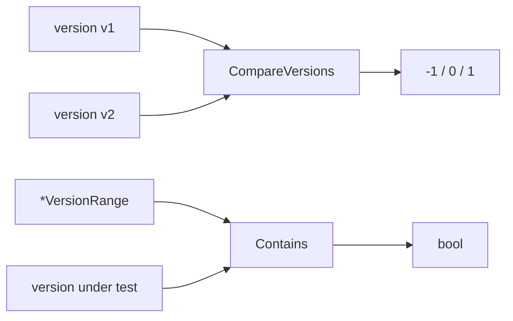
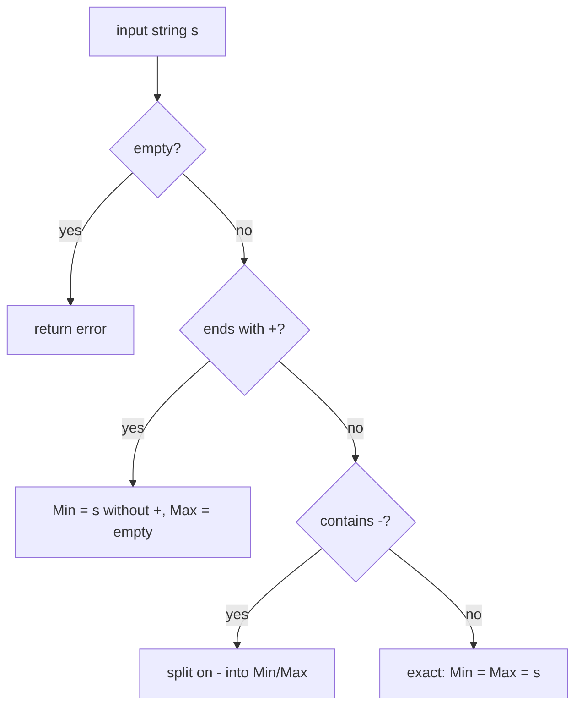

# 🔢 Version Comparison

The `version_compare` module (`version_compare.go`) provides version-string comparison and range checking. It is backed by the `github.com/scagogogo/versions` package for parsing version numbers.



## Type

### VersionRange

```go
type VersionRange struct {
    MinVersion string // inclusive lower bound
    MaxVersion string // inclusive upper bound
}
```

A closed version interval.

## Functions

### CompareVersions

```go
func CompareVersions(v1, v2 string) int
```

Compares two version strings.

**Parameters:**
- `v1` — first version
- `v2` — second version

**Returns:**
- `int` — `-1` if `v1 < v2`; `0` if equal; `1` if `v1 > v2`

**Example:**
```go
fmt.Println(cpeskills.CompareVersions("1.2.0", "1.2.1")) // -1
fmt.Println(cpeskills.CompareVersions("2.0", "1.9.9"))   // 1
fmt.Println(cpeskills.CompareVersions("1.0", "1.0"))     // 0
```

### IsVersionInRange

```go
func IsVersionInRange(version, minVersion, maxVersion string) bool
```

Checks whether `version` falls in the closed interval `[minVersion, maxVersion]`. An empty bound means that side is unbounded.

**Parameters:**
- `version` — version to test
- `minVersion` — lower bound (empty = no lower bound)
- `maxVersion` — upper bound (empty = no upper bound)

**Returns:**
- `bool` — whether in range

### IsSubVersion

```go
func IsSubVersion(parentVersion, subVersion string) bool
```

Checks whether `subVersion` is a sub-version of `parentVersion`. For example `1.0.1` is a sub-version of `1.0`: the numeric prefix of the child must match the parent exactly and be at least as long.

**Parameters:**
- `parentVersion` — parent version
- `subVersion` — candidate sub-version

**Returns:**
- `bool` — whether it is a sub-version

**Example:**
```go
cpeskills.IsSubVersion("1.0", "1.0.5") // true
cpeskills.IsSubVersion("1.0", "1.1")   // false
```

### ParseVersionRange

```go
func ParseVersionRange(s string) (*VersionRange, error)
```

Parses a version-range string. Supported formats:
- `"1.0"` → exact version (Min and Max both `1.0`)
- `"1.0-2.0"` → range from 1.0 to 2.0
- `"1.0+"` → 1.0 and above (Max empty)
- `"-2.0"` → 2.0 and below (Min empty)

**Parameters:**
- `s` — range string

**Returns:**
- `*VersionRange` — parsed range
- `error` — error on empty input

**Example:**
```go
vr, err := cpeskills.ParseVersionRange("1.0-2.0")
if err != nil {
    log.Fatal(err)
}
fmt.Println(vr.MinVersion, vr.MaxVersion) // 1.0 2.0
```

### VersionRange.Contains

```go
func (vr *VersionRange) Contains(version string) bool
```

Checks whether a version falls within this range (equivalent to `IsVersionInRange(version, vr.MinVersion, vr.MaxVersion)`).

**Parameters:**
- `version` — version to test

**Returns:**
- `bool` — whether in range

## Range Parsing Flow


