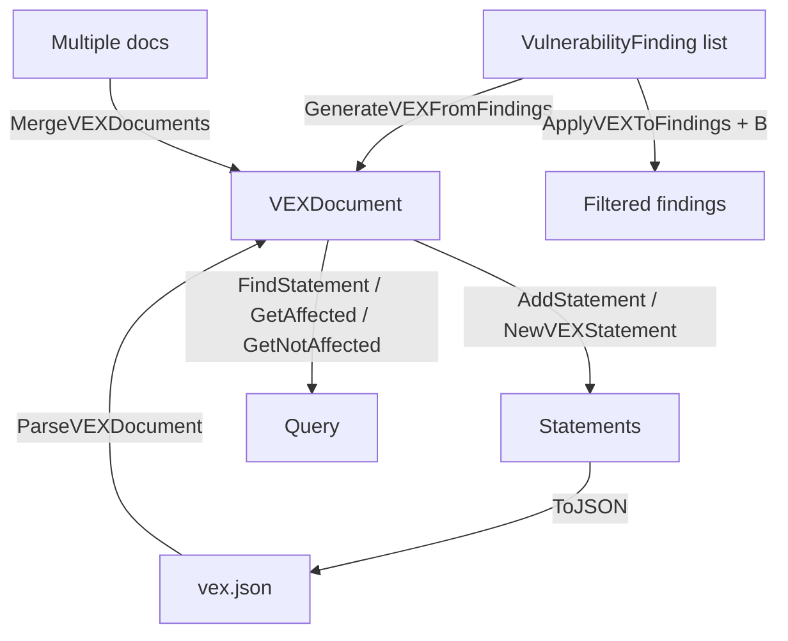

# 🚦 VEX

The `vex` module implements Vulnerability Exploitability eXchange (VEX) statements and documents, compatible with the CSAF VEX profile and the CycloneDX VEX extension. A VEX document declares, for a specific product, whether each known vulnerability is affected, not affected, fixed, or under investigation.

## Type: VEXStatus

```go
type VEXStatus string
```

Enumerates the exploitability status of a vulnerability in a product context.

| Constant | Type | Value |
| --- | --- | --- |
| `VEXNotAffected` | `VEXStatus` | `"not_affected"` |
| `VEXAffected` | `VEXStatus` | `"affected"` |
| `VEXFixed` | `VEXStatus` | `"fixed"` |
| `VEXUnderInvestigation` | `VEXStatus` | `"under_investigation"` |

## Type: VEXJustification

```go
type VEXJustification string
```

Enumerates the reasons a product is not affected.

| Constant | Type | Value |
| --- | --- | --- |
| `VEXComponentNotPresent` | `VEXJustification` | `"component_not_present"` |
| `VEXVulnerableCodeNotPresent` | `VEXJustification` | `"vulnerable_code_not_present"` |
| `VEXVulnerableCodeNotInExecutePath` | `VEXJustification` | `"vulnerable_code_not_in_execute_path"` |
| `VEXVulnerableCodeCannotBeControlledByAdversary` | `VEXJustification` | `"vulnerable_code_cannot_be_controlled_by_adversary"` |
| `VEXInlineMitigationsExist` | `VEXJustification` | `"inline_mitigations_already_exist"` |

## Type: VEXStatement

```go
type VEXStatement struct {
    ID                       string                 // unique statement ID
    VulnerabilityID          string                 // vulnerability ID (CVE, GHSA, etc.)
    VulnerabilityDescription string                 // human-readable vulnerability description
    Status                   VEXStatus              // exploitability status
    Justification            VEXJustification       // reason for not_affected
    ProductID                string                 // product ID (CPE URI or PURL)
    ProductName              string                 // human-readable product name
    ProductVersion           string                 // product version
    ImpactStatement          string                 // human-readable impact assessment
    ActionStatement          string                 // recommended action for affected products
    ActionStatementTimestamp time.Time              // when the action statement was last updated
    LastUpdated              time.Time              // when this statement was last updated
    Source                   string                 // who issued this statement
    SourceURL                string                 // URL to the original source
    Metadata                 map[string]interface{} // additional metadata
}
```

## Type: VEXDocument

```go
type VEXDocument struct {
    Format         string          // "csaf", "cyclonedx", "openvex"
    ID             string          // unique document ID
    Author         string          // document author
    AuthorRole     string          // author role (vendor, coordinator, etc.)
    Timestamp      time.Time       // creation time
    LastUpdated    time.Time       // last update time
    Version        int             // document version
    Title          string          // document title
    ProductID      string          // product this document describes
    ProductName    string          // human-readable product name
    ProductVersion string          // product version
    Supplier       string          // product supplier
    Statements     []*VEXStatement // VEX statements
}
```

## 🆕 NewVEXDocument

```go
func NewVEXDocument(format, productID, productName, author string) *VEXDocument
```

Creates a new VEX document. A unique `ID` (`VEX-<uuid>`) is generated, `Timestamp` and `LastUpdated` are set to now, `Version` is `1`, and `Statements` is initialized.

| Parameter | Type | Description |
| --- | --- | --- |
| `format` | `string` | VEX format (`"csaf"`, `"cyclonedx"`, `"openvex"`) |
| `productID` | `string` | product ID (CPE URI or PURL) |
| `productName` | `string` | human-readable product name |
| `author` | `string` | document author |

| Return | Type | Description |
| --- | --- | --- |
| #1 | `*VEXDocument` | initialized VEX document |

```go
doc := cpeskills.NewVEXDocument("cyclonedx", "pkg:app@1.0", "my-app", "security-team")
```

## ➕ AddStatement

```go
func (d *VEXDocument) AddStatement(stmt *VEXStatement)
```

Appends a statement. If `stmt.ID` is empty, a unique `VEXSTMT-<uuid>` ID is generated; if `stmt.LastUpdated` is zero, it is set to now. The document's `LastUpdated` is refreshed.

| Parameter | Type | Description |
| --- | --- | --- |
| `stmt` | `*VEXStatement` | statement to add |

```go
stmt := cpeskills.NewVEXStatement("CVE-2021-44228", "pkg:app@1.0", cpeskills.VEXAffected)
doc.AddStatement(stmt)
```

## 🆕 NewVEXStatement

```go
func NewVEXStatement(vulnerabilityID, productID string, status VEXStatus) *VEXStatement
```

Creates a new VEX statement. A unique `VEXSTMT-<uuid>` ID is generated and `LastUpdated` is set to now.

| Parameter | Type | Description |
| --- | --- | --- |
| `vulnerabilityID` | `string` | vulnerability ID (CVE, GHSA, etc.) |
| `productID` | `string` | product ID |
| `status` | `VEXStatus` | exploitability status |

| Return | Type | Description |
| --- | --- | --- |
| #1 | `*VEXStatement` | initialized statement |

```go
stmt := cpeskills.NewVEXStatement("CVE-2021-44228", "pkg:app@1.0", cpeskills.VEXNotAffected)
stmt.Justification = cpeskills.VEXComponentNotPresent
```

## 📤 ToJSON

```go
func (d *VEXDocument) ToJSON() ([]byte, error)
```

Serializes the VEX document to pretty-printed (2-space indented) JSON.

| Return | Type | Description |
| --- | --- | --- |
| #1 | `[]byte` | JSON document |
| #2 | `error` | serialization error |

```go
data, err := doc.ToJSON()
if err != nil {
    log.Fatal(err)
}
os.WriteFile("vex.json", data, 0644)
```

## 📥 ParseVEXDocument

```go
func ParseVEXDocument(data []byte) (*VEXDocument, error)
```

Parses VEX JSON bytes into a `VEXDocument`.

| Parameter | Type | Description |
| --- | --- | --- |
| `data` | `[]byte` | VEX JSON bytes |

| Return | Type | Description |
| --- | --- | --- |
| #1 | `*VEXDocument` | parsed document |
| #2 | `error` | wrapped `json.Unmarshal` error |

```go
data, _ := os.ReadFile("vex.json")
doc, err := cpeskills.ParseVEXDocument(data)
if err != nil {
    log.Fatal(err)
}
```

## 🔍 FindStatement

```go
func (d *VEXDocument) FindStatement(vulnerabilityID string) *VEXStatement
```

Returns the first statement whose `VulnerabilityID` matches, or `nil` if none.

| Parameter | Type | Description |
| --- | --- | --- |
| `vulnerabilityID` | `string` | vulnerability ID to find |

| Return | Type | Description |
| --- | --- | --- |
| #1 | `*VEXStatement` | matching statement, or `nil` |

```go
stmt := doc.FindStatement("CVE-2021-44228")
```

## 🔍 GetAffectedStatements

```go
func (d *VEXDocument) GetAffectedStatements() []*VEXStatement
```

Returns all statements with `VEXAffected` status.

| Return | Type | Description |
| --- | --- | --- |
| #1 | `[]*VEXStatement` | affected statements |

```go
for _, s := range doc.GetAffectedStatements() {
    fmt.Println(s.VulnerabilityID)
}
```

## 🔍 GetNotAffectedStatements

```go
func (d *VEXDocument) GetNotAffectedStatements() []*VEXStatement
```

Returns all statements with `VEXNotAffected` status.

| Return | Type | Description |
| --- | --- | --- |
| #1 | `[]*VEXStatement` | not-affected statements |

```go
for _, s := range doc.GetNotAffectedStatements() {
    fmt.Println(s.VulnerabilityID)
}
```

## 🔢 StatementCount

```go
func (d *VEXDocument) StatementCount() int
```

Returns the number of statements in the document.

| Return | Type | Description |
| --- | --- | --- |
| #1 | `int` | statement count |

```go
fmt.Println(doc.StatementCount())
```

## 🔀 MergeVEXDocuments

```go
func MergeVEXDocuments(docs []*VEXDocument) *VEXDocument
```

Merges multiple VEX documents into one. The merged document inherits `Format`, `Author`, `ProductID`, and `ProductName` from the first document and gets a fresh `ID`/`Timestamp`. Statements are deduplicated by `VulnerabilityID` with later documents taking precedence (last wins), then returned to original order.

| Parameter | Type | Description |
| --- | --- | --- |
| `docs` | `[]*VEXDocument` | documents to merge |

| Return | Type | Description |
| --- | --- | --- |
| #1 | `*VEXDocument` | merged document, or `nil` if the input is empty |

```go
merged := cpeskills.MergeVEXDocuments([]*cpeskills.VEXDocument{doc1, doc2})
```

## 🤖 GenerateVEXFromFindings

```go
func GenerateVEXFromFindings(component *SBOMComponent, findings []*VulnerabilityFinding, productID string) *VEXDocument
```

Generates a CycloneDX VEX document (`format: "cyclonedx"`, author: `"cpe-skills"`) for the given component's findings. For each finding, the vulnerability ID comes from `finding.CVE.CVEID` or `finding.OSV.ID` (defaulting to `"unknown"`), and the description from the same source. Status is `VEXAffected`, or `VEXFixed` when `finding.FixAvailable` is true; when `finding.FixedVersion` is set, an action statement `"Upgrade to version <v> or later."` is added.

| Parameter | Type | Description |
| --- | --- | --- |
| `component` | `*SBOMComponent` | component the findings belong to |
| `findings` | `[]*VulnerabilityFinding` | vulnerability findings |
| `productID` | `string` | product ID for the statements |

| Return | Type | Description |
| --- | --- | --- |
| #1 | `*VEXDocument` | generated VEX document |

```go
doc := cpeskills.GenerateVEXFromFindings(comp, findings, "pkg:app@1.0")
```

## 🎯 ApplyVEXToFindings

```go
func ApplyVEXToFindings(findings []*VulnerabilityFinding, doc *VEXDocument) []*VulnerabilityFinding
```

Filters or adjusts findings according to VEX status. If `doc` is nil, all findings are returned unchanged. For each finding, the vulnerability ID is taken from `finding.CVE.CVEID` or `finding.OSV.ID`; if no matching statement exists the finding is kept. `VEXNotAffected` findings are dropped; `VEXFixed` findings are kept with `FixAvailable` set to true; `VEXUnderInvestigation` and `VEXAffected` findings are kept.

| Parameter | Type | Description |
| --- | --- | --- |
| `findings` | `[]*VulnerabilityFinding` | input findings |
| `doc` | `*VEXDocument` | VEX document to apply |

| Return | Type | Description |
| --- | --- | --- |
| #1 | `[]*VulnerabilityFinding` | filtered/adjusted findings |

```go
filtered := cpeskills.ApplyVEXToFindings(findings, doc)
```

## VEX Lifecycle


