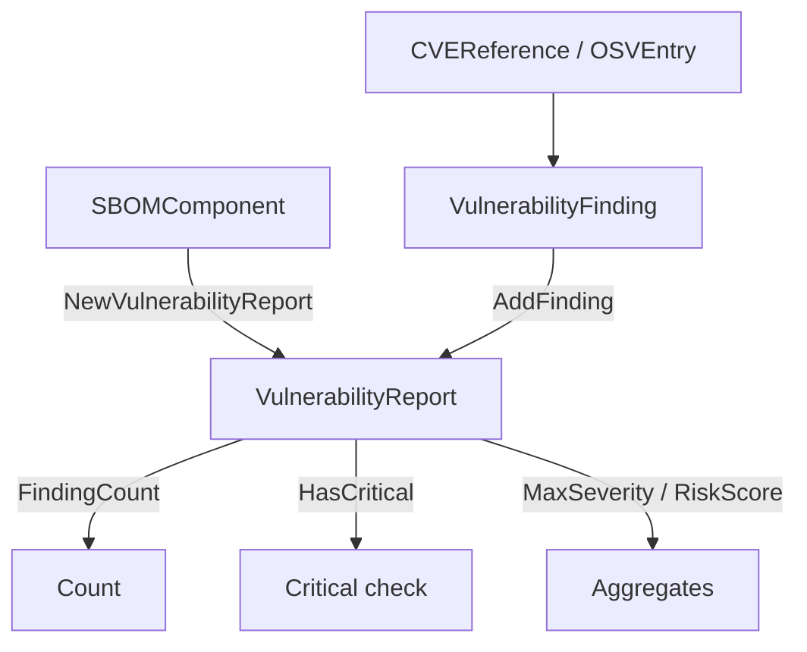

# 📋 Vulnerability Report

The `vulnerability_report` module defines a unified vulnerability view (`VulnerabilityFinding`) that integrates CVE, OSV, EPSS, KEV, and reachability data, and a per-component `VulnerabilityReport` that aggregates findings with a max severity and risk score.

## Type: VulnerabilityFinding

```go
type VulnerabilityFinding struct {
    CVE          *CVEReference // CVE reference (from NVD, etc.)
    OSV          *OSVEntry     // OSV entry (from OSV database)
    FixedVersion string        // fix version
    FixAvailable bool          // whether a fix is available
    EPSSScore    float64       // EPSS exploit prediction score (0.0-1.0)
    KEVListed    bool          // whether listed in CISA KEV
    Reachability string        // "direct", "transitive", "unknown"
    PublishedAt  time.Time     // vulnerability publication time
    Source       string        // vulnerability info source
}
```

## Type: OSVEntry

```go
type OSVEntry struct {
    ID             string                 // OSV entry ID (e.g. "GHSA-xxxx-xxxx-xxxx")
    Summary        string                 // vulnerability summary
    Details        string                 // vulnerability details
    Aliases        []string               // aliases (e.g. CVE ID)
    Modified       time.Time              // last modified time
    Published      time.Time              // publication time
    Severity       []*OSVSeverity         // severity scores
    Affected       []*OSVAffected         // affected packages
    References     []*OSVReference        // reference URLs
    DatabaseSpecific map[string]interface{} // database-specific fields
}
```

### OSVSeverity

```go
type OSVSeverity struct {
    Type  string // score type (CVSS_V3, CVSS_V4)
    Score string // score value
}
```

### OSVAffected

```go
type OSVAffected struct {
    Package          *OSVPackage            // package info
    Ranges           []*OSVRange            // version ranges
    Versions         []string               // specific affected versions
    EcosystemSpecific map[string]interface{} // ecosystem-specific fields
    DatabaseSpecific  map[string]interface{} // database-specific fields
}
```

### OSVPackage

```go
type OSVPackage struct {
    Ecosystem string // ecosystem
    Name      string // package name
    PURL      string // package URL
}
```

### OSVRange

```go
type OSVRange struct {
    Type   string      // range type (SEMVER, ECOSYSTEM, GIT)
    Events []*OSVEvent // range events
    Repo   string      // repository URL (for GIT type)
}
```

### OSVEvent

```go
type OSVEvent struct {
    Introduced    string // version that introduced the vuln
    Fixed         string // version that fixed the vuln
    LastAffected  string // last affected version
    Limit         string // limit version
}
```

### OSVReference

```go
type OSVReference struct {
    Type string // reference type (ADVISORY, ARTICLE, REPORT, FIX, PACKAGE, EVIDENCE, WEB)
    URL  string // reference URL
}
```

## Type: VulnerabilityReport

```go
type VulnerabilityReport struct {
    Component      *SBOMComponent            // assessed component
    Vulnerabilities []*VulnerabilityFinding  // findings
    RiskScore      float64                   // aggregate risk score (0-10)
    MaxSeverity    string                    // highest severity
    GeneratedAt    time.Time                 // report generation time
    Summary        string                    // report summary
}
```

## 🆕 NewVulnerabilityFinding

```go
func NewVulnerabilityFinding() *VulnerabilityFinding
```

Creates a new finding with `Reachability` set to `"unknown"`.

| Return | Type | Description |
| --- | --- | --- |
| #1 | `*VulnerabilityFinding` | initialized finding |

```go
f := cpeskills.NewVulnerabilityFinding()
f.CVE = cpeskills.NewCVEReference("CVE-2021-44228")
f.CVE.SetSeverity(10.0)
f.FixAvailable = true
f.FixedVersion = "2.15.0"
```

## 🆕 NewVulnerabilityReport

```go
func NewVulnerabilityReport(component *SBOMComponent) *VulnerabilityReport
```

Creates a new report for the given component. `Vulnerabilities` is initialized to an empty slice and `GeneratedAt` is set to now.

| Parameter | Type | Description |
| --- | --- | --- |
| `component` | `*SBOMComponent` | component to report on |

| Return | Type | Description |
| --- | --- | --- |
| #1 | `*VulnerabilityReport` | initialized report |

```go
report := cpeskills.NewVulnerabilityReport(comp)
```

## ➕ AddFinding

```go
func (r *VulnerabilityReport) AddFinding(finding *VulnerabilityFinding)
```

Appends a finding. If `finding.CVE` is set, the report's `MaxSeverity` is updated when the finding's severity outranks the current one (Critical > High > Medium > Low), and `RiskScore` is updated to the max of itself and `finding.CVE.CVSSScore`.

| Parameter | Type | Description |
| --- | --- | --- |
| `finding` | `*VulnerabilityFinding` | finding to add |

```go
report.AddFinding(f)
```

## 🔢 FindingCount

```go
func (r *VulnerabilityReport) FindingCount() int
```

Returns the number of findings in the report.

| Return | Type | Description |
| --- | --- | --- |
| #1 | `int` | finding count |

```go
fmt.Println(report.FindingCount())
```

## ❓ HasCritical

```go
func (r *VulnerabilityReport) HasCritical() bool
```

Returns true if the report's `MaxSeverity` is `"Critical"`.

| Return | Type | Description |
| --- | --- | --- |
| #1 | `bool` | true if any critical-severity finding exists |

```go
if report.HasCritical() {
    fmt.Println("Critical vulnerability detected")
}
```

## Vulnerability Report Flow


