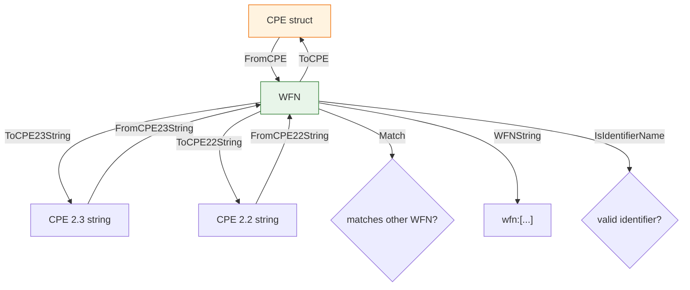

# 🧬 WFN (Well-Formed Name)

`WFN` is the canonical internal representation of a CPE. It stores the 11 attributes defined by the CPE specification (part, vendor, product, version, update, edition, language, sw_edition, target_sw, target_hw, other) as plain strings, using the logical values `*` (ANY) and `-` (NA). The functions in this module convert between `WFN`, the `CPE` struct, and CPE 2.3 / 2.2 string forms, and perform name matching.

## Constants

```go
const (
    ValueANY = "*" // logical value ANY
    ValueNA  = "-" // logical value NA
)

const (
    AttrPart            = "part"
    AttrVendor          = "vendor"
    AttrProduct         = "product"
    AttrVersion         = "version"
    AttrUpdate          = "update"
    AttrEdition         = "edition"
    AttrLanguage        = "language"
    AttrSoftwareEdition = "sw_edition"
    AttrTargetSoftware  = "target_sw"
    AttrTargetHardware  = "target_hw"
    AttrOther           = "other"
)

const (
    PartApplicationShort = "a"
    PartOSShort          = "o"
    PartHardwareShort    = "h"
)
```

`ValueANY` and `ValueNA` are the two logical values. The `Attr*` constants are the canonical attribute names used by `Get` / `Set` and by the binding logic. The `Part*Short` constants are the short names for the three part types.

## Type: WFN

```go
type WFN struct {
    Part            string
    Vendor          string
    Product         string
    Version         string
    Update          string
    Edition         string
    Language        string
    SoftwareEdition string
    TargetSoftware  string
    TargetHardware  string
    Other           string
}
```

All eleven attributes are plain `string` fields. An empty string is treated as ANY by `Get`.

## Variable: ValidPartValues

```go
var ValidPartValues = map[string]bool{
    "a": true,
    "o": true,
    "h": true,
    "*": true,
}
```

The set of allowed values for the `Part` attribute: the three short names plus the ANY wildcard.

## 🆕 NewWFN

```go
func NewWFN() *WFN
```

Creates an empty `WFN` whose attributes all default to ANY.

| Return | Type | Description |
| --- | --- | --- |
| #1 | `*WFN` | A pointer to a new empty WFN |

```go
w := cpeskills.NewWFN()
fmt.Println(w.Get(cpeskills.AttrPart)) // *
```

## 🔁 FromCPE

```go
func FromCPE(cpe *CPE) *WFN
```

Builds a `WFN` from a `CPE` struct, copying each attribute from the corresponding CPE field.

| Parameter | Type | Description |
| --- | --- | --- |
| `cpe` | `*CPE` | The source CPE struct |

| Return | Type | Description |
| --- | --- | --- |
| #1 | `*WFN` | The converted WFN |

```go
cpe := &cpeskills.CPE{
    Part:        *cpeskills.PartApplication,
    Vendor:      cpeskills.Vendor("microsoft"),
    ProductName: cpeskills.Product("windows"),
    Version:     cpeskills.Version("10"),
}
wfn := cpeskills.FromCPE(cpe)
fmt.Println(wfn.Part, wfn.Vendor, wfn.Product, wfn.Version) // a microsoft windows 10
```

## ↔️ ToCPE

```go
func (w *WFN) ToCPE() *CPE
```

Converts the WFN back into a `CPE` struct. The `Part` short name is mapped to the matching predefined `Part` value (`a`→Application, `h`→Hardware, `o`→Operation System); an unrecognized value defaults to Application. The resulting CPE has its `Cpe23` field populated via `ToCPE23String`.

| Return | Type | Description |
| --- | --- | --- |
| #1 | `*CPE` | The converted CPE, with `Cpe23` set |

```go
wfn := &cpeskills.WFN{Part: "a", Vendor: "microsoft", Product: "windows", Version: "10"}
cpe := wfn.ToCPE()
fmt.Println(cpe.Part.LongName) // Application
fmt.Println(cpe.Cpe23)         // cpe:2.3:a:microsoft:windows:10:*:*:*:*:*:*:*
```

## 📥 FromCPE23String

```go
func FromCPE23String(cpe23 string) (*WFN, error)
```

Parses a CPE 2.3 formatted string into a `WFN`. The string must start with `cpe:2.3:` and contain exactly 13 colon-separated components. Each non-part component is unescaped.

| Parameter | Type | Description |
| --- | --- | --- |
| `cpe23` | `string` | CPE 2.3 formatted string |

| Return | Type | Description |
| --- | --- | --- |
| #1 | `*WFN` | Parsed WFN, `nil` on error |
| #2 | `error` | `nil` on success, otherwise a format error |

```go
wfn, err := cpeskills.FromCPE23String("cpe:2.3:a:microsoft:windows:10:*:*:*:*:*:*:*")
if err != nil {
    panic(err)
}
fmt.Println(wfn.Part, wfn.Vendor, wfn.Product, wfn.Version)
```

## 📥 FromCPE22String

```go
func FromCPE22String(cpe22 string) (*WFN, error)
```

Parses a CPE 2.2 URI string into a `WFN`. Internally converts the 2.2 form to a 2.3 form and delegates to `FromCPE23String`.

| Parameter | Type | Description |
| --- | --- | --- |
| `cpe22` | `string` | CPE 2.2 URI string |

| Return | Type | Description |
| --- | --- | --- |
| #1 | `*WFN` | Parsed WFN, `nil` on error |
| #2 | `error` | `nil` on success, otherwise an error from the conversion |

```go
wfn, err := cpeskills.FromCPE22String("cpe:/a:microsoft:windows:10")
if err != nil {
    panic(err)
}
fmt.Println(wfn.Part, wfn.Vendor, wfn.Product, wfn.Version)
```

## 📤 ToCPE23String

```go
func (w *WFN) ToCPE23String() string
```

Serializes the WFN to a CPE 2.3 formatted string. Each attribute is escaped per the FS binding rules; the result always has 13 colon-separated parts and starts with `cpe:2.3:`.

| Return | Type | Description |
| --- | --- | --- |
| #1 | `string` | The CPE 2.3 formatted string |

```go
wfn := &cpeskills.WFN{Part: "a", Vendor: "microsoft", Product: "windows", Version: "10"}
fmt.Println(wfn.ToCPE23String()) // cpe:2.3:a:microsoft:windows:10:*:*:*:*:*:*:*
```

## 📤 ToCPE22String

```go
func (w *WFN) ToCPE22String() string
```

Serializes the WFN to a CPE 2.2 URI string. The five main parts (part, vendor, product, version, update) are colon-separated; extended attributes are appended after a colon, joined with `~`; trailing empty extended values are removed. Escaping follows the URI binding rules.

| Return | Type | Description |
| --- | --- | --- |
| #1 | `string` | The CPE 2.2 URI string |

```go
wfn := &cpeskills.WFN{
    Part: "a", Vendor: "microsoft", Product: "windows",
    Version: "10", Update: "sp1", Edition: "pro", Language: "zh-cn",
}
fmt.Println(wfn.ToCPE22String()) // cpe:/a:microsoft:windows:10:sp1:pro~zh-cn
```

## 🔍 Match

```go
func (w *WFN) Match(other *WFN) bool
```

Reports whether this WFN matches `other` per the CPE name-matching rules: any attribute that is `*` (ANY) on either side matches; two `-` (NA) values match; otherwise an exact, case-sensitive equality is required. All eleven attributes must match.

| Parameter | Type | Description |
| --- | --- | --- |
| `other` | `*WFN` | The WFN to compare against |

| Return | Type | Description |
| --- | --- | --- |
| #1 | `bool` | `true` if all attributes match, `false` otherwise |

```go
any := &cpeskills.WFN{Part: "a", Vendor: "microsoft", Product: "windows", Version: "*"}
concrete := &cpeskills.WFN{Part: "a", Vendor: "microsoft", Product: "windows", Version: "10"}
fmt.Println(any.Match(concrete))   // true
fmt.Println(concrete.Match(any))   // true
```

## 🗂️ Get

```go
func (w *WFN) Get(attr string) string
```

Returns the value of the named attribute. An empty field is reported as `*` (ANY). An unrecognized attribute name also returns ANY.

| Parameter | Type | Description |
| --- | --- | --- |
| `attr` | `string` | Attribute name (use an `Attr*` constant) |

| Return | Type | Description |
| --- | --- | --- |
| #1 | `string` | The attribute value, or ANY when unset/unknown |

```go
w := cpeskills.NewWFN()
fmt.Println(w.Get(cpeskills.AttrVendor)) // *
w.Set(cpeskills.AttrVendor, "microsoft")
fmt.Println(w.Get(cpeskills.AttrVendor)) // microsoft
```

## 🗂️ Set

```go
func (w *WFN) Set(attr string, value string)
```

Sets the named attribute to `value`. Unrecognized attribute names are silently ignored.

| Parameter | Type | Description |
| --- | --- | --- |
| `attr` | `string` | Attribute name (use an `Attr*` constant) |
| `value` | `string` | The new value |

```go
w := cpeskills.NewWFN()
w.Set(cpeskills.AttrPart, "a")
w.Set(cpeskills.AttrProduct, "windows")
fmt.Println(w.Part, w.Product) // a windows
```

## 🏷️ WFNString

```go
func (w *WFN) WFNString() string
```

Returns a compact, human-readable representation of the WFN, listing only the attributes whose value is not ANY, in the canonical attribute order. The form is `wfn:[attr="value",...]`, or `wfn:[]` when every attribute is ANY.

| Return | Type | Description |
| --- | --- | --- |
| #1 | `string` | The WFN string representation |

```go
w := &cpeskills.WFN{Part: "a", Vendor: "microsoft", Product: "windows"}
fmt.Println(w.WFNString()) // wfn:[part="a",vendor="microsoft",product="windows"]
```

## ✔️ IsIdentifierName

```go
func (w *WFN) IsIdentifierName() bool
```

Reports whether the WFN is a valid CPE identifier name. To qualify, `part`, `vendor`, and `product` must each be a set (non-ANY, non-NA) value, and no attribute may contain an unquoted wildcard (`*` or `?`).

| Return | Type | Description |
| --- | --- | --- |
| #1 | `bool` | `true` if the WFN is a valid identifier name |

```go
w := &cpeskills.WFN{Part: "a", Vendor: "microsoft", Product: "windows", Version: "10"}
fmt.Println(w.IsIdentifierName()) // true

w2 := &cpeskills.WFN{Part: "a", Vendor: "microsoft", Product: "windows", Version: "*"}
fmt.Println(w2.IsIdentifierName()) // false (version is a wildcard)
```

## 📐 WFN Conversion & Matching Diagram


