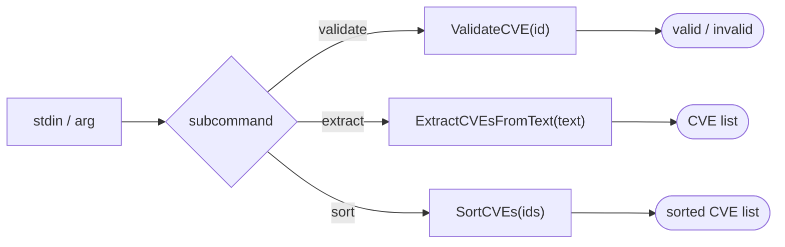

# 🧬 cpe cve

Validate, extract, and sort CVE identifiers.

The `cpe cve` command group provides offline utilities for working with CVE ID strings — checking whether an ID is well-formed, pulling CVE IDs out of free text, and sorting CVE IDs chronologically. These operations require no network access.

## Usage

```sh
cpe cve <subcommand> [flags]
```

## Subcommands

| Subcommand          | Description                                                  |
| ------------------- | ------------------------------------------------------------ |
| `validate <cve-id>` | Check if a CVE ID is valid (format: `CVE-YYYY-NNNN`)         |
| `extract`           | Extract CVE IDs from stdin text                              |
| `sort`              | Sort CVE IDs chronologically (stdin, one per line)           |

This command also inherits the global flags `--output, -o` (`text`/`json`) and `--no-color`.

## How It Works



## Examples

### Validate a CVE ID

```sh
cpe cve validate CVE-2021-44228
```

Expected output:

```text
VALID: CVE-2021-44228
```

Invalid IDs exit with code 1:

```sh
cpe cve validate INVALID-CVE
# INVALID: INVALID-CVE
```

### Extract CVE IDs from text

```sh
echo "See CVE-2021-44228 and CVE-2024-12345 in the advisory" | cpe cve extract
```

Expected output:

```text
CVE-2021-44228
CVE-2024-12345
```

### Sort CVE IDs chronologically

```sh
printf "CVE-2024-1234\nCVE-2021-44228\nCVE-2023-12345\n" | cpe cve sort
```

Expected output:

```text
CVE-2021-44228
CVE-2023-12345
CVE-2024-1234
```

### JSON output

```sh
cpe cve validate -o json CVE-2021-44228
```

```json
{"cve": "CVE-2021-44228", "valid": true}
```

## Error Handling

- `validate` exits 1 if the ID is malformed.
- `extract` / `sort` exit 0 even when no CVE is found (empty output).

## Related API Modules

- API module `cve` — `ValidateCVE`, `ExtractCVEsFromText`, `SortCVEs` (offline CVE string utilities)
- [NVD](./nvd) — `cpe nvd cves-for-cpe` to look up CVEs by CPE
