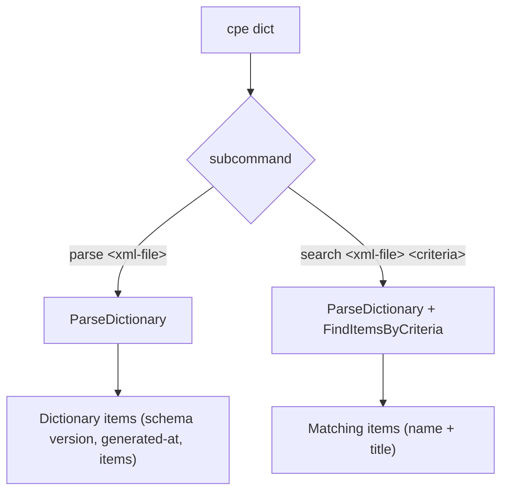

# 📚 cpe dict

Operations on CPE dictionaries: parse XML dictionary files and search within dictionaries.

A CPE dictionary is a collection of CPE items with metadata such as titles, references, and deprecation status. The official CPE dictionary is published by NIST as an XML file (`official-cpe-dictionary_v*.xml`).

The `dict` command is a parent command — it has no behavior of its own and requires one of its subcommands.

## Usage

```sh
cpe dict <subcommand> [args]
```

## Subcommands

| Subcommand | Usage                                  | Description                                              |
| ---------- | -------------------------------------- | -------------------------------------------------------- |
| `parse`    | `cpe dict parse <xml-file>`            | Parse a CPE dictionary XML file and list its items.     |
| `search`   | `cpe dict search <xml-file> <criteria-cpe>` | Search within a CPE dictionary for items matching a criteria CPE. |

Both subcommands inherit the global flags `--output, -o` (`text`/`json`) and `--no-color`. The `parse` subcommand honors the `json` output format; `search` always prints a text list.

## Subcommand Map

The diagram below shows how `cpe dict` dispatches to its two subcommands and which library function each one calls.



## cpe dict parse

```sh
cpe dict parse <xml-file>
```

### Arguments

| Argument     | Description                                            |
| ------------ | ------------------------------------------------------ |
| `<xml-file>` | Path to a CPE dictionary XML file. Exactly one arg.    |

### Behavior

Parses the XML file with `ParseDictionary` and prints:

- **text** (default): a header with `Schema Version`, `Generated At`, and `Items` count, followed by a numbered list of each item's `Name`, `Title` (if present), and `Deprecated` status (if deprecated).
- **json**: the full `Dictionary` struct, indented.

### Example

```sh
cpe dict parse official-cpe-dictionary_v2.3.xml
```

Expected output:

```text
CPE Dictionary
  Schema Version: 2.3
  Generated At:   2024-01-01T00:00:00Z
  Items:          1

1. cpe:2.3:a:microsoft:windows:10:*:*:*:*:*:*:*
   Title: Microsoft Windows 10
```

JSON output:

```sh
cpe -o json dict parse official-cpe-dictionary_v2.3.xml
```

## cpe dict search

```sh
cpe dict search <xml-file> <criteria-cpe>
```

### Arguments

| Argument          | Description                                                |
| ----------------- | ---------------------------------------------------------- |
| `<xml-file>`      | Path to a CPE dictionary XML file.                         |
| `<criteria-cpe>`  | Criteria CPE string (2.2 or 2.3). Exactly two args total.  |

### Behavior

Parses the XML file, parses the criteria CPE, and calls `dict.FindItemsByCriteria(criteria, nil)`. Prints `Found N matching item(s):` followed by each item's `Name` and `Title` (if present).

### Example

```sh
cpe dict search official-cpe-dictionary_v2.3.xml "cpe:2.3:a:microsoft:windows:*"
```

Expected output:

```text
Found 1 matching item(s):
1. cpe:2.3:a:microsoft:windows:10:*:*:*:*:*:*:* - Microsoft Windows 10
```

## Related API Modules

- [Dictionary](../api/dictionary) — `ParseDictionary`, `Dictionary`, `DictionaryItem`, `FindItemsByCriteria`
- [Parsing](../api/parsing) — parsing of the criteria CPE argument
