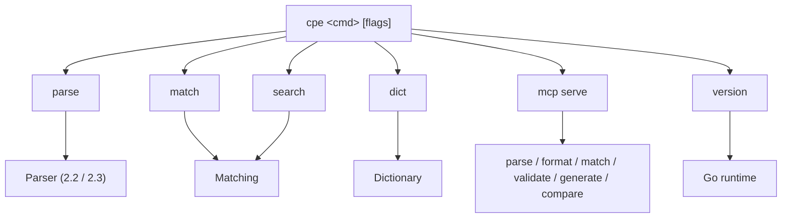

# 🛠️ CLI Overview

The `cpe` command-line tool provides command-line access to the core functionality of the `cpe-skills` library — parsing, matching, searching, and dictionary operations for CPE (Common Platform Enumeration) identifiers, plus an MCP server mode for AI assistants.

## Installation

Install the CLI with `go install`:

```sh
go install github.com/scagogogo/cpe-skills/cmd/cpe@latest
```

Verify the installation:

```sh
cpe version
```

Expected output:

```text
cpe CLI:     0.1.0
Git Commit:  unknown
Build Date:  unknown
Go Version:  go1.23.x
OS/Arch:     linux/amd64
```

## Global Flags

These flags are defined on the root command and inherited by every subcommand.

| Flag         | Shorthand | Type   | Default | Description                          |
| ------------ | --------- | ------ | ------- | ------------------------------------ |
| `--output`   | `-o`      | string | `text`  | Output format (`text` or `json`)     |
| `--no-color` |           | bool   | `false` | Disable colored output               |

## Subcommands

| Command  | Description                                            |
| -------- | ----------------------------------------------------- |
| `parse`  | Parse a CPE 2.2/2.3 string and display its components |
| `match`  | Check if two CPEs match (NISTIR 7696 semantics)      |
| `search` | Search CPEs from input that match criteria           |
| `dict`   | CPE dictionary operations (parse / search XML)       |
| `mcp`    | MCP (Model Context Protocol) server commands         |
| `version`| Print version information                            |

## Subcommand Map

The diagram below shows how a request flows from the root `cpe` command into one of its subcommands, and which library module each subcommand ultimately calls.



## Quick Reference

```sh
# Parse a CPE and show its components
cpe parse "cpe:2.3:a:microsoft:windows:10:*:*:*:*:*:*:*"

# Convert a CPE 2.3 string to CPE 2.2
cpe parse -t 2.2 "cpe:2.3:a:apache:log4j:2.0:*:*:*:*:*:*:*"

# Check whether two CPEs match
cpe match "cpe:2.3:a:microsoft:windows:*" "cpe:2.3:a:microsoft:windows:10"

# Ignore version while matching
cpe match --ignore-version "cpe:2.3:a:microsoft:windows:10" "cpe:2.3:a:microsoft:windows:11"

# Search a file for CPEs matching a criteria
cpe search --file cpes.txt "cpe:2.3:a:apache:*:*:*:*:*:*:*:*"

# Parse a CPE dictionary XML file
cpe dict parse official-cpe-dictionary_v2.3.xml

# Start the MCP server on stdio
cpe mcp serve

# Get JSON output from any command
cpe -o json parse "cpe:/a:apache:log4j:2.0"
```

## Exit Codes

The CLI exits with code `0` on success and `1` on error. Error messages are written to standard error.

## Related Documentation

- [API: Parsing](../api/parsing) — the parser modules behind `cpe parse`
- [API: Matching](../api/matching) — the matching algorithm behind `cpe match` / `cpe search`
- [API: Dictionary](../api/dictionary) — the dictionary module behind `cpe dict`
- [Guide: Basic Parsing](../guide/basic-parsing) — a walkthrough of parsing concepts
