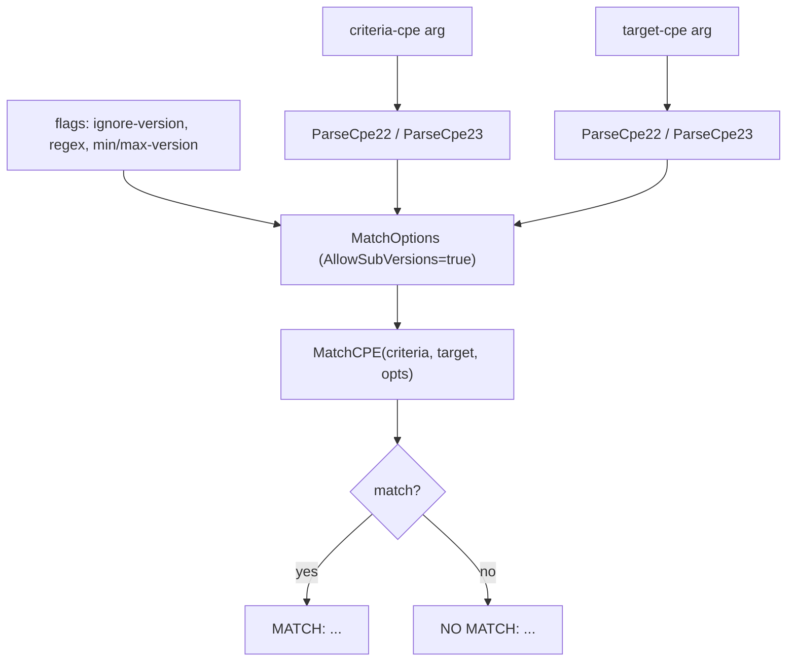

# 🤝 cpe match

Compare two CPE strings and check whether they match according to the cpe-skills matching algorithm. The first argument is the **criteria** CPE, the second is the **target** CPE.

Supports options for ignoring the version, using regex patterns on string fields, and specifying a version range.

## Usage

```sh
cpe match [flags] <criteria-cpe> <target-cpe>
```

## Arguments

| Argument          | Description                                                                 |
| ----------------- | --------------------------------------------------------------------------- |
| `<criteria-cpe>`  | The criteria CPE string (2.2 or 2.3). Exactly two arguments are required.   |
| `<target-cpe>`    | The target CPE string (2.2 or 2.3) to test against the criteria.            |

## Flags

| Flag              | Type   | Default | Description                                                       |
| ----------------- | ------ | ------- | ----------------------------------------------------------------- |
| `--ignore-version`| bool   | `false` | Ignore version when matching                                      |
| `--regex`         | bool   | `false` | Use regex matching for string fields                              |
| `--min-version`   | string | `""`    | Minimum version for range matching (enables range matching)      |
| `--max-version`   | string | `""`    | Maximum version for range matching (enables range matching)      |

This command also inherits the global flags `--output, -o` (`text`/`json`) and `--no-color`.

Internally the command always sets `AllowSubVersions: true`. Specifying either `--min-version` or `--max-version` enables `VersionRange` mode.

## How It Works

The diagram below shows how `cpe match` parses both arguments, builds a `MatchOptions` struct from its flags, calls `MatchCPE`, and reports the result.



## Examples

### Wildcard criteria matches a specific target

```sh
cpe match "cpe:2.3:a:microsoft:windows:*" "cpe:2.3:a:microsoft:windows:10"
```

Expected output:

```text
MATCH: cpe:/a:microsoft:windows matches cpe:/a:microsoft:windows:10
```

### Ignore version while matching

```sh
cpe match --ignore-version "cpe:2.3:a:microsoft:windows:10" "cpe:2.3:a:microsoft:windows:11"
```

Expected output:

```text
MATCH: cpe:/a:microsoft:windows:10 matches cpe:/a:microsoft:windows:11
```

### Version range matching (JSON output)

```sh
cpe -o json match --min-version 3.0 --max-version 4.0 \
  "cpe:2.3:a:apache:log4j" "cpe:2.3:a:apache:log4j:3.5"
```

Expected output:

```text
{"match": true, "criteria": "cpe:/a:apache:log4j", "target": "cpe:/a:apache:log4j:3.5"}
```

## Output

- **text** (default): `MATCH: <criteria> matches <target>` or `NO MATCH: <criteria> does not match <target>`.
- **json**: `{"match": <bool>, "criteria": "<2.2 URI>", "target": "<2.2 URI>"}`.

Both the criteria and target are rendered as their CPE 2.2 URI form in the output.

## Related API Modules

- [Matching](../api/matching) — `MatchCPE` and `MatchOptions`
- [Advanced Matching](../api/modules/advanced-matching) — `AdvancedMatchCPE`, `NewAdvancedMatchOptions`
- [Version Compare](../api/modules/version-compare) — `CompareVersions`, `IsVersionInRange` (used by range matching)
