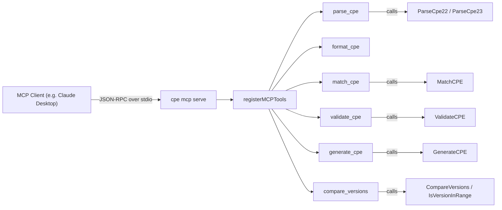

# 🤖 cpe mcp

Run cpe-skills as an MCP (Model Context Protocol) server, exposing CPE parsing, matching, generation, and validation as tools that AI assistants can call directly over stdio.

The `mcp` command is a parent command — it has no behavior of its own and requires the `serve` subcommand.

## Usage

```sh
cpe mcp serve
```

The `serve` subcommand takes no arguments and no flags (beyond the inherited global flags). It starts the MCP server on standard input/output using the official `go-sdk` MCP implementation.

## Client Configuration

Add this to your MCP client configuration (e.g. Claude Desktop `claude_desktop_config.json`):

```json
{
  "mcpServers": {
    "cpe-skills": {
      "command": "cpe",
      "args": ["mcp", "serve"]
    }
  }
}
```

## Exposed Tools

The server registers six tools. Each tool receives JSON arguments and returns a JSON text payload (or an `IsError` result on failure).

| Tool               | Description                                                              |
| ------------------ | ------------------------------------------------------------------------ |
| `parse_cpe`        | Parse a CPE 2.2/2.3 string into its components (auto-detects the format) |
| `format_cpe`       | Convert a CPE string to another format: `2.2`, `2.3`, or `wfn`           |
| `match_cpe`        | Check if two CPEs match (NISTIR 7696 semantics)                          |
| `validate_cpe`     | Validate a CPE string (format and components)                            |
| `generate_cpe`     | Generate a CPE 2.3 string from part/vendor/product/version               |
| `compare_versions` | Compare two version strings (-1/0/1), plus optional range check          |

## Tool Argument Schemas

### parse_cpe

```json
{
  "cpe": "CPE string (2.2 URI or 2.3 Formatted String)"
}
```

Returns: `input`, `format`, `part`, `vendor`, `product`, `version`, `update`, `edition`, `language`, `cpe_2_2`, `cpe_2_3`.

### format_cpe

```json
{
  "cpe": "input CPE string",
  "to": "2.2 | 2.3 | wfn"
}
```

Returns: `input`, `to`, `result`.

### match_cpe

```json
{
  "criteria": "criteria CPE string",
  "target": "target CPE string",
  "ignore_version": false
}
```

Returns: `criteria`, `target`, `match`, `ignore_version`. Internally sets `AllowSubVersions: true`.

### validate_cpe

```json
{
  "cpe": "CPE string to validate"
}
```

Returns: `cpe`, `valid`, `error` (empty if valid), `format`.

### generate_cpe

```json
{
  "part": "a | o | h",
  "vendor": "vendor name",
  "product": "product name",
  "version": "version"
}
```

Returns: `cpe_2_3`, `cpe_2_2`, `components`. `part` values: `a` (application), `o` (operating system), `h` (hardware).

### compare_versions

```json
{
  "a": "first version",
  "b": "second version",
  "min": "optional range minimum",
  "max": "optional range maximum"
}
```

Returns: `a`, `b`, `comparison` (-1/0/1), `meaning` (`a < b` / `a == b` / `a > b`), and `in_range` + `range` when `min` is provided.

## How It Works

The diagram below shows the MCP server lifecycle: the `serve` subcommand builds an MCP server, registers the six tools, and runs over a stdio transport. An MCP client (such as Claude Desktop) calls tools via JSON-RPC.



## Example Session

Start the server and have an MCP client call `parse_cpe`:

1. Start the server (your MCP client manages this process):

   ```sh
   cpe mcp serve
   ```

2. The client sends a `tools/call` request for `parse_cpe` with argument `{"cpe": "cpe:/a:apache:log4j:2.0"}`.

3. The server responds with a JSON text payload:

   ```json
   {
     "input": "cpe:/a:apache:log4j:2.0",
     "format": "2.2",
     "part": "a",
     "vendor": "apache",
     "product": "log4j",
     "version": "2.0",
     "update": "",
     "edition": "",
     "language": "",
     "cpe_2_2": "cpe:/a:apache:log4j:2.0",
     "cpe_2_3": "cpe:2.3:a:apache:log4j:2.0:*:*:*:*:*:*:*"
   }
   ```

## Related API Modules

- [Parsing](../api/parsing) — `ParseCpe22`, `ParseCpe23`, `FormatCpe22`, `FormatCpe23`
- [Matching](../api/matching) — `MatchCPE`, `MatchOptions`
- [Validation](../api/validation) — `ValidateCPE`
- [Generator](../api/modules/generator) — `GenerateCPE`
- [Version Compare](../api/modules/version-compare) — `CompareVersions`, `IsVersionInRange`
- [WFN](../api/wfn) — `FromCPE` used by the `wfn` format target
