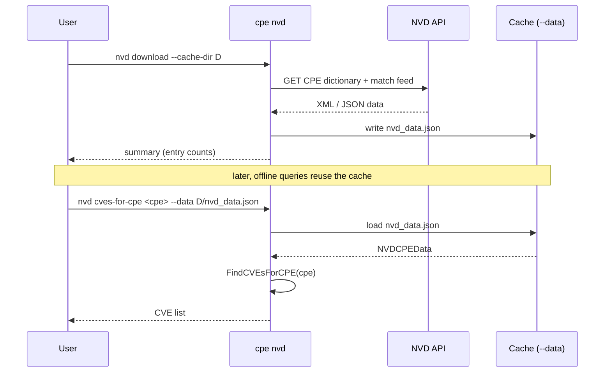

# 📡 cpe nvd

Download and query the NVD (National Vulnerability Database) CPE/CVE correlation data.

The `cpe nvd` command group wraps the NVD feed download and the bidirectional CPE↔CVE lookup facilities of the `cpe-skills` NVD module. It downloads the official CPE dictionary and the CPE match feed, then lets you ask "which CVEs affect this CPE?" or "which CPEs does this CVE affect?".

## Usage

```sh
cpe nvd <subcommand> [flags]
```

## Subcommands

| Subcommand                     | Description                                                  |
| ------------------------------ | ------------------------------------------------------------ |
| `download`                     | Download all NVD data (CPE dictionary + CPE match feed)      |
| `cves-for-cpe <cpe-string>`    | Find CVEs affecting a given CPE (requires `--data`)         |
| `cpes-for-cve <cve-id>`        | Find CPEs affected by a given CVE (requires `--data`)       |

## Flags

### `download`

| Flag            | Type   | Default | Description                                              |
| --------------- | ------ | ------- | -------------------------------------------------------- |
| `--cache-dir`   | string | temp    | Directory to cache NVD data                              |
| `--cache-max-age` | int  | `0`     | Max cache age in hours (0 = no expiry)                   |

### `cves-for-cpe` / `cpes-for-cve`

| Flag    | Type   | Description                                              |
| ------- | ------ | -------------------------------------------------------- |
| `--data`| string | Path to a cached NVD data JSON file (required)           |

This command also inherits the global flags `--output, -o` (`text`/`json`) and `--no-color`.

## How It Works

The diagram below shows the two-stage workflow: first download (once), then query against the cached data.



## Examples

### Download all NVD data

```sh
cpe nvd download --cache-dir ~/.cache/nvd --cache-max-age 24
```

Expected output:

```text
Downloaded NVD data:
  CPE Dictionary entries: 423817
  CPE Match entries: 189234 CVEs, 1984732 CPEs
  Cache directory: ~/.cache/nvd
```

### Find CVEs affecting a CPE

```sh
cpe nvd cves-for-cpe "cpe:2.3:a:apache:log4j:2.14:*:*:*:*:*:*:*" --data ~/.cache/nvd/nvd_data.json
```

Expected output:

```text
CVEs affecting cpe:2.3:a:apache:log4j:2.14:*:*:*:*:*:*:* (3):
  CVE-2021-44228
  CVE-2021-45046
  CVE-2021-45105
```

### Find CPEs affected by a CVE (JSON)

```sh
cpe nvd cpes-for-cve CVE-2021-44228 --data ~/.cache/nvd/nvd_data.json -o json
```

```json
{
  "cve": "CVE-2021-44228",
  "cpes": [
    "cpe:2.3:a:apache:log4j:2.14.0:*:*:*:*:*:*:*",
    "cpe:2.3:a:apache:log4j:2.14.1:*:*:*:*:*:*:*"
  ],
  "count": 2
}
```

## Error Handling

- If `--data` points to a non-existent or invalid file, the command returns `load NVD data: ...` and exits 1.
- If `download` cannot reach the NVD API, it returns `download NVD data: ...` and exits 1.

## Related API Modules

- [NVD](../api/nvd) — `DownloadAllNVDData`, `NVDCPEData.FindCVEsForCPE`, `FindCPEsForCVE`
- [CVE](./cve) — `cpe cve validate` for CVE ID format validation
