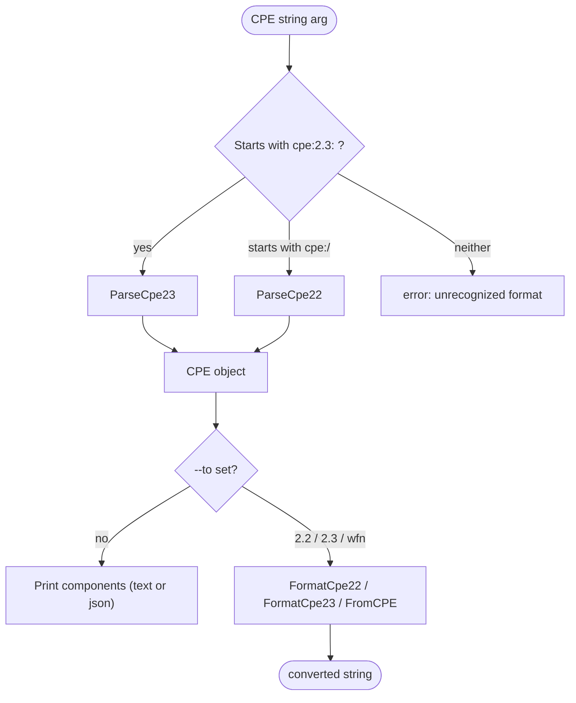

# 🔍 cpe parse

Parse a CPE 2.2 or 2.3 formatted string and display its individual components (part, vendor, product, version, update, edition, language, etc.).

The command automatically detects whether the input is CPE 2.2 (starts with `cpe:/`) or CPE 2.3 (starts with `cpe:2.3:`). It can also convert the input to another format via the `--to` flag.

## Usage

```sh
cpe parse [flags] <cpe-string>
```

## Arguments

| Argument      | Description                                                        |
| ------------- | ------------------------------------------------------------------ |
| `<cpe-string>`| A single CPE string in 2.2 (`cpe:/...`) or 2.3 (`cpe:2.3:...`) form. Exactly one argument is required. |

## Flags

| Flag    | Shorthand | Type   | Default | Description                                                       |
| ------- | --------- | ------ | ------- | ----------------------------------------------------------------- |
| `--to`  | `-t`      | string | `""`    | Convert to the given format instead of printing components. Accepted values: `2.2`, `2.3`, `wfn`. |

This command also inherits the global flags `--output, -o` (`text`/`json`) and `--no-color`.

## How It Works

The diagram below shows how `cpe parse` detects the input format, parses it into a `CPE` object, and then either prints the components (default) or converts it to a target format (`--to`).



## Examples

### Parse a CPE 2.3 string

```sh
cpe parse "cpe:2.3:a:microsoft:windows:10:*:*:*:*:*:*:*"
```

Expected output:

```text
CPE 2.3 URI: cpe:2.3:a:microsoft:windows:10:*:*:*:*:*:*:*
Part:        a (Application)
Vendor:      microsoft
Product:     windows
Version:     10
Update:      *
Edition:     *
Language:    *
```

### Parse a CPE 2.2 string as JSON

```sh
cpe -o json parse "cpe:/a:apache:log4j:2.0"
```

The output is a JSON object representing the parsed `CPE` structure, including its `Cpe23` field populated by the parser.

### Convert a CPE 2.3 string to CPE 2.2

```sh
cpe parse -t 2.2 "cpe:2.3:a:apache:log4j:2.0:*:*:*:*:*:*:*"
```

Expected output:

```text
cpe:/a:apache:log4j:2.0
```

### Convert to Well-Formed Name (WFN)

```sh
cpe parse -t wfn "cpe:/a:apache:log4j:2.0"
```

Expected output:

```text
wfn:[part=a,vendor=apache,product=log4j,version=2.0,update=,edition=,language=]
```

## Error Handling

If the input string does not start with `cpe:/` or `cpe:2.`, the command returns an error and exits with code 1:

```text
unrecognized CPE format: <input> (expected CPE 2.2 or 2.3)
```

If `--to` is given an unsupported value, the command returns:

```text
unsupported conversion format: <value> (supported: 2.2, 2.3, wfn)
```

## Related API Modules

- [Parsing](../api/parsing) — `ParseCpe22`, `ParseCpe23`, `FormatCpe22`, `FormatCpe23`
- [WFN](../api/wfn) — `FromCPE` for Well-Formed Name conversion
- [Validation](../api/validation) — `ValidateCPE` for validating parsed components
