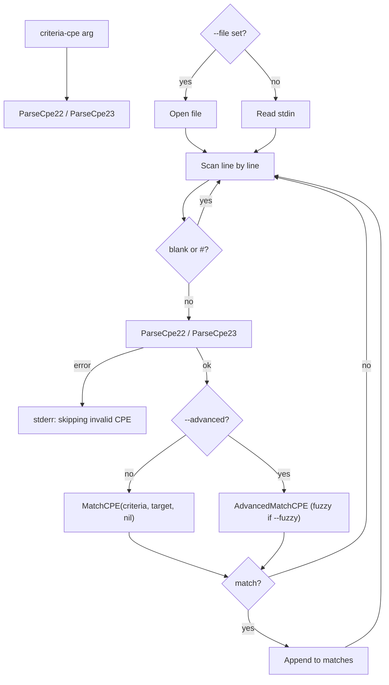

# 📋 cpe search

Search for CPEs that match the given criteria. Reads CPE strings from standard input (one per line) or from a file (`--file`), and prints the ones that match the criteria CPE.

Blank lines and lines starting with `#` are skipped. Lines that fail to parse are reported on standard error and skipped, but processing continues.

## Usage

```sh
cpe search [flags] <criteria-cpe>
```

## Arguments

| Argument          | Description                                                          |
| ----------------- | -------------------------------------------------------------------- |
| `<criteria-cpe>`  | The criteria CPE string (2.2 or 2.3). Exactly one argument is required. |

## Flags

| Flag         | Shorthand | Type   | Default | Description                                                        |
| ------------ | --------- | ------ | ------- | ------------------------------------------------------------------ |
| `--file`     | `-f`      | string | `""`    | Input file with CPE strings (one per line). Reads stdin if unset.  |
| `--advanced` |           | bool   | `false` | Use advanced matching (`AdvancedMatchCPE`) instead of basic `MatchCPE` |
| `--fuzzy`    |           | bool   | `false` | Enable fuzzy matching (requires `--advanced`)                      |

This command also inherits the global flags `--output, -o` (`text`/`json`) and `--no-color`.

When `--advanced` is **not** set, the command calls `MatchCPE(criteria, target, nil)` (basic matching). When `--advanced` is set, it builds options via `NewAdvancedMatchOptions()` and sets `UseFuzzyMatch` from `--fuzzy`.

## How It Works

The diagram below shows how `cpe search` reads lines from stdin or a file, parses each candidate, matches it against the criteria, and collects the matches.



## Examples

### Search from stdin via a pipe

```sh
cat cpes.txt | cpe search "cpe:2.3:a:microsoft:windows:*:*:*:*:*:*:*:*"
```

Expected output:

```text
Found 2 matching CPE(s):
1. cpe:/a:microsoft:windows:10
2. cpe:/a:microsoft:windows:11
```

### Search a file for Apache products

```sh
cpe search --file cpes.txt "cpe:2.3:a:apache:*:*:*:*:*:*:*:*"
```

### Advanced + fuzzy matching with JSON output

```sh
cpe -o json search --advanced --fuzzy "cpe:2.3:a:*:log4j:*:*:*:*:*:*:*" < cpes.txt
```

Expected output (a JSON array of matching CPE 2.2 URIs):

```text
["cpe:/a:apache:log4j:2.0", "cpe:/a:apache:log4j:2.14.1"]
```

## Output

- **text** (default): `Found N matching CPE(s):` followed by a numbered list of matching CPE 2.2 URIs.
- **json**: a JSON array of matching CPE 2.2 URIs, e.g. `["cpe:/a:...", "cpe:/a:..."]`.

## Related API Modules

- [Search](../api/modules/search) — the search module
- [Matching](../api/matching) — `MatchCPE` used in basic mode
- [Advanced Matching](../api/modules/advanced-matching) — `AdvancedMatchCPE`, `NewAdvancedMatchOptions`, `UseFuzzyMatch`
