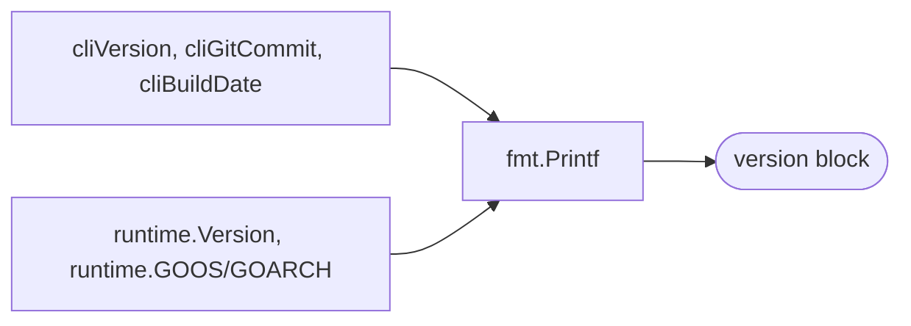

# 🏷️ cpe version

Print the version, git commit, build date, and Go runtime information for the `cpe` CLI.

## Usage

```sh
cpe version
```

## Arguments

This command takes no arguments.

## Flags

This command defines no flags of its own. The global flags (`--output, -o`, `--no-color`) are accepted but have no effect on this command — it always prints a fixed multi-line text block.

## Output

The command prints the following fields, one per line:

| Field         | Description                                          |
| ------------- | ---------------------------------------------------- |
| `cpe CLI`     | The CLI version (default `0.1.0`, set at build time) |
| `Git Commit`  | The git commit the binary was built from (`unknown` unless injected at build time) |
| `Build Date`  | The build date (`unknown` unless injected at build time) |
| `Go Version`  | The Go runtime version reported by `runtime.Version()` |
| `OS/Arch`     | The operating system and architecture (`runtime.GOOS`/`runtime.GOARCH`) |

## Example

```sh
cpe version
```

Expected output:

```text
cpe CLI:     0.1.0
Git Commit:  unknown
Build Date:  unknown
Go Version:  go1.25.0
OS/Arch:     linux/amd64
```

## How It Works

The diagram below shows that `cpe version` simply reads build-time variables and Go runtime values, then prints them — no library calls, no I/O.



The build-time variables (`cliVersion`, `cliGitCommit`, `cliBuildDate`) can be overridden at build time via `-ldflags`:

```sh
go build -ldflags "-X main.cliVersion=1.0.0 -X main.cliGitCommit=$(git rev-parse HEAD) -X main.cliBuildDate=$(date -u +%Y-%m-%dT%H:%M:%SZ)" \
  -o cpe ./cmd/cpe
```

## Related Documentation

- [CLI Overview](./) — installation and the full subcommand list
